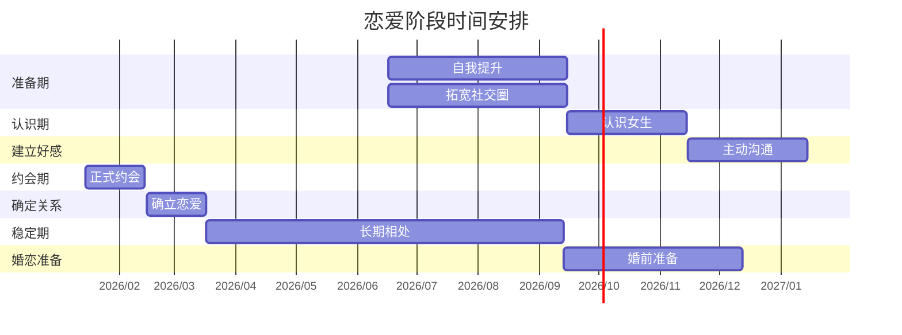

# 从0开始的恋爱全流程指南

## 执行摘要  
本文为一位2002年出生、男性、身高172cm、体重138斤、济宁农村出身、**专升本学历**、曾在潍坊和济南上学、目前在济南工作、无恋爱经验的读者制定一份详细的恋爱指南。首先分析其背景的优势与劣势，然后提出短期、中期、长期目标及择偶标准建议，最后按照认识→建立好感→约会→确立关系→稳定发展→婚恋准备六个阶段，给出时间节点、可执行行动、常见问题及解决策略、与女生相处注意事项和示例对话。还会介绍心理建设与自我提升方法（形象、沟通、经济、社交圈、兴趣爱好）、实际资源（线上交友平台、线下活动类型、穿搭形象建议、约会地点与话题）。为直观展示流程，附上甘特图和流程图（Mermaid格式）。同时提供不同交友渠道优缺点对比表，并标明经验估计的成功率（无权威数据时注明不确定）。所有观点尽量引用中文来源，包括实务指南、心理学研究或官方资料。文末列出所有假设（如年龄偏好、是否异地等），标注为不确定并给出可选方案。

## 个人背景分析  
**优势：** 该男性勤劳朴实、家庭观念强，农村出身往往更懂得责任和体贴（**假设**农村成长带来真诚友善）。他专升本考入本科，表明学习能力强且自我提升意识高，这有助于与城市女性交流。曾在潍坊、济南学习和工作，说明已有城市生活经验、普通话流利，对城市文化、交通等较熟悉。现工作在济南，城市环境交友机会多，职业和收入有一定保障（**假设**工作稳定，收入可覆盖基本生活）。身高172cm、体型适中（BMI≈23）无明显健康问题。年轻24岁，处于适婚年龄，尚未有恋爱经验也意味着无情伤，心态上可重新开始。

**劣势：** 农村出身意味着**起跑线**上可能缺少资源：经济实力可能不如城市出生的同龄人（尤其房产、车辆等），在择偶时常被要求有“房车彩礼”等条件。学历虽有本科，但仍有部分城市女性对农村或非名校毕业生存在偏见。专升本虽含金量提高，但在部分眼中可能不如985/211本一志愿生。有恋爱经验的空白意味着缺乏与异性交往的社交技能，需要时间和实践来积累经验。身高172cm略低于部分女生理想（中国男性平均身高约172cm），若女方偏好高个，则需通过穿着等方式弥补形象上的劣势。家人是否介意年龄、工作地点、户口等未知，也可能带来压力。

综上：他**聪明勤奋，有上进心且家教良好**（假设农村家庭教育踏实），但**当前资源相对有限**，需要通过自我提升和扩大交际圈来弥补劣势。同时保持自信心、不卑不亢尤为重要。

## 优势与劣势对比

| 优势                         | 劣势                        |
|----------------------------|---------------------------|
| 勤劳朴实、责任心强（**假设**重视家庭） | 农村户口、经济基础一般（**不确定**家庭是否供房） |
| 具有专升本学位，学习能力强         | 专升本学历非一志愿本科、学历光环弱（**不确定**对方教育要求） |
| 在城市上学、工作，适应城市生活      | 社交圈以农村同学为主，缺乏都市高级社交资源（**假设**） |
| 年轻无恋爱包袱，心态开放          | 缺乏恋爱经验，需要培养沟通技巧    |
| 身体健康无大碍               | 身高172cm稍低于部分女生理想（**不确定**是否在意身高） |
| 在济南工作，有本地生活基础       | 生存成本（房、车、彩礼）压力大 |
| 专升本考取成功显示上进           | 社会上仍有“农村背景有玻璃墙”现象 |

## 目标设定建议  

1. **短期目标（0–3个月）**：心理建设和自我提升是第一步。树立信心，尝试扩大社交圈。设定本阶段目标为：提升形象（仪表、穿搭）、学习高情商交际、熟悉至少两种线上或线下交友方式。具体可制定每周行动计划（参见后文模版），比如每天锻炼30分钟、每周与陌生女性主动搭话/交流3次。利用身边资源增加曝光，例如参加公司或同学聚会、兴趣班等。提醒我们择偶不宜过于理想化，要注重可实现的匹配度，不要“一开始就盯着天花板”。

2. **中期目标（3–12个月）**：开始恋爱实践。目标是认识并尝试约会1-2位合适的女生，筛选自己喜欢并合拍的异性。建立好感与恋爱关系应顺其自然，不追求一蹴而就。此阶段要明确：不要因为焦虑盲目开始过早的关系，需要步步为营、看清双方契合度。指出应设合理择偶标准，重视“三观契合”、兴趣爱好和价值观，避免攀比攀高不可及目标。可以制定每月目标：例如认识10位新女性，主动约出3次，保持每月至少1次正式约会。  

3. **长期目标（1–2年）**：若关系稳定，则考虑从恋爱过渡到婚恋准备。最终目标：建立长期、稳固的感情基础，为婚姻生活做准备。阶段末可视个人情况提前或延后，如经济尚不足可延长磨合期。现代年轻人“恋爱/结婚意愿下降”是普遍趋势，应以务实心态规划，不因父母催婚而焦虑，“先提升自己，再谈未来”是基本思路。

在目标设定时，注意避免急功近利。建议“摆平心态、立足现实”，将重点放在双方精神契合和共同成长上，而非功利或攀比：不要以为一定要高学历或有房才能约会，只要有提升的潜力和真诚的付出，就可以循序渐进。  

### 关键择偶标准  

根据调研，现代青年在择偶时**理想主义**和**现实压力**并存：他们既想“门当户对”，也强调“内在匹配”，要求物质基础同时重视精神契合。对我们而言，可参考以下标准（均衡择优）：

- **价值观与三观相近**：重视对方三观（人生观、价值观、兴趣爱好）是否契合，避免“谈恋爱后发现三观不合”的情况。比如对家庭、事业、子女教育等有共同看法更易长久。
- **性格互补/相投**：可参考心理学“互补定律”，如果双方性格互补或相投，会更易产生吸引。例如较内向的可找开朗开朗的伴侣，积极上进者可找性格温和的伴侣。
- **家庭与经济条件**：在合理范围内匹配。农村出身的男性可能更注重对方家庭的体贴和女方是否愿共同奋斗；对方家境不必过高，但最好不落差悬殊。经济上，应至少有稳定收入，能分担基本生活。避免“只有条件好才要”的攀比心态。
- **外貌与形象**：这因人而异，不必过分强调“颜值担当”，但适度要求。重要的是保持良好形象——干净整洁、穿搭得体即可。在北京、上海等大城市，高颜值竞争激烈，但在一般城市，诚实善良和责任感往往更吃香。  
- **共同兴趣爱好**：有共同的话题和活动，方便相处。比如都喜欢摄影、旅游或运动，就容易找到共同出行和聊天的话题。共同兴趣也是多次接触从而增进好感的桥梁（即“多看效应”）。
- **年龄与地域**：由于题目未提异地等限制，假设优先考虑济南本地或周边城市女生（方便相处交流）。**假设**可能包括：“对象年龄可在23–28岁区间”，“是否接受异地恋（X可选，做两种方案）”。如果他倾向在济南安家，可优先选择同城异性，否则可考虑省内近城或外省女友。

总之，应鼓励保持“宁缺勿滥”的择偶观，同时提醒现实：理想固然重要，但期望过高会错失良缘。理想对象当然最好，但往往不易遇到。可以先设定“可满足基本要求并感到舒适”的标准，慢慢摸索。最重要的是双方真诚相待、相互吸引。

## 恋爱阶段进程

以下将恋爱过程分为六大阶段：认识→建立好感→约会→确立关系→稳定发展→婚恋准备。每个阶段给出时间建议（仅供参考，可根据实际进展调整）、行动清单、常见问题与应对策略、与女生相处的注意事项及关键对话示例。



### 阶段一：认识（初识）  
**时间节点：** 推荐1–2个月。此阶段重点是主动认识更多女性，扩大社交圈。年龄24，每月若能主动认识5–10位新女性（可通过朋友聚会、社交活动、兴趣小组或线上平台），积累交流经验。**可执行行动清单：**  
- **线上交友**：注册至少2款主流APP（如探探、陌陌、本地相亲群、小程序等）。完善个人简介：真实、正面照片（微笑形象）、简洁自我介绍（喜好、职业、幽默点），突出优点（勤奋好学、有责任心）。主动浏览和联系感兴趣的人。提到大家都会“注重形象、物质和内在匹配”。比如在资料中提到爱好摄影、运动等共同兴趣。  
- **线下活动**：参加青年联谊会、兴趣班（健身房、写作、户外等），或同学聚会、校友会。**参与方式**：带着交流的意图出席，不要宅在角落。尝试主动与女性搭话，言语自然开场，比如看到她穿着某品牌衣服可以搭讪：“我也很喜欢这个牌子的衣服，款式很特别，你经常在XXX买衣服吗？”  
- **学会介绍朋友**：向好友或同学表示自己想认识新朋友，比较传统但有效。让熟悉你的男性朋友或亲戚介绍认识相亲会或同龄的女生。报道的“亲青恋”平台相亲，就是政府组织的线下联谊，或可留意类似公益项目。  
- **个人形象**：准备好合适的初始印象。参照壹心理的**首因效应**“第一印象决定后续”建议，保持干净整洁的外表：洗干净头发、修剪指甲、穿着得体（简约商务或干净休闲装均可）。适度运动保持身材。可以考虑买一两件质量较好的衣物（如白衬衫、合身T恤），显得精神。  

在初次见面时，**寒暄的开场**非常重要。保持真诚微笑、眼神自然。可尝试找共同话题，从周围环境或活动入手，不要直接问私人敏感问题。  
**常见问题与应对：**  
- *“不知道怎么开口？”* 可先从简单的问题开头：“你好，我刚才听到你说XXX，我也觉得很有意思…”。兴趣爱好、在场活动都是好话题。保持自然，避免生硬背问话术。  
- *“被冷场或拒绝？”* 若遭遇对方不感兴趣，不必沮丧：礼貌结束对话即可（如“挺高兴认识你，希望下次再聊”），然后及时总结反思改进。恋爱投入是双向的，不是失败者，而是积累经验。多参加活动可认识不同性格的人，提高成功率。  
- 注意**分寸感**：初识阶段不要过于急切或身体接近，避免给女生压力。尊重个人空间，如介绍名前请求“方便认识一下吗？”，获得认可后再交换微信或联系方式。

**注意事项：**  
- 真诚礼貌，尊重女生意见。不要**自贬**或显得过度自卑（这会破坏吸引力）；也不要过于自夸。  
- 聆听比讲话更重要。对方说话时表现出关注点头或回应，不要只是等待自己讲话机会。  
- 使用开放式问题，引导对方多说，让她感受到被重视。例如：“你为什么喜欢这个爱好？”而不是“你喜欢这个爱好吗？”。  

**示例对话：**  
> 男：*“你好，我看你也在看这本小说，作者写得很精彩。我也特别喜欢这位作家的作品，你怎么看？”*  
> 女：*“是啊，我也是第一次读他的书，觉得情节很吸引人。”*  
> 男：*“我之前读过他另一部作品，对文笔很印象深刻。能聊聊你喜欢哪些类型的故事吗？”*  

此类对话自然平和，通过共同兴趣进入深入交流。  

### 阶段二：建立好感（加深互动）  
**时间节点：** 约1–2个月。在认识阶段初步接触后，如果对方反应良好，就可以转入建立好感期。此阶段目的是让对方对你产生好感和信任。**行动清单：**  
- **持续跟进**：对感兴趣的女生保持主动联系。比如第一次聊天后第二天发条“昨晚想了你说的那个笑话，很有趣，谢谢你分享。”或提前约她一起做某件事。例如共同参加一个讲座、爬山或看场电影。  
- **丰富话题**：避免反复问同样的问题。可以提前准备一些轻松有趣的话题，例如电影、旅行经历、兴趣爱好等。根据她的回复进一步深入。适度展现幽默感，让气氛轻松（**黑暗效应**提示：适度暧昧的环境，如光线柔和的咖啡厅，有助于降低紧张）。  
- **非言语暗示**：保持适当眼神交流，微笑时眼带温度。女生通常会通过细节来判断男人的心意，例如是否关注她、是否体贴。小细节能打动她：为她拉下椅子、关心她吃得是否舒服、风大给披上外套等。  
- **赞美要具体**：看到对方做对的事或有亮点时及时赞扬，比如“你真的很会讲故事，让人很投入”或“你这件衣服颜色很适合你，显得特别温柔”。赞美要真实具体，避免过于空泛 (“你好漂亮”之类很普通，可以改成“今天笑起来特别好看”)。  
- **保持神秘感**：不要一次性把自己所有情况都说完。保持一定神秘感让对方有兴趣继续了解。只透露对方觉得有趣的信息，多留点悬念，比如对方问你周末计划，可以说“有个有趣的活动，不如你也来看看”，吸引她主动提出一起。  

**常见问题与解决策略：**  
- *“好感进展太慢？”* 尊重对方节奏。有些女生需要更长时间来感受安全感。遵循“多接触多了解”的原则（**多看效应**），放慢节奏，耐心陪伴。只要你持续展现真诚，关系自然向前发展。  
- *“她偶尔冷淡？”* 可能她正忙或不确定你的意图。遇到冷淡时可先退一步，不纠缠，让她有空间思考。如果过几天依然聊不起来，再试着提出见面喝咖啡或参加活动，观察她的反应。  
- *“怕尴尬沉默？”* 沉默是正常的部分。可事先准备一些备用话题，如“最近听说xxx新闻很有意思，你怎么看？”让对话自然转换主题。  

**注意事项：**  
- 不要过分关注对方社交网络或展现出占有欲。给彼此一定个人空间。  
- 避免提前过于深入的话题，例如“你想要孩子吗？”、“你父母对我的感觉？”这类话题留待关系更稳后再提。  
- 遵守约定时间。尊重她的时间安排，不要让她久等。  

**示例对话：**  
```
男：我上周看了《独行月球》，里面讲的科幻场景很震撼。你喜欢科幻片吗？  
女：还没看过这部，我对科幻电影不是很熟悉。  
男：太值得推荐了！下次要不要一起去电影院看？放完咱们顺便去楼下咖啡厅聊聊感想。  
```
这种邀请自然提出约会想法，给对方主动选择的余地。  

### 阶段三：正式约会  
**时间节点：** 通常可在认识后3–6个月开始约会，多次见面了解彼此。**行动清单：**  
- **策划约会**：选择轻松、有趣的活动或地方。例如晚餐后散步、公园野餐、主题展览、短途旅行等，让相处时间延长。有心理学研究指出，在刺激和轻松氛围中，人们更容易彼此产生好感。可在每次约会结束时给她留下一小件好印象，例如送她喜欢的书或小礼物（非昂贵但有意义）。  
- **保持有趣和尊重**：谈话中提及未来计划、梦想或有趣的旅行经历，展示上进心和趣味。避免谈论过去的恋爱细节或负面话题（“黑暗效应”下昏暗环境可能增加亲密感，但真相交谈要谨慎）。  
- **经济准备**：如果约会地点需要费用（餐厅、电影等），可主动付账或AA，看对方反应。大部分女生在初期约会不会介意男生付账，但要尊重女方意见。若其坚持AA，也不必强求。重要的是表现出你愿意为彼此时间和体验投资。  
- **沟通技巧**：如果约会双方同时喜欢同一话题，可以用**“首因效应”**原则（给人好印象后续容易好感），配合幽默和关切。例如对她说：“你的幽默感真好，让我一直在笑，你平时很开朗吗？”，增强互动的愉悦。  

**常见问题与解决策略：**  
- *“约会紧张？”* 记住女生也可能紧张。提前做准备（了解想去地点的情况，穿着得体），告诉自己“对话是双向的，对话压力不全在自己”，自然交流。多深呼吸，笑容自然。  
- *“对方迟到或取消约会？”* 遇到这种情况保持冷静：及时确认情况，无需责怪。尊重她的解释，改约时间。若经常爽约，可考虑她是否真的投入。  
- *“第一吻或拥抱？”* 初期约会最好保持慢节奏。在确定对方有好感并给出暗示后再自然接近。如在散步时逐渐靠近，触碰她手臂时观察对方是否放松。绝不要强迫接触。一般建议在确定关系后再进一步亲密。  

**相处注意事项：**  
- 持续做“倾听者”。真诚倾听和回应胜过滔滔不绝。  
- 不要过早“放手锚”。第一次约会如果不错，可以提出再次约会计划，但也可让女生提议，给她参与感。  
- 保持风度：如开启车门、行走在外侧、帮她挽衣摆等小细节。  
- 适当幽默：提高气氛，避免尴尬时用自嘲化解紧张。  

### 阶段四：确立关系（恋爱期初）  
**时间节点：** 约会3个月左右，如果双方感觉愉快可进入此阶段。重点是确认彼此的情感并确立“恋人”身份。**行动清单：**  
- **确认关系**：当感觉双方都愿意更进一步时，可找合适的时机表达喜欢：“这段时间和你在一起很开心，我很认真地想与你继续交往。”观察对方反应。双方同意后，可正式称对方为“男/女朋友”。  
- **沟通期待**：明确彼此对关系的期待。譬如，询问双方对恋爱关系界限、未来计划等的想法。避免“忽视判断”等误解。  
- **加深了解**：可以偶尔见面谈谈各自家庭、童年、人生目标等比较私密的话题，让双方更贴近。注意保护对方隐私，信息分享要建立在信任上。  
- **分担时光**：约会之外的日常交流也要维持。工作日发问候短信、节日送小礼物等，显示关心。  
- **示好行动**：如节假日共度、帮助解决实际困难（如生病送药、加班时送晚餐）等，让对方感受你的可靠与付出。  

**常见问题与解决策略：**  
- *“怕开始说分手？”* 若关系出现小摩擦，及时沟通。例如争执后能否真诚道歉，提出改进；**不要拖延争议**。理性交流，避免冷战。  
- *“她说不确定？”* 可能对方还需时间考虑。给她一些空间，同时继续保持关心。尊重她的步伐，自己生活也要丰富，不要粘得让对方窒息。  
- *“感情中出现第三者？”* 对于异性朋友互动，需及时沟通透明。让对方知晓你的社交圈内的其他人，避免误会；同时注意避免过于亲昵与其他异性交往。  

**注意事项：**  
- 建立信任：给对方安全感的最关键是行动一致。答应她的事就努力做到，不轻易食言。  
- 坦诚沟通：如有误会及时解释。**互相尊重**对方的感受，不做“忽悠”或双标。  
- 保持个人魅力：继续自我提升，不要因为有了恋爱而停滞。对方也需要看到你的成长和规划。  

**示例对话：**  
```
男：这段时间真的很开心，感觉我们越来越了解彼此。我想认真和你交往，你愿意做我女朋友吗？  
女：我也挺喜欢和你在一起的，好的，我们确定关系吧。  
男：太好了！以后有什么想法或者小事，都可以告诉我。我希望我们一起努力，也一起成长。  
```
真诚明确，适时提出，避免暧昧不清。  

### 阶段五：稳定发展（热恋期）  
**时间节点：** 成为恋人后，持续发展6–12个月以上。主要任务是稳固感情、为未来做计划。**行动清单：**  
- **共同活动**：继续一起培养共同爱好，例如一起旅游、学习新技能、参加情侣运动会或做公益。共同经历让两人关系更加牢固。  
- **融入对方圈子**：认识对方的朋友、家人。积极参与对方的生活，表现出尊重。如与她的家人或朋友相处时礼貌得体，适度展现你对她的关心。增强双方家庭对你的好感。  
- **未来规划讨论**：适度谈论未来生活，例如是否想在本地定居、购房计划、婚后想过怎样的生活等。不要高压逼问，而是以兴趣的口吻交流：“你有没有想过以后我们可以一起旅行/买房？”察觉两人的一致处。  
- **经营情感**：保持热情，偶尔制造小惊喜。比如纪念日送花、给她做份精心早餐、写一封小情书。在感情中适度表达**感激**和**爱意**，让对方感受安全和幸福。  
- **解决冲突**：大多数情侣都会遇到意见不合。此阶段要学会换位思考，多用“我觉得”“我们可以”类非指责语句表达不同意见。争吵后应及时和好，不积攒矛盾。**“拍球效应”**告诉我们，冲突时若双方都不退让，就会升级，应当适时冷静和让步。  

**常见问题与解决策略：**  
- *“感情平淡？”* 热恋期可能会出现惯性。可共同做些新鲜事（短途旅行、参加工作坊），制造刺激和新鲜感。记住**互补定律**：不同的兴趣可以互补，各做对方不擅长的事，带给彼此惊喜。  
- *“经济压力增大？”* 如房子、彩礼等现实问题，双方应开诚布公商量，设定共同财务目标。回顾现实调查，婚恋成本高居不下，是常见忧虑。建议从“立足现实”出发，避免攀比。比如可计划一起存款买房，或者考虑先同居等方案减轻负担。  
- *“婆媳矛盾预防？”* 若进入婚恋准备阶段，应了解彼此父母的期望和性格。双方提早与父母沟通、化解顾虑。如女方父母有彩礼要求，可坦诚解释目前经济状况，共同商量。  

**注意事项：**  
- 保持个人空间：虽然成为恋人，可适当给彼此一点个人时间和空间。不要24小时粘着对方，学习信任和理解对方有自己的朋友圈。  
- 持续沟通三观：定期交流彼此对工作、家庭、婚姻的想法，必要时调整彼此目标。  
- 共同成长：鼓励对方发展个人兴趣和事业，也投入时间提高自己。一个不断进步的你会更有魅力。  

**示例对话：**  
```
女：最近我们工作都挺忙的，要不抽个周末一起去附近山上露营换换心情？  
男：好啊，我正想找机会陪你放松放松。一起计划一下路线吧！  
```
共同做计划，增进彼此默契；同时询问对方需求体现关心。  

### 阶段六：婚恋准备（婚前）  
**时间节点：** 稳定恋爱1年以上，根据双方情况（经济、年龄、家庭期望）而定。此阶段目标是为结婚和婚后生活做准备。**行动清单：**  
- **婚后规划**：明确双方婚后工作、居住计划。若计划生育，需对共同承担家务、育儿、双方家庭照顾等分工达成共识。考虑未来住房和经济基础，制定储蓄计划，学习理财知识。  
- **婚礼准备**：讨论是否举办婚礼及规模等。可共同浏览婚礼信息，为重要事项（彩礼、婚礼形式）寻找两家都可接受的方案。注意避免因彩礼、酒席而冲突，回避“铺张婚礼”。简约文明的婚礼往往更符合“新婚俗”趋势，减少经济负担。  
- **法律与财务**：了解双方家庭负担、如已有房贷、车贷情况，理性计算婚姻成本。必要时咨询亲友或专业意见。签署婚前财产协议视个人情况而定。  
- **健康检查**：可约一起做婚前体检，关注彼此健康，为下一阶段（如育儿）做准备。  
- **情感巩固**：此阶段压力较大，容易情绪波动。互相给予理解和支持，如安抚焦虑情绪，回顾恋爱时的美好时光来增强信心。  

**常见问题与解决策略：**  
- *“对婚姻仍有犹豫？”* 婚姻改变生活方式，恐惧是正常。可一起参加一些婚前辅导课程或阅读心理学书籍，对“恐婚”心理进行梳理。回归初心，讨论“为什么要结婚”，把婚姻看作两个人相互扶持而非终点。  
- *“彩礼冲突？”* 在婚恋观教育下，建议双方以沟通为主。比如一起和女方家长讨论，一个在城里有房支付首付、彩礼适度折中等方式化解压力。务实看待“成本—收益”问题，避免过度攀比。  

**注意事项：**  
- 相互体谅：对方可能因长辈催婚、经济压力而焦虑。给予情感支持与信心，一起承担压力。  
- 坦诚沟通：对重大决策，如生育计划、买房买车等，保证双方都参与讨论与决定。  

## 心理建设与自我提升  

- **心理建设：** 先端正心态。不要因为短期未遇理想对象而焦虑，也不盲目将就。参考调查，现代青年婚恋观趋于务实，强调“价值观契合”胜于一时激情。要把失恋或拒绝看作经验，不要怀疑自己价值。可以通过运动、读书、跟朋友聊天等方式缓解压力。给自己积极暗示：“我值得被爱，我也有优势可以吸引对的人”。  
- **提升外貌**：日常规律作息，注意个人卫生（如每天洗澡、刷牙、定期理发）。学会基本的时尚搭配：深色上衣百搭，裤子合身，鞋袜整洁。必要时向朋友或网上学习穿搭技巧。男性可以定期锻炼（慢跑、健身、游泳等）增强体能和自信，也改善体型。注意不要做**突兀改变**（比如一次性减肥太多、染发极端造型），维持“清爽自然”形象。  
- **提升沟通能力**：通过阅读社交技巧类书籍（如两性心理学著作），学习如何倾听和回应。练习讲故事的能力：在对话中加入一些幽默或生活小故事，让自己对话更生动。与女性聊天时，多使用“我们”这种包含性的词汇，减少“我”语序。反馈性对话：比如她刚说完，引出相关看法或提问，让对话更流畅。  
- **提升经济条件**：虽然房子不易，但可尝试储蓄或额外兼职（**假设**业余时间可用来做些副业、写作或技能培训）。经济自立是增加魅力的重要因素。与此同时认真计划财务，如制订每月预算、存一部分钱。及时还清债务保持信用。可将财务目标写下来，比如“半年后存够X元”并执行。  
- **拓宽社交圈**：加入不同圈子：比如职业社群、同学群、兴趣群（摄影、电影、体育等）。定期参加聚会和活动。扩大圈子意味着增加认识优秀女生的概率。网络社交也别局限于APP，尝试微博、知乎、豆瓣小组等平台的活动讨论，寻找线下活动机会。培养一两个可以介绍相亲对象的朋友，让他们知晓你的择偶意愿。  
- **培养兴趣爱好**：选择一两样能展现个人魅力的爱好，如运动（篮球、羽毛球）、艺术（吉他、绘画）、户外（攀岩、露营）等。既充实生活，又为交友提供话题。对方往往会被有追求的人吸引。平时不沉迷手机，偶尔和女生分享你的作品或经验，可以增加吸引力。  

**示例行动计划（周模板）：**  

| 周次 | 目标                                         | 行动清单                                                       | 备注                         |
|------|-------------------------------------------|------------------------------------------------------------|----------------------------|
| 第1周 | 建立自信、完善形象                           | 1. 每天早起锻炼20分钟；更新两套穿搭。 <br>2. 注册交友APP，完善个人资料并发送5条问候。 | 形象清爽，资料真实积极。         |
| 第2周 | 扩展认识面、初步搭讪                         | 1. 参加一次公司或校友活动，与至少2名陌生女生交流。<br>2. 在APP上主动开启3次聊天，友好互动。 | 记录交流话题与对方反应。       |
| 第3周 | 持续跟进、增加沟通经验                       | 1. 回复上周交流较好的女生，约在咖啡厅见面聊天。 <br>2. 学习倾听技巧，保持对话积极。 | 观察相处氛围，她的兴趣点。    |
| 第4周 | 回顾调整、设定下月目标                       | 1. 总结之前成功/失败经验，改进交谈方式。<br>2. 制定下月参加活动与约会计划。  | 保持学习心态，积极面对反馈。   |
| 第5周 | 巩固成果或重新拓展                           | 1. 对上次约会结束时感觉不错的女生持续联络，可提出二次见面。<br>2. 若需要，继续参加聚会认识新朋友。 | 注意平衡，不使对方压力太大。 |
| ...  | 持续迭代                                     | 按实际进展灵活调整计划，每周复盘。                                  |                            |

通过每周反思和总结，不断调整策略，保持持续行动。

## 实际资源与活动建议  

- **线上平台：** 除了大众化APP（如探探、陌陌、Soul、伊对、百合网、世纪佳缘等），还可利用**专业婚恋网站/公众号**。比如浙江的“亲青恋”政务平台就为18–45岁青年提供实名交友服务，审核严格、用户素质高；类似服务在北京、上海等地有大学城婚介组织或青年团体的相亲活动。**使用建议：**填照片和择偶条件时真实性要高（平台通常与民政学历、社保等数据联网），可以先做认证头像让女生安心。  
- **线下活动：** 各地常有免费的青年联谊、体育比赛、公益活动、文艺沙龙等。例如：学校/社区组织的“青年节联谊”、大型展会和节庆活动中也可脱单。公司或校友会聚餐、旅游活动能借机认识朋友的朋友。**创意活动**：可以报团一起做饭、花艺工作坊、烘焙课堂、编程课、攀岩等主题活动，这些能吸引共同兴趣的女生参与。  
- **穿搭形象：** 男生应选择简洁经典的搭配：例如衬衫+牛仔裤+皮鞋，或Polo衫+休闲裤+干净运动鞋。假设其工作环境偏正式，可准备1–2套正式西装或干净西装式搭配以应对宴会或正式场合。女性一般喜欢成熟稳重又带点小帅气的男生形象，可以尝试戴表、领带或小配饰来提升质感。出门前保证发型整洁，指甲干净。注意**色彩搭配**：避免全身暗沉，衬衫或外套可以选择亮色系（浅蓝、浅灰等）提升亲和力。  
- **约会地点：** 对于第一次约会，可选择**安全舒适**的公共场所：咖啡馆、书店、艺术展、小餐厅或公园漫步等。如了解她喜欢景点，可安排一起去。切忌第一次约会太晚或私密（如仅限单独车程远的郊外）。约会时带上小礼物（如花、一小盒巧克力），但量力而行。  
- **话题清单：** 准备一些安全话题：大学/工作经历、家乡风景、旅行趣闻、最近看的电影或书籍、共同的兴趣爱好（如运动、音乐）。避免提问过于敏感：工资、前任、宗教、政治、家庭矛盾等不是初期谈话重点。使用“我”语言谈及感受，如“我觉得这个电影很感人，里面的故事让我想起……”。   
- **示例对话**：  
  ```
  男：这周末有什么安排？是否想一起去公园放风筝，天气预报说会很晴朗呢？  
  女：好啊，我小时候很喜欢放风筝，还挺怀念的！  
  男：那咱们可以自带或去买一个，然后找个好位置。顺便带点小吃一起野餐。  
  ```  
  以邀请为导向，提供具体方案，让女生更易答应。  
- **兴趣小组与课程：** 可报名摄影培训班、户外徒步俱乐部、烘焙工作坊等。这样的环境下女生学习和放松心情，更愿意交谈，男性也能展示才艺。注意在课程或活动中遇到目标女生时，自然打招呼，不打断她学习，让对方感到尊重。

## 交友渠道比较  

下面对几类常用的交友/相亲渠道进行对比（成功率为经验估计，仅供参考）：

| 渠道            | 优点                                              | 缺点                                              | 成功率(估计)    |
|---------------|-------------------------------------------------|--------------------------------------------------|--------------|
| **婚恋网站/APP**   | 用户量大、可筛选条件、初步了解容易；操作便捷          | 用户鱼龙混杂，容易遇到虚假资料或骚扰；需投入时间维护    | 约5–15%（见效慢，需主动把握） |
| **线下相亲活动**   | 针对单身群体，家长朋友介绍或组织；信息真实度高         | 需主动出席，活动质量参差；成功率不稳定，多次参加效果较好 | 约10–20%（视规模和组织情况）   |
| **朋友/亲戚介绍** | 相互信任度高，匹配建议更贴近个性；成功率相对较高        | 可选范围小，需社交关系支持，父母介入可能压力大          | 约20%（受熟人渠道限制）      |
| **兴趣活动/俱乐部**| 同兴趣匹配度高，自然环境下接触，关系发展真实            | 组织不频繁或圈子较小；需要较强主动沟通能力            | 约10–25%（兴趣相投提升成功率）  |
| **政府/公益平台** | 实名审核严格（如“亲青恋”），可信度高；配套线下活动多         | 地区限制，目前主要在部分城市；注册用户量较其他APP少      | 约15–20%（平台较新，数据不多） |

**说明：**成功率为根据经验给出的粗略估计，具体效果因人而异且缺乏权威统计，故标注不确定。实际应用时可同时尝试多种渠道，综合取长补短。

## 示例对话

### 初次聊天实例：  

```
男：你好，我看到你也喜欢摄影。这张照片拍得很好看，是在哪里拍的？  
女：谢谢！那是在济南大明湖拍的。我喜欢自然风景。  
男：哇，我也很喜欢大明湖，前几天还去了打鸟。有没有兴趣下次一起去？  
女：可以啊，一起去野拍一定很有趣！  
```

### 约会邀约示例：  

```
男：这个周末市中心有个美食节，我们可以一起去尝尝不同的小吃，然后顺着河边散步，你觉得怎么样？  
女：听起来不错，我很喜欢尝试各种小吃！  
男：那太好了，我去买票，然后到时候见！  
```

### 恋爱确认示例：  

```
男：最近真的很开心能每天和你聊天、见面。我发现自己特别在乎你，我愿意继续努力让你幸福。你愿意做我的女朋友吗？  
女：我也很喜欢和你在一起的感觉，好啊，那我就做你女朋友！  
```

## 假设说明  

- **年龄要求（不确定）**：假设其可接受的对象年龄为23–28岁（常见同龄或稍大群体）。可选方案：若喜欢小年龄，可扩大到22岁；若愿接受更成熟对象，可适当放宽。  
- **地域偏好（不确定）**：假设优先考虑济南及附近城市姑娘，利于线下约会。如考虑外地，可选方案：利用视频聊天、异地时常往返见面等方式。  
- **是否想要异地恋（不确定）**：假设更希望本地女友，可选在省内城市找；如愿意异地，则可考虑外省近邻，如聊城、青岛等。  
- **对方学历要求（不确定）**：假设对方本科以上或大专。本科女生多数注重学历，但优先性格匹配和三观，不必只盯学历。  
- **结婚/生育意向（不确定）**：假设双方都期望未来结婚生育。本阶段不必急于商定生育计划，但应有共识“结婚是我们的目标之一”。如有不同想法，应尊重并沟通。  

> **致读者：**以上各阶段时间仅为参考，可根据具体进展灵活调整。恋爱是两个人的事，需要耐心和适应。最关键的是保持自信和真诚，不断学习与成长。愿你在行动中不断收获经验，最终找到合适的她！

**参考资料：** 本文观点结合了**心理学研究**及**婚恋调查**数据。例如调查显示农村男性在婚姻市场处于不利地位；现实中青年择偶受经济与价值观影响；浙江“亲青恋”平台等政府婚恋公益活动取得成效；以及经典心理学效应（首因效应、多看效应等）对恋爱交往的指导意义。

