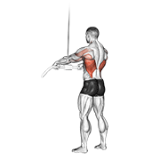

# 个人训练计划（三分化）

> **定制对象**：王振强 | 24岁 | 172cm / 69kg | 程序员
> **训练目标**：匀称塑形 / 减脂 / 体态矫正（圆肩驼背）
> **训练经验**：7-8个月 | **频率**：一周 3-4 练 | **每次时长**：~60分钟
> **训练地点**：商业健身房 | **模式**：推-拉-腿三分化（PPL）
>
> ⚠️ **注意事项**：有轻度肩部不适，所有推类动作需注意肩关节保护。每天包含肩外旋 + 面拉 矫正体态。

---

## 📋 快速跳转

> 每个训练日已拆分为独立文件，方便训练时直接查看：

| 训练日 | 直达链接 | 重点肌群 |
|--------|---------|----------|
| **🔥 第一天：拉日** | [→ 打开拉日训练计划](./training-plan/day1-push.md) | 背部 + 后束 + 二头 |
| **🔥 第二天：推日** | [→ 打开推日训练计划](./training-plan/day2-pull.md) | 胸部 + 肩部 + 三头 |
| **🔥 第三天：腿日** | [→ 打开腿日训练计划](./training-plan/day3-legs.md) | 下肢 + 核心 |

---

## 📋 训练概览：循环模式

> **本计划不绑定星期几。** 你只需要按照「练一天 → 休一天 → 练下一天 → 休一天 → …」的节奏往下推进，像日历翻页一样，练到哪天就是哪天。

### 循环节奏

```
┌──────────────────────────────────────────────────────────┐
│  练 ──→ 休 ──→ 练 ──→ 休 ──→ 练 ──→ 休 ──→ 练（可选）──→ 回到开头  │
│ 第1天     1天    第2天    1天    第3天    1天    第4天                │
│  拉日      休      推日      休      腿日      休    体态日            │
└──────────────────────────────────────────────────────────┘
```

- **每次训练之间至少休息 1 天**（让肌肉恢复）
- 腿日之后如果特别累，多休一天也没问题
- 一周大概走完 **1.5 ~ 2 个循环**（3-4 练），**根据自己的精力和时间灵活安排**
- 这周忙只练了 2 次？没关系，下次进健身房接着上次的位置继续

### 三个训练日速览

| 训练日 | 重点肌群 | 动作数 | 时长 | 一句话 |
|--------|----------|--------|------|--------|
| **第1天：拉日** | 背阔肌、中上背、后束、二头 | 7个 | 60min | [查看详情→](./training-plan/day1-push.md) |
| **第2天：推日** | 胸大肌、三角肌前中束、三头 | 7个 | 60min | [查看详情→](./training-plan/day2-pull.md) |
| **第3天：腿日** | 股四头肌、腘绳肌、臀大肌、小腿 | 7个 | 60min | [查看详情→](./training-plan/day3-legs.md) |

### 两种走法，任选

```
走法 A（3练/周）：
  拉 → 推 → 腿 → 休 → 拉 → 推 → 腿 → 休 → …

走法 B（4练/周，加入体态日）：
  拉 → 推 → 腿 → 体态 → 拉 → 推 → 腿 → 体态 → …
```

> 💡 怎么知道下次练什么？**记住上次练到第几天就行了。** 比如今天练了推日（第2天），下次进健身房就是腿日（第3天）。
> 💡 如果超过 3 天没练，建议从拉日重新开始——背部激活对体态最重要。

---

## 🔑 核心原则

### 体态矫正优先

作为程序员，每天久坐 10-12 小时，**圆肩驼背**是核心问题。本计划遵循以下策略：

1. **每天训练前必做肩外旋 + 面拉**：激活肩袖肌群，打开胸椎
2. **拉 > 推**：背部训练量始终大于胸部，平衡前后肌力
3. **胸肌必须拉伸**：紧张缩短的胸肌是圆肩的元凶
4. **肩部保护**：肩不舒服时，跳过所有过头推举，改为侧平举+前平举

### 渐进超负荷（Progressive Overload）

| 周数 | 策略 |
|------|------|
| 第 1-2 周 | 适应期，RPE 6-7（留 3-4 个 reps 余力），专注动作质量 |
| 第 3-4 周 | 增重期，RPE 7-8（留 2-3 个 reps），小幅加重 2.5-5kg |
| 第 5-6 周 | 挑战期，RPE 8-9（留 1-2 个 reps），尝试新重量 |
| 第 7 周 | **减载周**：重量降至 60-70%，组数减半，让身体恢复 |
| 第 8 周 | 新循环开始 |

### 休息规则

- **组间休息**：主项复合动作 90-120 秒，孤立动作 60-90 秒
- **训练之间**：每次训练后至少休 1 天。腿日（第3天）后如果特别酸，多休 1 天也无妨——循环不会因此「中断」，只是顺延
- **循环不重置**：哪怕休息了一周，回来也接着上次的进度走。如果断超过 10 天，建议从拉日重新开始让身体适应
- **减载信号**：连续两次训练感觉变弱/关节持续不适/睡眠质量下降 → 提前减载

---

## 🔥 第一天：拉日（背部 + 后束 + 二头）

### 一、练前拉伸/热身（5-8 分钟）

> 目标：激活肩袖、活动胸椎、预热背部肌群

#### 1.1 弹力带肩外旋


- **弹力带绑在固定物上**，肘部夹紧身体呈 90°
- 向外旋转手臂，感受肩袖后侧发力
- **2 组 × 15 次/侧**，慢速控制（2 秒外旋 + 2 秒回程）
- 🎯 关键：**肘部紧贴身体不离开**，只旋转前臂

#### 1.2 弹力带反向飞鸟


- 双手握住弹力带，手臂微屈，向两侧拉开
- 感受**后束和上背中部**的收缩
- **2 组 × 15 次**，顶峰收缩保持 1 秒
- 🎯 关键：肩胛骨主动后收，不是用手臂硬拉

#### 1.3 弹力带面拉（Face Pull）

> ⚠️ 本计划无对应 GIF，此处用文字描述，可参考弹力带反向飞鸟的轨迹

- 弹力带固定在面部高度，正握拉向面部
- 拉到底时手掌外旋（拇指向后），肘部向外打开
- **2 组 × 15 次**
- 🎯 关键：**面拉是对抗圆肩的第一动作**，每次训练都做

#### 1.4 辅助引体向上（可选激活）


- 用弹力带辅助或器械辅助，**2 组 × 5-8 次**
- 感受背阔肌发力，不是纯靠手臂

---

### 二、正式训练动作（~45 分钟）

> ⚡ 主项动作与辅助动作交替，主项重、辅助轻，避免过早力竭。

---

#### 🔷 A1. 高位下拉（Lat Pulldown）— 主项


| 项目 | 参数 |
|------|------|
| **组数 × 次数** | 4 组 × 8-12 次 |
| **RPE** | 7-9 |
| **握法** | 宽握（比肩宽 1.5 倍） |
| **组间休息** | 90 秒 |

**动作讲解**：
1. 坐稳，大腿卡在垫子下，**挺胸沉肩**
2. 正握横杆，握距约为肩宽的 1.5 倍
3. 下拉时**想象肘部向下向后拉**，不是用手臂拽
4. 拉到锁骨/上胸高度，顶峰收缩挤压背部 1 秒
5. 慢速放回（2-3 秒），感受背阔肌被拉伸
6. 身体不要过度后仰（后仰角度 < 15°）

🎯 **重点关注**：下拉时**先启动肩胛骨下沉**，再带动手臂。很多人用手臂拉而背部不动——如果你发现二头比背部先疲劳，减轻重量重新找发力感。

---

#### 🔷 A2. 坐姿绳索划船（Seated Cable Row）— 主项


| 项目 | 参数 |
|------|------|
| **组数 × 次数** | 4 组 × 10-12 次 |
| **RPE** | 7-9 |
| **握把** | V 型把手或绳索 |
| **组间休息** | 90 秒 |

**动作讲解**：
1. 坐于划船凳上，双脚踩稳踏板，膝盖微屈
2. 背部保持直立，**不弯腰、不前倾**
3. 拉向腹部时，**肘部贴近身体向后滑**，肩胛骨夹紧
4. 顶峰收缩 1 秒，想象背部中间夹一支笔
5. 慢速放回（2 秒），手臂不完全伸直以保持背部张力

🎯 **重点关注**：全程**背部始终挺直**！弯腰是划船中最常见的错误，容易伤腰。如果腰部撑不住，减轻重量。

---

#### 🔷 B1. 哑铃俯身划船（Bent Over Row）— 辅助


| 项目 | 参数 |
|------|------|
| **组数 × 次数** | 3 组 × 10-12 次/侧 |
| **RPE** | 7-8 |
| **组间休息** | 60-90 秒 |

**动作讲解**：
1. 单手撑凳，同侧膝跪凳，另一手持哑铃
2. 背部与地面接近平行，保持中立
3. 将哑铃拉向腰部，**肘部贴近身体**
4. 顶峰收缩 1 秒，缓慢下放
5. 先用轻重量掌握发力感，再加重量

🎯 **重点关注**：这个动作对单侧背部发展极好，可以发现并纠正左右不平衡。**拉到最顶端时背部应该完全收紧**。

---

#### 🔷 B2. 哑铃反向飞鸟（Reverse Fly）— 后束


| 项目 | 参数 |
|------|------|
| **组数 × 次数** | 3 组 × 12-15 次 |
| **RPE** | 6-8 |
| **组间休息** | 60 秒 |

**动作讲解**：
1. 坐在凳子上，俯身至胸部接近大腿，双手持轻哑铃（建议 **2-4kg 起步**）
2. 手臂微屈（不要锁死），向两侧抬起
3. 想象**拇指指向天花板**，感受后束收缩
4. 顶峰保持 1 秒，慢速下放
5. **重量不要大！后束是小肌群，靠控制和次数，不靠重量**

🎯 **重点关注**：后束是改善圆肩的关键！后束弱 → 肩胛骨前引 → 圆肩。**这个动作比你想的更重要**。

---

#### 🔷 C1. 直臂下压（Straight Arm Pulldown）— 背阔肌收尾



| 项目 | 参数 |
|------|------|
| **组数 × 次数** | 3 组 × 12-15 次 |
| **RPE** | 6-8 |
| **组间休息** | 60 秒 |

**动作讲解**：
1. 站于高位龙门架前，双手正握直杆
2. 手臂基本伸直（微屈不锁死），从肩高位置向下压至大腿前
3. 发力时**想象背阔肌收缩**，不是耸肩下压
4. 回程时控制（2 秒），手臂不超过肩高

🎯 **重点关注**：全程手臂角度不变，靠**背阔肌发力**不是靠身体下压。这是背阔肌的孤立收尾动作，建立背阔肌的神经连接。

---

#### 🔷 C2. 哑铃弯举（Biceps Curl）— 二头


| 项目 | 参数 |
|------|------|
| **组数 × 次数** | 3 组 × 10-12 次/侧 |
| **RPE** | 7-8 |
| **组间休息** | 60 秒 |

**动作讲解**：
1. 站姿或坐姿，双手持哑铃，掌心朝前
2. 肘部固定在大腿或身体两侧，**不要摆动借力**
3. 弯举至顶峰，挤压二头肌 1 秒
4. 慢速下放（2-3 秒），离心过程比向心更重要

🎯 **重点关注**：如果身体开始晃 → 重量太大。二头肌是小肌群，**控制和离心比重量更重要**。

---

#### 🔷 C3. 绳索弯举（Cable Curl）— 二头收尾


| 项目 | 参数 |
|------|------|
| **组数 × 次数** | 3 组 × 12-15 次 |
| **RPE** | 6-8 |
| **组间休息** | 45-60 秒 |

**动作讲解**：
1. 站于低位龙门架前，双手正握直杆/绳索
2. 肘部贴紧身体两侧，弯举至肩高
3. 慢速下放，保持二头持续张力
4. 绳索带来的恒定张力，比哑铃更持续刺激

🎯 **重点关注**：绳索在整个行程中都提供阻力（不像哑铃在某些角度失去张力），是二头肌很好的收尾动作。

---

### 三、练后拉伸（5 分钟）

> 目标：恢复背部/手臂肌群长度，打开胸椎

#### 3.1 背阔肌拉伸


- 跪姿或站姿，双手抓住固定物
- 臀部向后坐，感受背阔肌/大圆肌的拉伸
- **每侧保持 30 秒 × 2 组**

#### 3.2 上背拉伸


- 双手交叉于胸前，拱背含胸
- 感受肩胛骨之间的拉伸
- **保持 30 秒 × 2 组**

#### 3.3 胸背拉伸


- 双手背后交叉，肩胛骨向后夹紧
- 同时抬头挺胸，打开胸腔
- **保持 20 秒，做 3 次**

---

## 🔥 第二天：推日（胸部 + 肩部 + 三头）

### 一、练前拉伸/热身（5-8 分钟）

> ⚠️ 推日热身尤其重要！肩膀有不适时更要充分热身。

#### 1.1 弹力带肩外旋


- **3 组 × 15 次/侧**（推日多加一组保护肩袖）
- 动作同拉日

#### 1.2 胸部动态拉伸


- 双手向两侧展开，动态向后伸展
- 感受胸肌和肩前部的拉伸
- **1 组 × 10 次**，逐渐加大幅度

#### 1.3 弹力带反向飞鸟（激活后束 + 打开胸椎）


- **2 组 × 15 次**
- 推日前激活后束，帮助在推的动作中稳定肩胛骨

#### 1.4 弹力带面拉（Face Pull）

- **2 组 × 15 次**（同拉日）

---

### 二、正式训练动作（~45 分钟）

---

#### 🔷 A1. 器械推胸（Chest Press Machine）— 主项


| 项目 | 参数 |
|------|------|
| **组数 × 次数** | 4 组 × 8-12 次 |
| **RPE** | 7-9 |
| **组间休息** | 90 秒 |

**动作讲解**：
1. 调整座椅高度，使**握把与胸部下缘对齐**（非肩膀高度）
2. 背部贴紧靠垫，肩胛骨后收下沉
3. 推的时候**不要耸肩**，肩胛骨始终保持后收贴凳
4. 推到手臂接近伸直（不要锁死肘关节）
5. 回程时控制（2-3 秒），手肘不超过身体平面
6. 感受**胸肌的挤压**，不是肩膀前束的推动

🎯 **重点关注**：选择器械而非杠铃卧推的原因——你的肩部有不适，器械轨迹固定更安全。**如果推的时候肩膀前侧疼，降低重量 + 缩减动作幅度**（不要把手肘拉得太靠后）。

---

#### 🔷 A2. 上斜器械推胸（Incline Chest Press）— 上胸


| 项目 | 参数 |
|------|------|
| **组数 × 次数** | 3 组 × 10-12 次 |
| **RPE** | 7-8 |
| **组间休息** | 75-90 秒 |

**动作讲解**：
1. 使用上斜推胸器械，角度约 30-45°
2. 调整握把位置，发力轨迹朝向前上方
3. 推到顶端时感受**上胸肌**的收缩
4. 回程控制，不要借助反弹力

🎯 **重点关注**：上胸是很多人（尤其是久坐族）的弱项。上胸发展好，侧面看胸部更饱满，视觉上体态也更挺拔。

---

#### 🔷 B1. 器械推肩（Shoulder Press Machine）— 肩部主项


| 项目 | 参数 |
|------|------|
| **组数 × 次数** | 3 组 × 10-12 次 |
| **RPE** | 6-8 |
| **组间休息** | 75 秒 |

> ⚠️ **肩部保护提示**：如果推肩时肩关节有刺痛或弹响伴随疼痛 → **立即停止，跳过此动作**，改为做多两组侧平举。

**动作讲解**：
1. 调整座椅，握把与肩膀高度对齐
2. 上推时避免**完全锁死肘关节**
3. 下放时手肘不超过肩膀平面以下（减少肩关节压力）
4. 全程控制，不要借力
5. 整个过程中**肩胛骨保持稳定**

🎯 **重点关注**：器械推肩比哑铃/杠铃推肩更安全，因为轨迹固定，不易出现代偿。**如果今天肩膀感觉不好，用轻重量做 15-20 次高次数即可**。

---

#### 🔷 B2. 哑铃侧平举（Lateral Raise）— 中束


| 项目 | 参数 |
|------|------|
| **组数 × 次数** | 3 组 × 12-15 次 |
| **RPE** | 6-8 |
| **组间休息** | 60 秒 |

**动作讲解**：
1. 双手持轻哑铃（建议 **2-5kg 起步**），站姿或坐姿
2. 手臂微屈，从身体两侧抬起至与地面平行
3. 想象**倒水壶的动作**——小拇指侧略高，像在倒水
4. 顶峰保持 1 秒，慢速下放（2-3 秒）
5. **不要借力摆动！**纯靠中束发力

🎯 **重点关注**：侧平举是最容易「借力」的动作之一。重量小不丢人——用 2kg 做到完美控制，比用 8kg 甩上去有效 10 倍。另外，**抬起时肘部先于手腕启动**，让中束主导发力。

---

#### 🔷 C1. 绳索下压（Tricep Pushdown）— 三头


| 项目 | 参数 |
|------|------|
| **组数 × 次数** | 3 组 × 12-15 次 |
| **RPE** | 7-8 |
| **组间休息** | 60 秒 |

**动作讲解**：
1. 站于高位龙门架前，正握直杆或绳索
2. **肘部紧贴身体两侧**，下压至手臂伸直
3. 顶峰停顿 1 秒，挤压三头肌
4. 回程时前臂回到约 90°，不让配重片落下
5. **全程肘部不移动**

🎯 **重点关注**：很多人做这个动作时肘部会前后摆动——这是借力。**肘部固定是唯一要点**。

---

#### 🔷 C2. 绳索过头臂屈伸（Overhead Tricep Extension）— 三头长头


| 项目 | 参数 |
|------|------|
| **组数 × 次数** | 3 组 × 12-15 次 |
| **RPE** | 6-8 |
| **组间休息** | 45-60 秒 |

**动作讲解**：
1. 背对龙门架，双手拉绳索过头
2. 从颈后向前伸展手臂，感受三头肌长头的收缩
3. 手臂伸直后停顿 1 秒
4. 慢速回到起始位

🎯 **重点关注**：这个动作刺激三头肌的长头，是三头肌中体积最大的部分。**注意不要用太重**，否则容易耸肩借力。

---

### 三、练后拉伸（5 分钟）

#### 3.1 胸部动态拉伸


- **保持 30 秒 × 2 组**

#### 3.2 胸部与肩前拉伸


- 手扶墙或门框，身体前倾旋转
- 感受胸肌和三角肌前束的拉伸
- **每侧保持 30 秒 × 2 组**

> 推日后胸肌拉伸极其重要！紧张的胸肌会加重圆肩。**多做 1 组胸肌拉伸，对你比多练 1 组推胸更有价值**。

#### 3.3 背阔肌拉伸


- **每侧保持 30 秒 × 2 组**

---

## 🔥 第三天：腿日（下肢 + 核心）

### 一、练前拉伸/热身（5-8 分钟）

> 腿日热身重点是**打开髋关节 + 激活臀部**，久坐族的髋屈肌通常很紧。

#### 1.1 自重深蹲（预热动作模式）


- 不负重，仅做动作模式预热
- 手臂前伸保持平衡，缓慢下蹲，底部停顿 2 秒
- **1 组 × 10 次**

#### 1.2 弹力带臀桥（激活臀部）

- 弹力带套在膝盖上方，仰卧做臀桥
- 膝盖向外对抗弹力带，激活臀中肌
- **2 组 × 15 次**

#### 1.3 弹力带肩外旋


- **2 组 × 15 次/侧**（每天做！）

#### 1.4 腿摆动（动态拉伸髋关节）

- 手扶固定物，单腿前后/左右摆动
- **前后 × 10 次/侧 + 左右 × 10 次/侧**

---

### 二、正式训练动作（~45 分钟）

---

#### 🔷 A1. 史密斯深蹲（Smith Machine Squat）— 主项


| 项目 | 参数 |
|------|------|
| **组数 × 次数** | 4 组 × 8-12 次 |
| **RPE** | 7-9 |
| **组间休息** | 90-120 秒 |

**动作讲解**：
1. 杠铃放在**斜方肌上方**（不是颈椎！），双脚略宽于肩，脚尖微外八
2. 史密斯机轨迹是斜后方的，顺着轨迹下蹲
3. 下蹲时**挺胸、收紧核心**，像坐在一把看不见的椅子上
4. 大腿至少蹲到与地面平行（幅度不够效果打折）
5. 推起时臀部主动发力，膝盖不要内扣
6. 全程**膝盖方向与脚尖方向一致**

🎯 **重点关注**：选择史密斯而非自由深蹲——你的训练经验（7-8 个月）+ 久坐髋屈肌紧张，史密斯更安全。**如果蹲不下去（脚踝灵活度不够），在脚后跟垫 2.5kg 的杠铃片**。

---

#### 🔷 A2. 腿举（Leg Press）


| 项目 | 参数 |
|------|------|
| **组数 × 次数** | 3 组 × 10-15 次 |
| **RPE** | 7-8 |
| **组间休息** | 75-90 秒 |

**动作讲解**：
1. 坐稳靠背，双脚与肩同宽置于踏板上
2. 推出时**不要完全锁死膝盖**（留一点微屈）
3. 下降时大腿至少与踏板平行，但不要让臀部离开靠背
4. 全程腰背贴紧靠背，不要因为太重而让下背离开

🎯 **重点关注**：腿举是安全的大重量动作，但**下放太低会让下背离开靠背→伤腰**。宁可缩减幅度，也不要让臀部抬起来。

---

#### 🔷 B1. 罗马尼亚硬拉（Romanian Deadlift）— 腘绳肌+臀


| 项目 | 参数 |
|------|------|
| **组数 × 次数** | 3 组 × 10-12 次 |
| **RPE** | 7-8 |
| **组间休息** | 75-90 秒 |

**动作讲解**：
1. 双手持杠铃（或哑铃），站距与臀同宽
2. **膝盖微屈不锁死**，臀部向后推（想象用屁股关门）
3. 杠铃沿大腿前侧下滑，背部全程挺直
4. 下降到膝盖下方、腘绳肌感到强烈拉伸时停止
5. 臀部收紧发力回到起始位

🎯 **重点关注**：罗马尼亚硬拉不是传统硬拉——**膝盖弯曲幅度很小**，主要是髋关节铰链动作。全程背部挺直！**如果弯腰 → 重量太大**。这是腘绳肌和臀大肌的王牌动作，对改善久坐族的「臀肌失忆」极有帮助。

---

#### 🔷 B2. 腿屈伸（Leg Extension）— 股四头肌孤立


| 项目 | 参数 |
|------|------|
| **组数 × 次数** | 3 组 × 12-15 次 |
| **RPE** | 7-8 |
| **组间休息** | 60 秒 |

**动作讲解**：
1. 调整靠背使膝关节旋转轴与器械轴对齐
2. 小腿垫在脚踝上方（不是胫骨中部）
3. 匀速伸展至膝盖接近伸直（不要锁死）
4. 顶峰收缩股四头肌 1 秒，慢速下放（3 秒）

🎯 **重点关注**：**离心（下放）比向心（抬起）更重要**，离心阶段控制 3 秒。这个动作可以很好地找到股四头肌的发力感。

---

#### 🔷 C1. 腿弯举（Leg Curl）— 腘绳肌孤立


| 项目 | 参数 |
|------|------|
| **组数 × 次数** | 3 组 × 12-15 次 |
| **RPE** | 7-8 |
| **组间休息** | 60 秒 |

**动作讲解**：
1. 俯卧在腿弯举器上，膝盖略超出凳子边缘
2. 小腿垫在脚踝后上方，抓住把手稳定身体
3. 弯举至最大限度挤压腘绳肌
4. 顶峰保持 1 秒，慢速下放（3 秒）
5. **臀部不要因为太重而翘起来**

🎯 **重点关注**：腘绳肌是多数人的弱项，也是改善体态的关键——强壮的腘绳肌可以稳定骨盆，减少下背代偿。**不追求大重量，追求强烈的肌肉感受**。

---

#### 🔷 C2. 坐姿提踵（Seated Calf Raise）— 小腿


| 项目 | 参数 |
|------|------|
| **组数 × 次数** | 4 组 × 12-20 次 |
| **RPE** | 7-9 |
| **组间休息** | 45-60 秒 |

**动作讲解**：
1. 膝关节呈 90°，前脚掌踩在踏板上
2. 尽可能高地踮起脚尖，顶峰保持 2 秒
3. 慢速下放至脚后跟低于踏板，感受小腿拉伸
4. **全程大范围活动**：从最大拉伸位到最大收缩位

🎯 **重点关注**：小腿肌群需要高容量 + 大范围活动才肯长。每次做到真正力竭。**坐姿更针对比目鱼肌（厚度），站姿更针对腓肠肌（长度）**。

---

### 三、练后拉伸（5 分钟）

#### 3.1 股四头肌拉伸


- 站姿或跪姿，将脚后跟拉向臀部
- **膝盖不要外展**（保持双膝并拢）
- **每侧保持 30 秒 × 2 组**

#### 3.2 腘绳肌拉伸


- 坐姿或站姿，单腿前伸脚尖朝上
- 身体前倾，感受大腿后侧拉伸
- **每侧保持 30 秒 × 2 组，拉伸时不要弓背**

#### 3.3 臀大肌拉伸


- 坐姿，一只脚踝搭在另一侧膝盖上
- 身体前倾，感受臀部外侧拉伸
- **每侧保持 30 秒 × 2 组**

#### 3.4 梨状肌拉伸


- 深层的臀部拉伸，对久坐族非常重要
- **每侧保持 30 秒 × 2 组**

#### 3.5 小腿拉伸


- 手扶墙，前后弓步，后腿伸直脚后跟着地
- **每侧保持 30 秒 × 2 组**

---

## 🔥 第四天（可选）：体态矫正 + 弱项加强

> 在 4 练的循环走法中加入这一天。但如果觉得太累或时间不够，完全可以跳过，走 3 练循环一样有效。
> 重点是**体态矫正 + 后链加强 + 核心 + 有氧**。

### 训练内容（45-60 分钟）

#### 1. 弹力带面拉（Face Pull）
- **4 组 × 15 次**（高容量矫正体态）
- 弹力带/绳索，拉向面部，外旋收尾

#### 2. 肩外旋（External Rotation）

- **3 组 × 15 次/侧**

#### 3. 反向飞鸟（Reverse Fly）

- **3 组 × 15 次**

#### 4. 绳索划船（宽握）— 中背加强

- **3 组 × 12-15 次**（比拉日用更轻的重量，专注收缩感）

#### 5. 核心训练（选 2 个，交替做）
- 悬垂抬腿/跪姿卷腹：3 组 × 10-15 次
- 平板支撑：3 组 × 30-60 秒
- 死虫式（Dead Bug）：3 组 × 10 次/侧

#### 6. 有氧（15-20 分钟）
- 跑步机快走（坡度 10-12，速度 4-5km/h）
- 或椭圆机
- 心率控制在 120-140bpm（低强度稳态有氧）

### 练后拉伸

参照前三天灵活组合，重点是**胸部 + 髋屈肌**（久坐最紧张的两个区域）。

---

## 🛡️ 肩膀保护专项指南

> 因为你提到「有点肩膀疼」，以下是整个训练周期中必须遵守的肩部保护策略：

| 规则 | 说明 |
|------|------|
| **每天做面拉 + 肩外旋** | 两个动作是肩关节的「保险」，越多越好 |
| **推类动作手肘不要超过身体平面** | 卧推/推胸时，杠铃下放太深会让肩关节前侧承受巨大压力 |
| **推肩时不要完全锁死肘关节** | 锁死 = 压力从肌肉转移到关节 |
| **肩疼立即停止** | 不要「忍着练」，找出原因再调整 |
| **弹力带热身比你想的重要** | 肩袖肌群血流量低，不充分热身容易受伤 |
| **加强中下斜方肌** | 面拉、反向飞鸟、划船——拉>推 |

---

## 📈 动作替换表

> 如果身体不适或器材被占，可以用以下等价动作替换：

| 原始动作 | 替换动作 A | 替换动作 B |
|----------|-----------|-----------|
| 高位下拉 | 引体向上（辅助/自重） | 器械高位下拉（不同握把） |
| 坐姿绳索划船 | 器械划船 | 哑铃单臂划船 |
| 器械推胸 | 哑铃卧推（注意肩膀） | 绳索夹胸 |
| 器械推肩 | 哑铃推肩（轻重量） | 器械侧平举 |
| 史密斯深蹲 | 哑铃高脚杯深蹲 | 器械哈克深蹲 |
| 腿举 | 哑铃弓步走 | 保加利亚分腿蹲 |

---

## 🍽️ 饮食配合提示

> 详细的饮食计划见 [饮食计划](./diet.md)

- **训练前（30-60 分钟）**：快碳 + 少量蛋白质（如：全麦吐司 1 片 + 香蕉半根）
- **训练后（30 分钟内）**：蛋白质 + 快碳（如：蛋白粉 1 勺 + 香蕉 1 根）
- **补剂**：一水肌酸每日 3-5g，坚持服用（不需要停用期）
- **每日饮水量**：目前 1500ml 偏少，建议提升到 **2000-2500ml**

---

## 📊 进度追踪

> 建议每走完 3-4 个循环后回顾一次，每 2-3 个月拍照对比。

| 维度 | 记录方式 |
|------|----------|
| **体重** | 每天早上空腹测量，每周取平均值 |
| **力量进步** | 每次记录主项重量 × 次数，走完一轮循环后比较是否进步 |
| **体态变化** | 侧面拍照，观察圆肩程度、头前伸角度 |
| **肩部感受** | 训练日志中写一句：训练后肩膀是否不适（0-10 分） |
| **循环追踪** | 简单记「今天第X天」，下次来就知道该练什么了 |

---

> 📅 **计划制定日期**：2026-07-08
> 🔄 **下次更新时间**：4 周后（2026-08-05）或身体有明显变化时
> 💬 **训练日志记录**：建议用手机备忘录或 Notion，记两件事：**① 今天第几天 ② 主项重量/次数**
