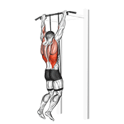
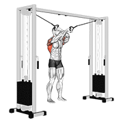
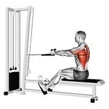
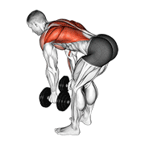
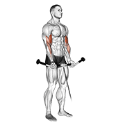
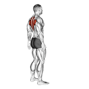
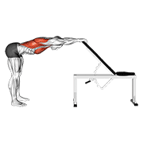
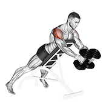

# 个人训练计划（四分化）

> **定制对象**：王振强 | 24岁 | 172cm / 69kg | 程序员
> **训练目标**：匀称塑形 / 减脂 / 体态矫正（圆肩驼背）
> **训练经验**：7-8个月 | **频率**：一周 3-4 练 | **每次时长**：~50-55分钟
> **训练地点**：商业健身房 | **模式**：四分化（背+二头 / 胸+三头 / 腿+腹 / 肩）
>
> ⚠️ **注意事项**：有轻度肩部不适，所有推类动作需注意肩关节保护。每天包含肩外旋 + 面拉矫正体态。肩日（第四天）独立出来，给肩部更充分的刺激和恢复时间。

---

## 📋 快速跳转

> 每个训练日已拆分为独立文件，方便训练时直接查看：

| 训练日 | 直达链接 | 重点肌群 |
|--------|---------|----------|
| **🔥 第一天** | [→ 背+肱二头](./training-plan/day1-back-biceps.md) | 背部 + 肩后束 + 肱二头 |
| **🔥 第二天** | [→ 胸+肱三头](./training-plan/day2-chest-triceps.md) | 胸部 + 肩前束 + 肱三头 |
| **🔥 第三天** | [→ 腿+腹](./training-plan/day3-legs-abs.md) | 下肢 + 核心 |
| **🔥 第四天** | [→ 肩](./training-plan/day4-shoulders.md) | 三角肌前中后束 |

---

## 📋 训练概览：循环模式

> **本计划不绑定星期几。** 你只需要按照「背+二头 → 胸+三头 → 腿+腹 → 肩 → 休 → …」的节奏往下推进，像日历翻页一样，练到哪天就是哪天。

### 循环节奏

```
┌──────────────────────────────────────────────────────────────────┐
│  练  ──→  休  ──→  练  ──→  休  ──→  练  ──→  休  ──→  练  ──→  休  │
│ 第1天     1天    第2天     1天    第3天     1天    第4天     1天      │
│ 背+二头    休    胸+三头    休    腿+腹     休     肩       休       │
└──────────────────────────────────────────────────────────────────┘
```

- **每次训练之间至少休息 1 天**（让肌肉恢复）
- 腿日之后如果特别累，多休一天也没问题
- 一周大概走完 **1.5 ~ 2 个循环**（3-4 练），**根据自己的精力和时间灵活安排**
- 这周忙只练了 2 次？没关系，下次进健身房接着上次的位置继续

### 四个训练日速览

| 训练日 | 重点肌群 | 动作数 | 时长 | 一句话 |
|--------|----------|--------|------|--------|
| **第1天：背+二头** | 背阔肌、中上背、后束、二头 | 4-5个 | 55min | [查看详情→](./training-plan/day1-back-biceps.md) |
| **第2天：胸+三头** | 胸大肌、前束、肱三头 | 4个 | 50min | [查看详情→](./training-plan/day2-chest-triceps.md) |
| **第3天：腿+腹** | 股四头肌、腘绳肌、臀大肌、核心 | 5个 | 55min | [查看详情→](./training-plan/day3-legs-abs.md) |
| **第4天：肩** | 三角肌前中后束 | 3-4个 | 45min | [查看详情→](./training-plan/day4-shoulders.md) |

### 循环走法

```
标准走法（练一休一）：
  背+二头 → 休 → 胸+三头 → 休 → 腿+腹 → 休 → 肩 → 休 → 循环...

忙时走法（只练3天）：
  背+二头 → 胸+三头 → 腿+腹 → 下次从肩开始 → 循环...
  （肩日顺延到下一轮的第一天）
```

> 💡 怎么知道下次练什么？**记住上次练到第几天就行了。**
> 💡 如果超过 4 天没练，建议从背+二头日重新开始——背部激活对体态最重要。

---

## 🔑 核心原则

### 体态矫正优先

作为程序员，每天久坐 10-12 小时，**圆肩驼背**是核心问题。本计划遵循以下策略：

1. **每天训练前必做肩外旋 + 面拉**：激活肩袖肌群，打开胸椎
2. **拉 > 推**：背部训练量始终大于胸部，平衡前后肌力
3. **胸肌必须拉伸**：紧张缩短的胸肌是圆肩的元凶
4. **肩部独立训练日**：第四天专攻肩部，前中后束均衡发展，避免肩部滞后
5. **肩部保护**：肩不舒服时，跳过所有过头推举，改为侧平举+前平举

### 渐进超负荷（Progressive Overload）

| 周数 | 策略 |
|------|------|
| 第 1-2 周 | 适应期，RPE 6-7（留 3-4 个 reps 余力），专注动作质量 |
| 第 3-4 周 | 增重期，RPE 7-8（留 2-3 个 reps），小幅加重 2.5-5kg |
| 第 5-6 周 | 挑战期，RPE 8-9（留 1-2 个 reps），尝试新重量 |
| 第 7 周 | **减载周**：重量降至 60-70%，组数减半，让身体恢复 |
| 第 8 周 | 新循环开始 |

### 休息规则

- **组间休息**：主项复合动作 90-120 秒，孤立动作 60-90 秒
- **训练之间**：每次训练后至少休 1 天。腿日（第3天）后如果特别酸，多休 1 天也无妨——循环不会因此「中断」，只是顺延
- **循环不重置**：哪怕休息了一周，回来也接着上次的进度走。如果断超过 10 天，建议从背+二头日重新开始让身体适应
- **减载信号**：连续两次训练感觉变弱/关节持续不适/睡眠质量下降 → 提前减载

---

## 🔥 第一天：背 + 肩后束 + 肱二头

### 一、练前拉伸/热身（5-8 分钟）

> 目标：激活肩袖、活动胸椎、预热背部肌群

#### 1.1 弹力带肩外旋


- **弹力带绑在固定物上**，肘部夹紧身体呈 90°
- 向外旋转手臂，感受肩袖后侧发力
- **2 组 × 15 次/侧**，慢速控制（2 秒外旋 + 2 秒回程）
- 🎯 关键：**肘部紧贴身体不离开**，只旋转前臂

#### 1.2 弹力带反向飞鸟


- 双手握住弹力带，手臂微屈，向两侧拉开
- 感受**后束和上背中部**的收缩
- **2 组 × 15 次**，顶峰收缩保持 1 秒
- 🎯 关键：肩胛骨主动后收，不是用手臂硬拉

#### 1.3 弹力带面拉（Face Pull）

- 弹力带固定在面部高度，正握拉向面部
- 拉到底时手掌外旋（拇指向后），肘部向外打开
- **2 组 × 15 次**
- 🎯 关键：**面拉是对抗圆肩的第一动作**，每次训练都做

#### 1.4 辅助引体向上（可选激活）



- 用弹力带辅助或器械辅助，**2 组 × 5-8 次**
- 感受背阔肌发力，不是纯靠手臂

---

### 二、正式训练动作（~40 分钟）

> ⚡ 本日采用超级组配对训练：A1/A2 主项交替做，C1/C2 二头收尾交替做。

---

#### 🔷 A1. 高位下拉（Lat Pulldown）— 主项



| 项目 | 参数 |
|------|------|
| **组数 × 次数** | 4 组 × 8-10 次 |
| **RPE** | 7-9 |
| **握法** | 宽握（比肩宽 1.5 倍） |
| **组间休息** | 90 秒 |

**动作讲解**：
1. 坐稳，大腿卡在垫子下，**挺胸沉肩**
2. 正握横杆，握距约为肩宽的 1.5 倍
3. 下拉时**想象肘部向下向后拉**，不是用手臂拽
4. 下拉时**先启动肩胛骨下沉**，再带动手臂
5. 拉到锁骨/上胸高度，顶峰收缩挤压背部 1 秒
6. 慢速放回（2-3 秒），感受背阔肌被拉伸

🎯 **重点关注**：很多人用手臂拉而背部不动——如果二头比背部先疲劳，减轻重量重新找发力感。

---

#### 🔷 A2. 坐姿绳索划船（Seated Cable Row）— 主项



| 项目 | 参数 |
|------|------|
| **组数 × 次数** | 4 组 × 8-10 次 |
| **RPE** | 7-9 |
| **握把** | V 型把手或绳索 |
| **组间休息** | 90 秒 |

**动作讲解**：
1. 坐于划船凳上，双脚踩稳踏板，膝盖微屈
2. 背部保持直立，**不弯腰、不前倾**
3. 拉向腹部时，**肘部贴近身体向后滑**，肩胛骨夹紧
4. 顶峰收缩 1 秒，慢速放回（2 秒），手臂不完全伸直以保持背部张力

🎯 **重点关注**：全程**背部始终挺直**！弯腰容易伤腰。

---

#### 🔷 B1. 单边哑铃划船（Single-Arm Dumbbell Row）— 可选



| 项目 | 参数 |
|------|------|
| **组数 × 次数** | 2 组 × 8-10 次/侧 |
| **RPE** | 7-8 |
| **组间休息** | 60-90 秒 |

> ⚠️ **可选动作**：根据当天状态决定做不做，状态好就加两组。

**动作讲解**：
1. 单手撑凳，同侧膝跪凳，另一手持哑铃
2. 背部与地面接近平行，将哑铃拉向腰部，**肘部贴近身体**
3. 顶峰收缩 1 秒，缓慢下放

🎯 **重点关注**：单侧训练能发现并纠正左右不平衡。

---

#### 🔷 C1. 坐姿绳索二头弯举（Cable Biceps Curl）— 二头



| 项目 | 参数 |
|------|------|
| **组数 × 次数** | 4 组 × 10-12 次 |
| **RPE** | 7-8 |
| **组间休息** | 60 秒 |

**动作讲解**：
1. 坐于低位龙门架前，双手正握直杆/绳索
2. 肘部贴紧身体两侧，弯举至肩高
3. 顶峰挤压二头肌 1 秒，慢速下放（2-3 秒）

🎯 **重点关注**：绳索全程提供恒定阻力，是非常好的二头训练动作。

---

#### 🔷 C2. 哑铃二头弯举（Dumbbell Biceps Curl）— 二头收尾


| 项目 | 参数 |
|------|------|
| **组数 × 次数** | 4 组 × 10-12 次/侧 |
| **RPE** | 7-8 |
| **组间休息** | 45-60 秒 |

**动作讲解**：
1. 站姿或坐姿，肘部固定，**不要摆动借力**
2. 弯举至顶峰挤压二头肌 1 秒，慢速下放（2-3 秒）

🎯 **重点关注**：身体晃动 → 重量太大。**控制和离心比重量更重要**。

---

### 三、练后拉伸（5 分钟）

#### 3.1 背阔肌拉伸


- 跪姿或站姿，双手抓住固定物，臀部向后坐
- **每侧保持 30 秒 × 2 组**

#### 3.2 上背拉伸



- 双手交叉于胸前，拱背含胸
- **保持 30 秒 × 2 组**

#### 3.3 胸背拉伸



- 双手背后交叉，肩胛骨向后夹紧，抬头挺胸
- **保持 20 秒，做 3 次**

---

## 🔥 第二天：胸 + 肩前束 + 肱三头

### 一、练前拉伸/热身（5-8 分钟）

> ⚠️ 推日热身尤其重要！肩膀有不适时更要充分热身。

#### 1.1 弹力带肩外旋


- **3 组 × 15 次/侧**（推日多加一组保护肩袖）

#### 1.2 胸部动态拉伸


- 双手向两侧展开，动态向后伸展
- **1 组 × 10 次**，逐渐加大幅度

#### 1.3 弹力带反向飞鸟


- **2 组 × 15 次**（推前激活后侧稳定肩胛骨）

#### 1.4 弹力带面拉（Face Pull）

- **2 组 × 15 次**（同第一天）

---

### 二、正式训练动作（~38 分钟）

---

#### 🔷 A1. 仰卧杠铃推胸（Barbell Bench Press）— 主项


| 项目 | 参数 |
|------|------|
| **组数 × 次数** | 4 组 × 8-10 次 |
| **RPE** | 7-9 |
| **握距** | 略宽于肩（约 1.5 倍肩宽） |
| **组间休息** | 90 秒 |

> ⚠️ 如果杠铃推胸时肩关节不适 → 改为器械推胸，轨迹固定更安全。

**动作讲解**：
1. 仰卧，眼睛位于杠铃正下方，双脚踩实地面
2. **肩胛骨后收下沉**贴紧凳子
3. 下放至胸部下缘，**手肘与身体呈约 45-60°**（不要打得太开！）
4. 推起时胸肌发力，手臂接近伸直但不锁死
5. 全程**肩胛骨保持后收**，不要耸肩

🎯 **重点关注**：手肘角度是关键！打开到 90° 会给肩关节前侧巨大压力。

---

#### 🔷 A2. 器械上斜推胸（Incline Chest Press）— 上胸


| 项目 | 参数 |
|------|------|
| **组数 × 次数** | 4 组 × 8-10 次 |
| **RPE** | 7-8 |
| **角度** | 30-45° |
| **组间休息** | 75-90 秒 |

**动作讲解**：
1. 角度约 30-45°，发力轨迹朝向前上方
2. 推到顶端感受**上胸肌**收缩
3. 回程控制，不要反弹。**角度不要超过 45°**（否则变练肩前束）

🎯 **重点关注**：久坐族上胸普遍偏弱，上胸发展好体态更挺拔。

---

#### 🔷 B1. 龙门架直杆下压（Straight Bar Tricep Pushdown）— 三头


| 项目 | 参数 |
|------|------|
| **组数 × 次数** | 4 组 × 10-12 次 |
| **RPE** | 7-8 |
| **组间休息** | 60 秒 |

**动作讲解**：
1. 站于高位龙门架前，正握直杆
2. **肘部紧贴身体两侧**，下压至手臂伸直
3. 顶峰停顿 1 秒，回程时前臂回到约 90°
4. **全程肘部不移动**

🎯 **重点关注**：肘部固定是唯一要点，前后摆动就是借力。

---

#### 🔷 B2. 过顶三头臂屈伸（Overhead Tricep Extension）— 三头长头


| 项目 | 参数 |
|------|------|
| **组数 × 次数** | 4 组 × 10-12 次 |
| **RPE** | 6-8 |
| **组间休息** | 45-60 秒 |

**动作讲解**：
1. 背对龙门架，双手拉绳索过头
2. 从颈后向前伸展手臂，感受三头肌长头收缩
3. 手臂伸直后停顿 1 秒，慢速回到起始位

🎯 **重点关注**：长头是三头肌中体积最大的部分。不要用太重，否则容易耸肩借力。

---

### 三、练后拉伸（5 分钟）

#### 3.1 胸部拉伸


- **保持 30 秒 × 2 组**

#### 3.2 胸部与肩前拉伸


- 手扶墙或门框，身体前倾旋转
- **每侧保持 30 秒 × 2 组**

> 🎯 推日后胸肌拉伸极其重要！紧张的胸肌会加重圆肩。**多做 1 组拉伸，比多练 1 组推胸更有价值**。

#### 3.3 三头肌拉伸

- 手臂上举屈肘，另一只手拉肘部向后
- **每侧保持 30 秒 × 2 组**

---

## 🔥 第三天：腿 + 腹

### 一、练前拉伸/热身（5-8 分钟）

> 腿日热身重点是**打开髋关节 + 激活臀部**，久坐族的髋屈肌通常很紧。

#### 1.1 自重深蹲（预热动作模式）


- 不负重，仅做动作模式预热
- 缓慢下蹲，底部停顿 2 秒
- **1 组 × 10 次**

#### 1.2 弹力带臀桥（激活臀部）

- 弹力带套在膝盖上方，仰卧做臀桥
- 膝盖向外对抗弹力带，激活臀中肌
- **2 组 × 15 次**

#### 1.3 弹力带肩外旋


- **2 组 × 15 次/侧**（每天做！）

#### 1.4 腿摆动（动态拉伸髋关节）

- 手扶固定物，单腿前后/左右摆动
- **前后 × 10 次/侧 + 左右 × 10 次/侧**

---

### 二、正式训练动作（~40 分钟）

> ⚡ 本日强调单侧训练和自由重量——单腿动作能发现并纠正左右不平衡。

---

#### 🔷 A1. 单腿哑铃硬拉 / 哑铃保加利亚蹲（二选一）— 主项

> 💡 **两个动作选一个做**，建议每次训练轮换。

**选项一：单腿哑铃硬拉（Single-Leg Dumbbell RDL）**


| 项目 | 参数 |
|------|------|
| **组数 × 次数** | 4 组 × 10-12 次/侧 |
| **RPE** | 7-8 |
| **组间休息** | 75-90 秒 |

**动作讲解**：
1. 单手持哑铃（对侧手），同侧腿支撑
2. 支撑腿膝盖微屈，臀部向后推，另一条腿向后伸展
3. 哑铃沿支撑腿前侧下滑，背部全程挺直
4. 臀部收紧发力回到起始位

🎯 **重点关注**：单腿硬拉是髋关节稳定性的终极测试。**全程背部挺直**，平衡不了先扶墙。

**选项二：哑铃保加利亚蹲（Bulgarian Split Squat）**


| 项目 | 参数 |
|------|------|
| **组数 × 次数** | 4 组 × 10-12 次/侧 |
| **RPE** | 7-9 |
| **组间休息** | 90 秒 |

**动作讲解**：
1. 后脚搭在凳子上，前脚站距约一步远
2. 双手持哑铃，身体直立，核心收紧
3. 缓慢下蹲到大腿与地面平行，前侧膝盖不要内扣
4. 前侧腿发力站起

🎯 **重点关注**：先自重掌握平衡再加哑铃。**这个动作很累但效果非常好**。

---

#### 🔷 B1. 哑铃酒杯深蹲（Goblet Squat）— 辅助


| 项目 | 参数 |
|------|------|
| **组数 × 次数** | 4 组 × 10-12 次 |
| **RPE** | 7-8 |
| **组间休息** | 75-90 秒 |

**动作讲解**：
1. 双手托哑铃置于胸前（像捧酒杯），双脚略宽于肩
2. **挺胸、收紧核心**，手肘在膝盖内侧
3. 缓慢下蹲，手肘轻推膝盖外侧帮助打开髋关节
4. 大腿至少蹲到与地面平行，站起时臀部主动发力

🎯 **重点关注**：胸前负重自然帮你保持躯干直立。蹲不下去在脚后跟垫杠铃片。

---

#### 🔷 B2. 山羊挺身（Back Extension）— 下背 + 臀

| 项目 | 参数 |
|------|------|
| **组数 × 次数** | 3 组 × 10-12 次 |
| **RPE** | 6-8 |
| **组间休息** | 60 秒 |

**动作讲解**：
1. 调整罗马椅使髋部卡在垫子前沿
2. 身体呈一条直线，双手交叉于胸前
3. 缓慢下放，臀部和下背发力抬起
4. 抬到身体呈直线即可，**不要过度反弓腰椎**

🎯 **重点关注**：强大的后链是预防腰痛的关键。发力时用臀部而不是腰椎推起来。

---

#### 🔷 C1. 平板卷腹（Crunch）— 腹直肌

| 项目 | 参数 |
|------|------|
| **组数 × 次数** | 3 组 × 10-12 次 |
| **RPE** | 7-8 |
| **组间休息** | 45-60 秒 |

**动作讲解**：
1. 仰卧屈膝，双手交叉胸前（不要抱头拉脖子）
2. 腹部发力卷起上半身，肩胛骨离开地面即可
3. 顶峰收缩 1 秒，慢速下放

🎯 **重点关注**：用腹部发力，不是用脖子和惯性。幅度不用大。

---

#### 🔷 C2. 悬垂举腿（Hanging Leg Raise）— 腹直肌下部

| 项目 | 参数 |
|------|------|
| **组数 × 次数** | 3 组 × 10-12 次 |
| **RPE** | 7-9 |
| **组间休息** | 60 秒 |

**动作讲解**：
1. 双手正握单杠，身体悬垂
2. 腹部发力将腿抬起，至少到与地面平行
3. 顶峰收缩 1 秒，**慢速下放**（不要自由落体）

🎯 **重点关注**：不要摆动借力。控制不住先做屈膝版本。下放越慢刺激越强。

---

### 三、练后拉伸（5 分钟）

#### 3.1 股四头肌拉伸


- 站姿或跪姿，脚后跟拉向臀部，**膝盖不要外展**
- **每侧保持 30 秒 × 2 组**

#### 3.2 腘绳肌拉伸


- 坐姿单腿前伸，身体前倾，**不要弓背**
- **每侧保持 30 秒 × 2 组**

#### 3.3 臀大肌拉伸


- 脚踝搭在另一侧膝盖上，身体前倾
- **每侧保持 30 秒 × 2 组**

#### 3.4 梨状肌拉伸


- 深层臀部拉伸，对久坐族非常重要
- **每侧保持 30 秒 × 2 组**

---

## 🔥 第四天：肩（前束 + 中束 + 后束）

> 🆕 **全新独立肩日！** 从三分化中拆出，给肩部更充分的刺激和恢复时间。目标是打造立体饱满的「3D 肩」。

### 一、练前拉伸/热身（5-8 分钟）

> 肩日热身比其他日子更关键！肩关节灵活性好但稳定性差，必须充分预热。

#### 1.1 弹力带肩外旋


- **3 组 × 15 次/侧**（肩日多加一组！）
- 动作同其他训练日

#### 1.2 弹力带反向飞鸟


- **2 组 × 15 次**

#### 1.3 弹力带面拉（Face Pull）

- **2 组 × 15 次**
- 🎯 肩日热身的核心！激活后束的同时稳定肩关节

#### 1.4 手臂画圈（肩关节润滑）

- 双臂侧平举，做小幅度画圈
- 顺时针 10 次 + 逆时针 10 次，**1-2 组**

---

### 二、正式训练动作（~35 分钟）

> ⚡ 按照前束 → 中束 → 后束顺序，全程控制优先，宁轻勿重。

---

#### 🔷 A1. 哑铃推举（Dumbbell Shoulder Press）— 前束主项


| 项目 | 参数 |
|------|------|
| **组数 × 次数** | 4 组 × 10-12 次 |
| **RPE** | 7-8 |
| **组间休息** | 75-90 秒 |

> ⚠️ 推举时肩关节刺痛 → 立即停止，改为多做两组侧平举。

**动作讲解**：
1. 坐于凳子上（最好有靠背），双手持哑铃于肩膀高度
2. 掌心朝前，肘部在身体前方（不是完全侧开）
3. 上推至头顶，**不要完全锁死肘关节**
4. 下放控制（2-3 秒），手肘下放到约耳朵高度

🎯 **重点关注**：如果肩膀感觉不好，用轻重量做 15-20 次高次数即可。

---

#### 🔷 A2. 哑铃前平举（Dumbbell Front Raise）— 前束

| 项目 | 参数 |
|------|------|
| **组数 × 次数** | 4 组 × 10-12 次 |
| **RPE** | 6-8 |
| **组间休息** | 60 秒 |

**动作讲解**：
1. 站姿，双手持哑铃放于大腿前方
2. 手臂微屈，将哑铃向前上方抬起至与肩同高
3. 顶峰收缩 1 秒，慢速下放（2-3 秒）
4. **不要借力摆动**，建议交替单手做减少借力

🎯 **重点关注**：前束在推胸日已有参与，用轻重量 + 高控制即可。

---

#### 🔷 B1. 哑铃飞鸟 / 侧平举（Lateral Raise）— 中束


| 项目 | 参数 |
|------|------|
| **组数 × 次数** | 4 组 × 10-12 次 |
| **RPE** | 6-8 |
| **组间休息** | 60 秒 |

**动作讲解**：
1. 双手持轻哑铃（**2-5kg 起步**），手臂微屈
2. 从身体两侧抬起至与地面平行，想象**倒水壶**——小拇指侧略高
3. 顶峰保持 1 秒，慢速下放（2-3 秒）
4. **抬起时肘部先于手腕启动**，不要耸肩

🎯 **重点关注**：2kg 完美控制 > 8kg 甩上去。**中束是肩膀宽度的关键**。

---

#### 🔷 B2. 蝴蝶机反向飞鸟 / 绳索面拉（二选一）— 后束

> 💡 **两个动作选一个做**，建议交替使用。

**选项一：蝴蝶机反向飞鸟（Pec Deck Reverse Fly）**



| 项目 | 参数 |
|------|------|
| **组数 × 次数** | 4 组 × 10-12 次 |
| **RPE** | 6-8 |
| **组间休息** | 60 秒 |

**动作讲解**：
1. 调整座椅使握把与肩膀同高，手臂微屈向正后方展开
2. 顶峰时**肩胛骨用力夹紧**，保持 1 秒，慢速回程
3. 不要耸肩，不要用上背代偿

🎯 **重点关注**：蝴蝶机轨迹固定，比哑铃更容易找到后束发力感。

**选项二：绳索面拉（Cable Face Pull）**

| 项目 | 参数 |
|------|------|
| **组数 × 次数** | 4 组 × 10-12 次 |
| **RPE** | 6-8 |
| **组间休息** | 60 秒 |

**动作讲解**：
1. 龙门架前，绳索调至面部高度，正握拉向面部
2. 拉到脸前时手掌外旋（拇指向后），肘部向外打开
3. 顶峰感受**后束 + 上背 + 肩袖**的全面收缩
4. 慢速放回，手臂不完全伸直

🎯 **重点关注**：面拉不仅是后束训练，更是肩关节健康的保障动作。

---

### 三、练后拉伸（5 分钟）

#### 3.1 肩前束拉伸


- 手扶墙或门框，身体前倾旋转
- **每侧保持 30 秒 × 2 组**

#### 3.2 肩后束拉伸

- 一只手臂横过胸前，另一只手勾住肘部轻拉
- **每侧保持 30 秒 × 2 组**

#### 3.3 肩中束拉伸

- 一只手臂向对侧斜下方伸展，另一只手轻压肘部
- **每侧保持 30 秒 × 2 组**

#### 3.4 背阔肌拉伸


- **每侧保持 30 秒 × 2 组**

---

## 🛡️ 肩膀保护专项指南

> 因为你提到「有点肩膀疼」，以下是整个训练周期中必须遵守的肩部保护策略：

| 规则 | 说明 |
|------|------|
| **每天做面拉 + 肩外旋** | 两个动作是肩关节的「保险」，越多越好 |
| **推类动作手肘不要超过身体平面** | 卧推/推胸时，杠铃下放太深会让肩关节前侧承受巨大压力 |
| **推肩时不要完全锁死肘关节** | 锁死 = 压力从肌肉转移到关节 |
| **肩疼立即停止** | 不要「忍着练」，找出原因再调整 |
| **弹力带热身比你想的重要** | 肩袖肌群血流量低，不充分热身容易受伤 |
| **加强中下斜方肌** | 面拉、反向飞鸟、划船——拉>推 |
| **肩日控制优先** | 肩关节不是承重关节，所有动作宁轻勿重 |

---

## 📈 动作替换表

> 如果身体不适或器材被占，可以用以下等价动作替换：

| 原始动作 | 替换动作 A | 替换动作 B |
|----------|-----------|-----------|
| 高位下拉 | 引体向上（辅助/自重） | 器械高位下拉（不同握把） |
| 坐姿绳索划船 | 器械划船 | 哑铃单臂划船 |
| 仰卧杠铃推胸 | 器械推胸 | 哑铃卧推（注意肩膀） |
| 器械上斜推胸 | 哑铃上斜推胸 | 绳索夹上胸 |
| 单腿哑铃硬拉 | 哑铃罗马尼亚硬拉（双腿） | 器械腿弯举 |
| 哑铃保加利亚蹲 | 哑铃弓步走 | 腿举 |
| 哑铃酒杯深蹲 | 史密斯深蹲 | 器械哈克深蹲 |
| 哑铃推举 | 器械推肩 | 杠铃推肩（轻重量） |
| 哑铃侧平举 | 绳索侧平举 | 器械侧平举 |

---

## 🍽️ 饮食配合提示

> 详细的饮食计划见 [饮食计划](./diet.md)

- **训练前（30-60 分钟）**：快碳 + 少量蛋白质（如：全麦吐司 1 片 + 香蕉半根）
- **训练后（30 分钟内）**：蛋白质 + 快碳（如：蛋白粉 1 勺 + 香蕉 1 根）
- **补剂**：一水肌酸每日 3-5g，坚持服用（不需要停用期）
- **每日饮水量**：目前 1500ml 偏少，建议提升到 **2000-2500ml**

---

## 📊 进度追踪

> 建议每走完一轮循环后回顾一次，每 2-3 个月拍照对比。

| 维度 | 记录方式 |
|------|----------|
| **体重** | 每天早上空腹测量，每周取平均值 |
| **力量进步** | 每次记录主项重量 × 次数，走完一轮循环后比较是否进步 |
| **体态变化** | 侧面拍照，观察圆肩程度、头前伸角度 |
| **肩部感受** | 训练日志中写一句：训练后肩膀是否不适（0-10 分） |
| **循环追踪** | 简单记「今天第X天」，下次来就知道该练什么了 |

---

> 📅 **计划制定日期**：2026-07-23
> 🔄 **下次更新时间**：4 周后（2026-08-20）或身体有明显变化时
> 💬 **训练日志记录**：建议用手机备忘录或 Notion，记两件事：**① 今天第几天 ② 主项重量/次数**
