# 第二天：推日（胸部 + 肩部 + 三头）

> **训练目标**：胸大肌、三角肌前中束、肱三头肌
> **训练时长**：~60 分钟 | **组间休息**：主项 90s，辅助 60s
> **注意事项**：有轻度肩部不适，热身务必充分。肩疼立即停止，降低重量或换动作

---

## 一、练前热身（5-8 分钟）

> 目标：激活肩袖、打开胸椎、预热上肢

### 1.1 弹力带肩外旋

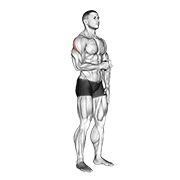

| 阶段 | 说明 |
|------|------|
| **收缩** | 肘部夹紧 90°，手臂向外旋转，感受肩袖后侧收紧 |
| **伸展** | 缓慢回到起始位，感受肩袖前侧的轻微拉伸 |

- 弹力带绑在固定物上，肘部夹紧身体呈 **90°**
- 向外旋转手臂，感受肩袖后侧发力
- **2 组 × 15 次/侧**，慢速控制

### 1.2 胸部动态拉伸

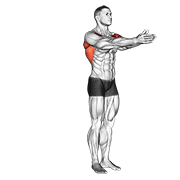

| 阶段 | 说明 |
|------|------|
| **收缩** | 双手向后展开，胸肌收缩 |
| **伸展** | 双手向前合拢，感受胸肌拉伸 |

- 双手向两侧展开，动态向后伸展
- 感受胸肌和肩前部的拉伸
- **1 组 × 10 次**，逐渐加大幅度

### 1.3 弹力带反向飞鸟

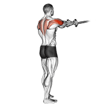

- 双手握住弹力带，手臂微屈，向两侧拉开
- 激活**后束和上背中部**
- **2 组 × 15 次**

### 1.4 弹力带面拉（Face Pull）

- 弹力带固定在面部高度，正握拉向面部
- 拉到底时手掌外旋（拇指向后），肘部向外打开
- **2 组 × 15 次**
- 🎯 **面拉是对抗圆肩的第一动作，推日必做！**

---

## 二、正式训练（~45 分钟）

> **💡 A1/A2、B1/B2、C1/C2 是什么意思？**
>
> 同字母的**全部都要练**，不是选一个。这是**超级组（Super Set）** 配对交替做：
> ```
> A1（做完1组）→ 休息 → A2（做完1组）→ 休息 → A1（第2组）→ 休息 → A2（第2组）→ ……
> ```
> 这样安排能**节约时间**（交替做省去等待肌肉恢复的时间），同时让同一肌群得到更集中的刺激。
>
> **详细说明**：
> - **A 组**（主项，4 组）：大重量复合动作，练最大力量
> - **B 组**（辅助，3 组）：轻重量针对性训练，增加训练量
> - **C 组**（收尾，3 组）：孤立动作，榨干最后一点力

### 🟦 A1. 器械推胸（Chest Press Machine）— 主项

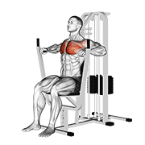

| | |
|------|------|
| **组数 × 次数** | 4 组 × 8-12 次 |
| **RPE** | 7-9 |
| **组间休息** | 90 秒 |

**动作讲解**：
1. 调整座椅高度，使**握把与胸部下缘对齐**（非肩膀高度）
2. 背部贴紧靠垫，肩胛骨后收下沉，**不要耸肩**
3. 推起时胸肌发力，手臂接近伸直但不锁死肘关节
4. 回程控制（2-3 秒），手肘不超过身体平面

> 🎯 **重点关注**：选择器械而非杠铃卧推——肩部有不适时器械轨迹固定更安全。

---

### 🟦 A2. 上斜器械推胸（Incline Chest Press）— 上胸

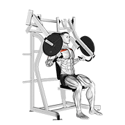

| | |
|------|------|
| **组数 × 次数** | 3 组 × 10-12 次 |
| **RPE** | 7-8 |
| **组间休息** | 75-90 秒 |

**动作讲解**：
1. 使用上斜推胸器械，角度约 **30-45°**
2. 发力轨迹朝向前上方，推到顶端感受**上胸肌**收缩
3. 回程控制，不要借助反弹力

> 🎯 **重点关注**：久坐族的上胸普遍偏弱。上胸练好了，侧面看胸部更饱满，体态也更挺拔。

---

### 🟩 B1. 器械推肩（Shoulder Press Machine）— 肩部主项

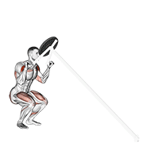

| | |
|------|------|
| **组数 × 次数** | 3 组 × 10-12 次 |
| **RPE** | 6-8 |
| **组间休息** | 75 秒 |

> ⚠️ 如果推肩时肩关节有刺痛或弹响伴随疼痛 → **立即停止**，改为多做两组侧平举。

**动作讲解**：
1. 握把与肩膀高度对齐，上推时避免完全锁死肘关节
2. 下放时手肘不超过肩膀平面以下（减少肩关节压力）
3. 全程控制，肩胛骨保持稳定

> 🎯 **重点关注**：今天肩膀感觉不好？用轻重量做 15-20 次高次数即可。

---

### 🟩 B2. 哑铃侧平举（Lateral Raise）— 中束

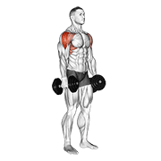

| 阶段 | 说明 |
|------|------|
| **收缩** | 手臂抬起至与地面平行，三角肌中束收紧 |
| **伸展** | 慢速下放，感受中束的拉伸 |

| | |
|------|------|
| **组数 × 次数** | 3 组 × 12-15 次 |
| **RPE** | 6-8 |
| **组间休息** | 60 秒 |

**动作讲解**：
1. 双手持轻哑铃（**2-5kg 起步**），手臂微屈
2. 从身体两侧抬起至与地面平行，想象**倒水壶**——小拇指侧略高
3. 顶峰保持 1 秒，慢速下放（2-3 秒）
4. **不要借力摆动！**抬起时肘部先于手腕启动

> 🎯 **重点关注**：侧平举是最容易借力的动作。用 2kg 做到完美控制，比用 8kg 甩上去有效 10 倍。

---

### 🟪 C1. 绳索下压（Tricep Pushdown）— 三头

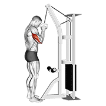

| 阶段 | 说明 |
|------|------|
| **收缩** | 手臂伸直下压，三头肌收紧 |
| **伸展** | 回程至前臂约 90°，感受三头肌拉伸 |

| | |
|------|------|
| **组数 × 次数** | 3 组 × 12-15 次 |
| **RPE** | 7-8 |
| **组间休息** | 60 秒 |

**动作讲解**：
1. 站于高位龙门架前，正握直杆或绳索
2. **肘部紧贴身体两侧**，下压至手臂伸直
3. 顶峰停顿 1 秒，回程时前臂回到约 90°
4. **全程肘部不移动**

> 🎯 **重点关注**：肘部前后摆动就是借力。肘部固定是唯一要点。

---

### 🟪 C2. 绳索过头臂屈伸（Overhead Tricep Extension）— 三头长头

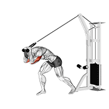

| | |
|------|------|
| **组数 × 次数** | 3 组 × 12-15 次 |
| **RPE** | 6-8 |
| **组间休息** | 45-60 秒 |

**动作讲解**：
1. 背对龙门架，双手拉绳索过头
2. 从颈后向前伸展手臂，感受**三头肌长头**的收缩
3. 手臂伸直后停顿 1 秒，慢速回到起始位

> 🎯 **重点关注**：长头是三头肌中体积最大的部分。不要用太重，否则容易耸肩借力。

---

## 三、练后拉伸（5 分钟）

> 目标：放松胸肌、肩前束，改善圆肩

### 3.1 胸部拉伸


| 阶段 | 说明 |
|------|------|
| **拉伸** | 双手向后展开，胸部向前挺，感受胸大肌拉伸 |

- **保持 30 秒 × 2 组**

### 3.2 胸部与肩前拉伸

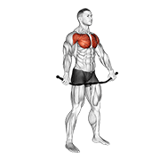

| 阶段 | 说明 |
|------|------|
| **拉伸** | 手扶墙/门框，身体前倾旋转，胸肌和肩前束被拉长 |

- 手扶墙或门框，身体前倾旋转
- 感受胸肌和三角肌前束的拉伸
- **每侧保持 30 秒 × 2 组**

### 3.3 背阔肌拉伸

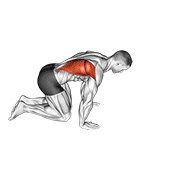

| 阶段 | 说明 |
|------|------|
| **拉伸** | 臀部向后坐，背阔肌被充分拉开 |

- 跪姿或站姿，双手抓住固定物，臀部向后坐
- **每侧保持 30 秒 × 2 组**

---

## 📌 推日小贴士

- **肩部保护**：推肩时有不适 → 立刻停止，换侧平举/前平举
- **胸肌拉伸**：推日后紧张的胸肌会加重圆肩，**拉伸比训练更重要**
- **呼吸**：发力时呼气，回程时吸气
- **渐进超负荷**：记录每次的主项重量和次数，下次争取突破

---

> 📅 **本文件对应**：三分化训练 - 第二天（推日）
> 🔄 **循环方式**：拉 → 推 → 腿 → 休 → 拉 → 推 → 腿 → 休 → …