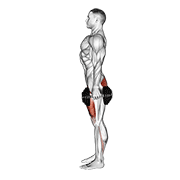
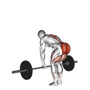
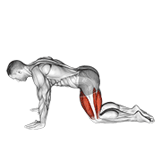
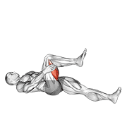
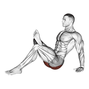
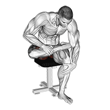

# 第三天：腿 + 腹

> **训练目标**：股四头肌、腘绳肌、臀大肌、下背、核心
> **训练时长**：~55 分钟 | **组间休息**：主项 90-120s，辅助 60-75s
> **注意事项**：腿日是最累的一天，训练后务必充分拉伸！练完腿如果特别累，多休一天也没问题

---

## 一、练前热身（5-8 分钟）

> 目标：打开髋关节、激活臀部——久坐族的髋屈肌和臀肌通常很紧

### 1.1 自重深蹲（预热动作模式）

| 阶段 | 说明 |
|------|------|
| **收缩** | 站起时臀部收紧，股四头肌发力 |
| **伸展** | 下蹲时髋关节、膝关节弯曲，感受大腿和臀部拉伸 |

- 不负重，仅做动作模式预热
- 手臂前伸保持平衡，缓慢下蹲，底部停顿 2 秒
- **1 组 × 10 次**

### 1.2 弹力带臀桥（激活臀部）

- 弹力带套在膝盖上方，仰卧做臀桥
- 膝盖向外对抗弹力带，激活臀中肌
- **2 组 × 15 次**

### 1.3 弹力带肩外旋

- **2 组 × 15 次/侧**（每天做！）

### 1.4 腿摆动（动态拉伸髋关节）

- 手扶固定物，单腿前后/左右摆动
- **前后 × 10 次/侧 + 左右 × 10 次/侧**

---

## 二、正式训练（~40 分钟）

> **💡 训练安排说明**
>
> 本日的动作选择强调**单侧训练**和**自由重量**——单腿动作能发现并纠正左右不平衡，对久坐族的髋关节稳定性极有帮助。
>
> - **A 组**（主项，4 组）：单侧下肢复合动作，选一个做
> - **B 组**（辅助，4 组）：深蹲 + 后链
> - **C 组**（核心，3 组）：腹部训练

### 🟦 A1. 单腿哑铃硬拉 / 哑铃保加利亚蹲（二选一）— 主项

> 💡 **两个动作选一个做**，建议每次训练轮换，全面刺激下肢。

---

#### 选项一：单腿哑铃硬拉（Single-Leg Dumbbell RDL）

| 阶段 | 说明 |
|------|------|
| **收缩** | 站起时臀部收紧、腘绳肌发力 |
| **伸展** | 下放时哑铃沿支撑腿下滑，腘绳肌被强烈拉伸 |

| | |
|------|------|
| **组数 × 次数** | 4 组 × 10-12 次/侧 |
| **RPE** | 7-8 |
| **组间休息** | 75-90 秒 |

**动作讲解**：
1. 单手持哑铃（对侧手），同侧腿支撑站立
2. **支撑腿膝盖微屈不锁死**，臀部向后推
3. 另一条腿向后伸展保持平衡，背部全程挺直
4. 哑铃沿支撑腿前侧下滑，下降到腘绳肌感到强烈拉伸
5. 臀部收紧发力回到起始位

> 🎯 **重点关注**：单腿硬拉是髋关节稳定性的终极测试！**全程背部挺直**，如果平衡不了先扶墙或减轻重量。这个动作对改善「臀肌失忆」和左右不平衡极有帮助。

---

#### 选项二：哑铃保加利亚蹲（Bulgarian Split Squat）

| 阶段 | 说明 |
|------|------|
| **收缩** | 站起时前侧腿股四头肌和臀大肌收紧 |
| **伸展** | 下蹲时前侧大腿和臀部被拉伸 |

| | |
|------|------|
| **组数 × 次数** | 4 组 × 10-12 次/侧 |
| **RPE** | 7-9 |
| **组间休息** | 90 秒 |

**动作讲解**：
1. 后脚搭在凳子上（约膝盖高度），前脚站距约一步远
2. 双手各持哑铃放于身体两侧
3. 身体直立，核心收紧，缓慢下蹲
4. 前侧大腿蹲到与地面平行，**膝盖不要超过脚尖太多**
5. 前侧腿发力站起，全程身体不要前倾

> 🎯 **重点关注**：保加利亚蹲是下肢训练的「噩梦动作」——效果好但非常累。**先自重掌握平衡**，再加哑铃。前侧膝盖方向与脚尖一致，不要内扣。

---

### 🟩 B1. 哑铃酒杯深蹲（Goblet Squat）— 辅助

| 阶段 | 说明 |
|------|------|
| **收缩** | 站起时股四头肌、臀大肌收紧 |
| **伸展** | 下蹲时大腿后侧和臀部被拉伸，髋关节折叠 |

| | |
|------|------|
| **组数 × 次数** | 4 组 × 10-12 次 |
| **RPE** | 7-8 |
| **组间休息** | 75-90 秒 |

**动作讲解**：
1. 双手托住一个哑铃置于胸前（像捧一个酒杯），双脚略宽于肩，脚尖微外八
2. **挺胸、收紧核心**，手肘在膝盖内侧
3. 缓慢下蹲，手肘轻轻推膝盖外侧帮助打开髋关节
4. 大腿至少蹲到与地面平行，底部停顿 1 秒
5. 站起时臀部主动发力，膝盖不要内扣

> 🎯 **重点关注**：酒杯深蹲是最友好的深蹲变式——胸前负重自然帮你保持躯干直立。**蹲不下去？在脚后跟垫 2.5kg 杠铃片**。这个动作也是学习正确深蹲模式的绝佳工具。

---

### 🟩 B2. 山羊挺身（Back Extension）— 下背 + 臀

| 阶段 | 说明 |
|------|------|
| **收缩** | 抬起上半身，下背和臀部收紧 |
| **伸展** | 缓慢下放，下背和腘绳肌被拉伸 |

| | |
|------|------|
| **组数 × 次数** | 3 组 × 10-12 次 |
| **RPE** | 6-8 |
| **组间休息** | 60 秒 |

**动作讲解**：
1. 调整罗马椅使髋部刚好卡在垫子前沿（上半身可以自由活动）
2. 身体呈一条直线，双手交叉于胸前（或抱一片杠铃片增加负重）
3. 缓慢下放上半身，感受下背和腘绳肌的拉伸
4. 臀部和下背发力将身体抬起，**不要过度反弓腰椎**
5. 抬到身体呈一条直线即可，不要超过水平面

> 🎯 **重点关注**：山羊挺身强化下背和臀大肌——强大的后链是预防腰痛的关键。**控制幅度，不要过度反弓**。发力时想象用臀部而不是腰椎把身体推起来。

---

### 🟪 C1. 平板卷腹（Crunch）— 腹直肌

| 阶段 | 说明 |
|------|------|
| **收缩** | 卷起上半身，腹直肌收紧 |
| **伸展** | 缓慢下放，腹肌被拉伸但不完全放松 |

| | |
|------|------|
| **组数 × 次数** | 3 组 × 10-12 次 |
| **RPE** | 7-8 |
| **组间休息** | 45-60 秒 |

**动作讲解**：
1. 仰卧，膝盖弯曲，双脚踩地
2. 双手交叉于胸前或轻放于耳侧（不要抱头用力拉脖子）
3. 腹部发力将上半身卷起，**下巴不要贴胸**
4. 卷到肩胛骨离开地面即可（不需要坐起来）
5. 顶峰收缩腹肌 1 秒，慢速下放

> 🎯 **重点关注**：卷腹的关键是**用腹部发力**，不是用脖子和惯性。幅度不用大，感受腹肌的收缩比次数更重要。

---

### 🟪 C2. 悬垂举腿（Hanging Leg Raise）— 腹直肌下部

| 阶段 | 说明 |
|------|------|
| **收缩** | 抬腿至与地面平行或更高，下腹部收紧 |
| **伸展** | 慢速下放，腹部始终保持张力 |

| | |
|------|------|
| **组数 × 次数** | 3 组 × 10-12 次 |
| **RPE** | 7-9 |
| **组间休息** | 60 秒 |

**动作讲解**：
1. 双手正握单杠，身体悬垂，肩胛骨下沉
2. 核心收紧，双腿并拢，膝盖微屈或伸直
3. 腹部发力将腿抬起，至少抬到与地面平行
4. 顶峰收缩 1 秒，**慢速下放**（不要自由落体）
5. 全程身体不要摆动借力

> 🎯 **重点关注**：悬垂举腿是下腹部的王牌动作。**不要摆动借力**——如果控制不住，先做屈膝版本（膝盖抬到胸口）。下放越慢，刺激越强。

---

## 三、练后拉伸（5 分钟）

> 目标：放松下肢肌群，缓解腿日后的酸痛

### 3.1 股四头肌拉伸

| 阶段 | 说明 |
|------|------|
| **拉伸** | 脚后跟拉向臀部，股四头肌被拉长，膝盖不要外展 |

- 站姿或跪姿，将脚后跟拉向臀部
- **双膝保持并拢**，不要外展
- **每侧保持 30 秒 × 2 组**

### 3.2 腘绳肌拉伸

| 阶段 | 说明 |
|------|------|
| **拉伸** | 身体前倾，单腿前伸，大腿后侧被拉长，注意不弓背 |

- 坐姿或站姿，单腿前伸脚尖朝上
- 身体前倾，感受大腿后侧拉伸
- **每侧保持 30 秒 × 2 组**

### 3.3 臀大肌拉伸

| 阶段 | 说明 |
|------|------|
| **拉伸** | 脚踝搭在另一侧膝盖上，身体前倾，臀部外侧被拉长 |

- 坐姿，一只脚踝搭在另一侧膝盖上
- 身体前倾，感受臀部外侧拉伸
- **每侧保持 30 秒 × 2 组**

### 3.4 梨状肌拉伸

| 阶段 | 说明 |
|------|------|
| **拉伸** | 深层的臀部拉伸，对久坐族非常重要，缓解坐骨神经压力 |

- **每侧保持 30 秒 × 2 组**

---

## 📌 腿+腹日小贴士

- **热身充分**：腿日是消耗最大的训练日，髋关节和膝关节需要充分预热
- **膝盖保护**：深蹲时膝盖与脚尖方向一致，不要内扣
- **单侧优先**：本日强调单侧训练，能有效发现和纠正左右不平衡
- **呼吸**：下蹲时吸气，站起时呼气；大重量时用瓦式呼吸
- **练后吃饭**：腿日消耗最大，练后 30 分钟内补充蛋白质 + 快碳
- **恢复**：腿日后如果特别累，多休一天完全没问题

---

> 📅 **本文件对应**：四分化训练 - 第三天（腿+腹）
> 🔄 **循环方式**：背+二头 → 胸+三头 → 腿+腹 → 肩 → 休 → 循环…
