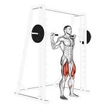
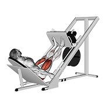
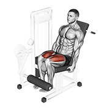
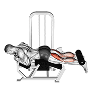
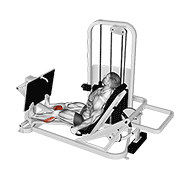
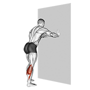

# 第三天：腿日（下肢 + 核心）

> **训练目标**：股四头肌、腘绳肌、臀大肌、小腿、核心
> **训练时长**：~60 分钟 | **组间休息**：主项 90-120s，辅助 60-75s
> **注意事项**：腿日是最累的一天，训练后务必充分拉伸！练完腿如果特别累，多休一天也没问题

---

## 一、练前热身（5-8 分钟）

> 目标：打开髋关节、激活臀部——久坐族的髋屈肌和臀肌通常很紧

### 1.1 自重深蹲（预热动作模式）


| 阶段 | 说明 |
|------|------|
| **收缩** | 站起时臀部收紧，股四头肌发力 |
| **伸展** | 下蹲时髋关节、膝关节弯曲，感受大腿和臀部拉伸 |

- 不负重，仅做动作模式预热
- 手臂前伸保持平衡，缓慢下蹲，底部停顿 2 秒
- **1 组 × 10 次**

### 1.2 弹力带臀桥（激活臀部）

- 弹力带套在膝盖上方，仰卧做臀桥
- 膝盖向外对抗弹力带，激活臀中肌
- **2 组 × 15 次**

### 1.3 弹力带肩外旋


- **2 组 × 15 次/侧**（每天做！）

### 1.4 腿摆动（动态拉伸髋关节）

- 手扶固定物，单腿前后/左右摆动
- **前后 × 10 次/侧 + 左右 × 10 次/侧**

---

## 二、正式训练（~45 分钟）

> **💡 A1/A2、B1/B2、C1/C2 是什么意思？**
>
> 同字母的**全部都要练**，不是选一个。这是**超级组（Super Set）** 配对交替做：
> ```
> A1（做完1组）→ 休息 → A2（做完1组）→ 休息 → A1（第2组）→ 休息 → A2（第2组）→ ……
> ```
> 这样安排能**节约时间**（交替做省去等待肌肉恢复的时间），同时让同一肌群得到更集中的刺激。
>
> **详细说明**：
> - **A 组**（主项，4 组）：大重量复合动作，练最大力量
> - **B 组**（辅助，3 组）：轻重量针对性训练，增加训练量
> - **C 组**（收尾，3 组）：孤立动作，榨干最后一点力

### 🟦 A1. 史密斯深蹲（Smith Machine Squat）— 主项



| 阶段 | 说明 |
|------|------|
| **收缩** | 站起时股四头肌、臀大肌收紧 |
| **伸展** | 下蹲时大腿后侧和臀部被拉伸，髋关节折叠 |

| | |
|------|------|
| **组数 × 次数** | 4 组 × 8-12 次 |
| **RPE** | 7-9 |
| **组间休息** | 90-120 秒 |

**动作讲解**：
1. 杠铃放在**斜方肌上方**（不是颈椎！），双脚略宽于肩，脚尖微外八
2. 史密斯机轨迹是斜后方的，顺着轨迹下蹲
3. 下蹲时**挺胸、收紧核心**，像坐在一把看不见的椅子上
4. 大腿至少蹲到与地面平行（幅度不够效果打折）
5. 推起时臀部主动发力，膝盖不要内扣
6. 全程**膝盖方向与脚尖方向一致**

> 🎯 **重点关注**：选择史密斯而非自由深蹲——久坐髋屈肌紧张，史密斯更安全。**如果蹲不下去，在脚后跟垫 2.5kg 的杠铃片**。

---

### 🟦 A2. 腿举（Leg Press）



| 阶段 | 说明 |
|------|------|
| **收缩** | 推出时股四头肌收紧 |
| **伸展** | 下放时大腿接近胸部，股四头肌被拉伸 |

| | |
|------|------|
| **组数 × 次数** | 3 组 × 10-15 次 |
| **RPE** | 7-8 |
| **组间休息** | 75-90 秒 |

**动作讲解**：
1. 坐稳靠背，双脚与肩同宽置于踏板上
2. 推出时**不要完全锁死膝盖**（留一点微屈）
3. 下降时大腿至少与踏板平行，但不要让臀部离开靠背
4. 全程腰背贴紧靠背

> 🎯 **重点关注**：下放太低会让下背离开靠背→伤腰。宁可缩减幅度，也不要让臀部抬起来。

---

### 🟩 B1. 罗马尼亚硬拉（Romanian Deadlift）— 腘绳肌 + 臀


| 阶段 | 说明 |
|------|------|
| **收缩** | 站起时臀部收紧、腘绳肌发力 |
| **伸展** | 下放时杠铃沿大腿下滑，腘绳肌被强烈拉伸 |

| | |
|------|------|
| **组数 × 次数** | 3 组 × 10-12 次 |
| **RPE** | 7-8 |
| **组间休息** | 75-90 秒 |

**动作讲解**：
1. 双手持杠铃（或哑铃），站距与臀同宽
2. **膝盖微屈不锁死**，臀部向后推（想象用屁股关门）
3. 杠铃沿大腿前侧下滑，背部全程挺直
4. 下降到膝盖下方、腘绳肌感到强烈拉伸时停止
5. 臀部收紧发力回到起始位

> 🎯 **重点关注**：罗马尼亚硬拉主要是**髋关节铰链**动作，膝盖弯曲幅度很小。全程背部挺直！**如果弯腰 → 重量太大**。这是改善「臀肌失忆」的王牌动作。

---

### 🟩 B2. 腿屈伸（Leg Extension）— 股四头肌孤立



| 阶段 | 说明 |
|------|------|
| **收缩** | 伸展至膝盖接近伸直，股四头肌收紧 |
| **伸展** | 慢速下放，股四头肌被拉伸 |

| | |
|------|------|
| **组数 × 次数** | 3 组 × 12-15 次 |
| **RPE** | 7-8 |
| **组间休息** | 60 秒 |

**动作讲解**：
1. 调整靠背使膝关节旋转轴与器械轴对齐
2. 小腿垫在脚踝上方（不是胫骨中部）
3. 匀速伸展至膝盖接近伸直（不要锁死）
4. 顶峰收缩股四头肌 1 秒，慢速下放（3 秒）

> 🎯 **重点关注**：**离心（下放）比向心（抬起）更重要**，下放控制 3 秒。这个动作能帮找到股四头肌的发力感。

---

### 🟪 C1. 腿弯举（Leg Curl）— 腘绳肌孤立



| 阶段 | 说明 |
|------|------|
| **收缩** | 弯举至最大限度，腘绳肌收紧 |
| **伸展** | 慢速下放，腘绳肌被拉长 |

| | |
|------|------|
| **组数 × 次数** | 3 组 × 12-15 次 |
| **RPE** | 7-8 |
| **组间休息** | 60 秒 |

**动作讲解**：
1. 俯卧在腿弯举器上，膝盖略超出凳子边缘
2. 小腿垫在脚踝后上方，抓住把手稳定身体
3. 弯举至最大限度挤压腘绳肌，顶峰保持 1 秒
4. 慢速下放（3 秒）
5. **臀部不要因为太重而翘起来**

> 🎯 **重点关注**：腘绳肌是多数人的弱项——强壮的腘绳肌可以稳定骨盆，减少下背代偿。**不追求大重量，追求强烈的肌肉感受**。

---

### 🟪 C2. 坐姿提踵（Seated Calf Raise）— 小腿



| 阶段 | 说明 |
|------|------|
| **收缩** | 踮起脚尖到最高，小腿肌肉收紧 |
| **伸展** | 脚后跟低于踏板，小腿被充分拉伸 |

| | |
|------|------|
| **组数 × 次数** | 4 组 × 12-20 次 |
| **RPE** | 7-9 |
| **组间休息** | 45-60 秒 |

**动作讲解**：
1. 膝关节呈 90°，前脚掌踩在踏板上
2. 尽可能高地踮起脚尖，顶峰保持 2 秒
3. 慢速下放至脚后跟低于踏板，感受小腿拉伸
4. **全程大范围活动**：从最大拉伸位到最大收缩位

> 🎯 **重点关注**：小腿需要高容量 + 大范围活动才肯长。**坐姿更针对比目鱼肌（厚度），站姿更针对腓肠肌（长度）**。

---

## 三、练后拉伸（5 分钟）

> 目标：放松下肢肌群，缓解腿日后的酸痛

### 3.1 股四头肌拉伸


| 阶段 | 说明 |
|------|------|
| **拉伸** | 脚后跟拉向臀部，股四头肌被拉长，膝盖不要外展 |

- 站姿或跪姿，将脚后跟拉向臀部
- **双膝保持并拢**，不要外展
- **每侧保持 30 秒 × 2 组**

### 3.2 腘绳肌拉伸


| 阶段 | 说明 |
|------|------|
| **拉伸** | 身体前倾，单腿前伸，大腿后侧被拉长，注意不弓背 |

- 坐姿或站姿，单腿前伸脚尖朝上
- 身体前倾，感受大腿后侧拉伸
- **每侧保持 30 秒 × 2 组**

### 3.3 臀大肌拉伸


| 阶段 | 说明 |
|------|------|
| **拉伸** | 脚踝搭在另一侧膝盖上，身体前倾，臀部外侧被拉长 |

- 坐姿，一只脚踝搭在另一侧膝盖上
- 身体前倾，感受臀部外侧拉伸
- **每侧保持 30 秒 × 2 组**

### 3.4 梨状肌拉伸


| 阶段 | 说明 |
|------|------|
| **拉伸** | 深层的臀部拉伸，对久坐族非常重要，缓解坐骨神经压力 |

- **每侧保持 30 秒 × 2 组**

### 3.5 小腿拉伸



| 阶段 | 说明 |
|------|------|
| **拉伸** | 前后弓步，后腿伸直脚后跟着地，小腿被拉长 |

- 手扶墙，前后弓步，后腿伸直脚后跟着地
- **每侧保持 30 秒 × 2 组**

---

## 📌 腿日小贴士

- **热身充分**：腿日是三大项中最累的，髋关节和膝关节需要充分预热
- **膝盖保护**：深蹲时膝盖与脚尖方向一致，不要内扣
- **呼吸**：下蹲时吸气，站起时呼气；大重量时用瓦式呼吸（腹内压）
- **练后吃饭**：腿日消耗最大，练后 30 分钟内补充蛋白质 + 快碳
- **恢复**：腿日后如果特别累，多休一天完全没问题

---

> 📅 **本文件对应**：三分化训练 - 第三天（腿日）
> 🔄 **循环方式**：推 → 拉 → 腿 → 休 → 推 → 拉 → 腿 → 休 → …
