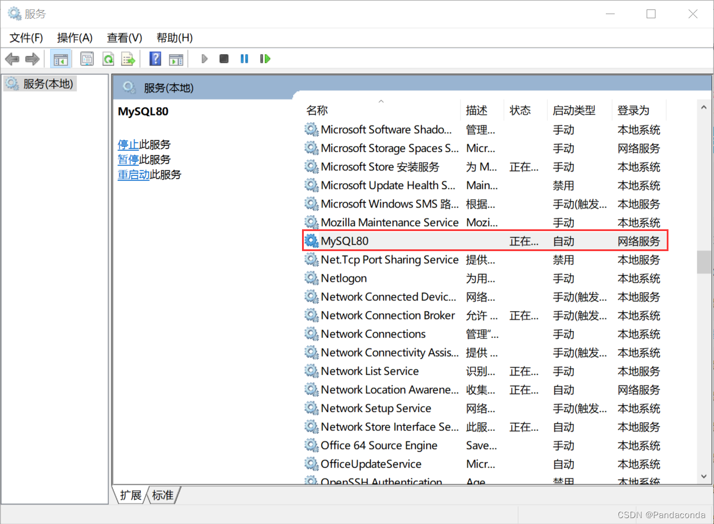
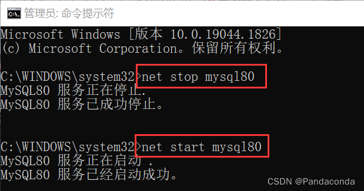
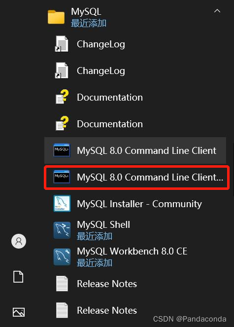
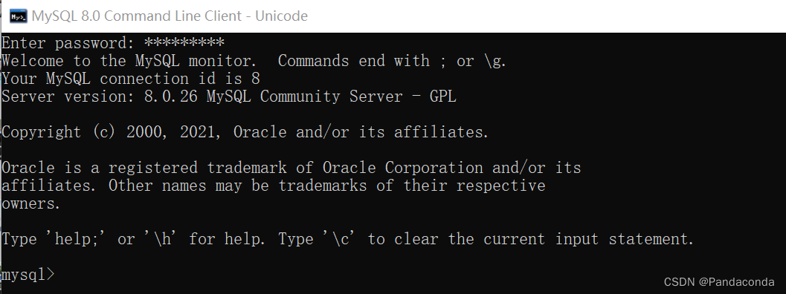
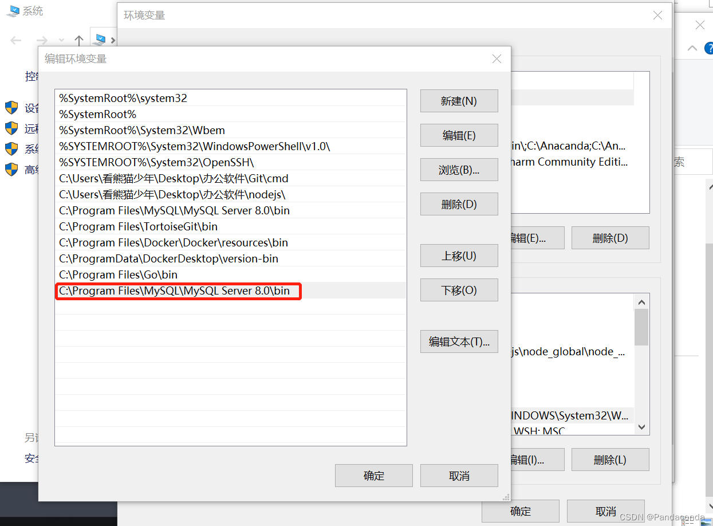
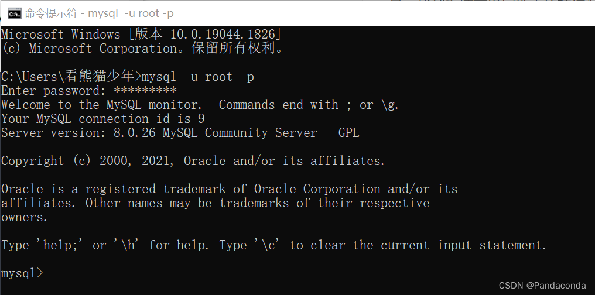
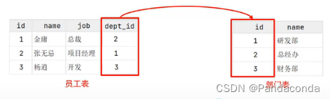
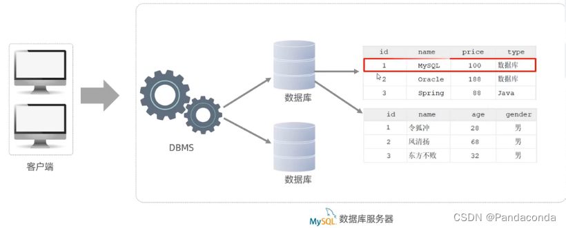

## MySQL 安装

[**MySQL 官网社区版下载**](https://dev.mysql.com/downloads/installer/)

## MySQL 启动

### 方法一：服务管理界面

使用系统自带的功能，通过 `Win + R` 输入 `services.msc` 就可以看到控制界面。




### 方式二：命令行

以管理员的身份启动 `cmd`，执行指令：

```bash
// 停止
net stop mysql80
// 启动
net start mysql80
```



## 客户端连接

### 方法一：MySQL CLI 客户端

MySQL 提供的客户端命令行工具。





### 方式二：系统命令行

系统自带的命令行工具执行指令。

```bash
mysql [-h 127.0.0.1][-P 3306] -u root -p
```

想要执行该命令，需要先**配置环境变量**：在系统高级设置中，找到环境配置，在 `Path` 下添加如下路径（路径在自己安装的目录下找）：





## MySQL 数据库

MySQL 数据库是**关系型数据库**。

### 关系型数据库

**概念：** 建立在关系模型基础上，由多张互相连接的二维表组成的数据库。

> 而所谓二维表，指的就是由行和列组成的表，如下图-就类似于Excel表格数据，有表头、列、行，还可以通过一列关联另一个表格中的某一列数据。**简单的说，基于二维表存储数据的数据库就称为关系型数据库，不是基于二维表存储数据的数据库就称为非关系型数据库。**

**特点：**

1. 使用表存储数据，格式统一，便于维护
2. 使用 SQL 语言操作，标准统一，使用方便

> 非关系型数据库就是不用表存储数据的数据库。



### 数据模型

MySQL是关系型数据库，是基于二维表进行数据存储的，具体结构如下：



- 我们可以通MySQL客户端连接数据库管理系DBMS操作数据库。
- 可以使用SQL语句，通过数据库管理系统操作数据库，以及操作数据库中的表结构及数据。
- 一个数据库服务器中可以创建多个数据库，一个数据库中也可以包含多张表，一张表中又可以包含多行记录。
