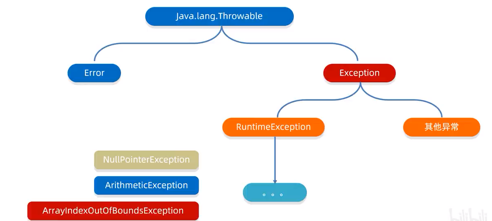
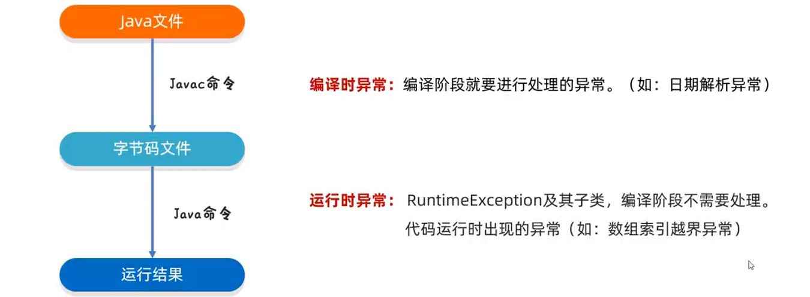
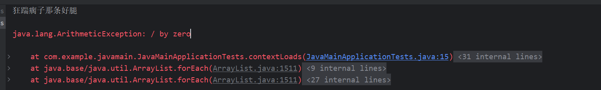
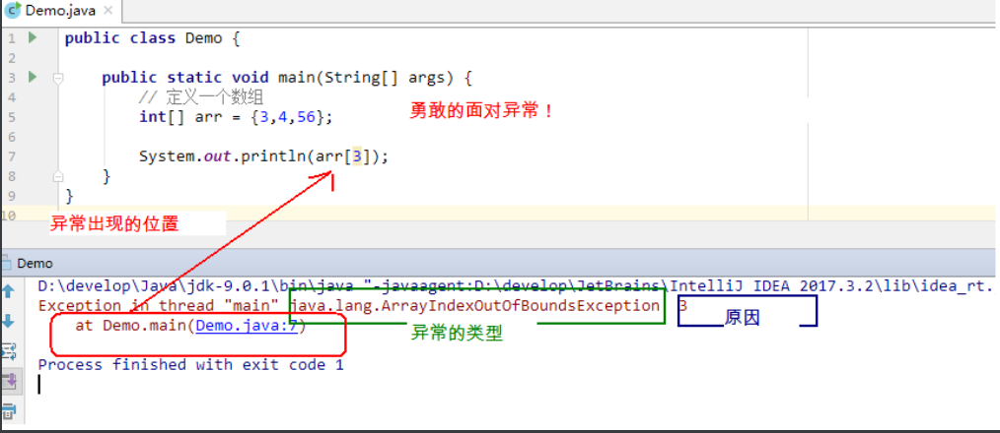
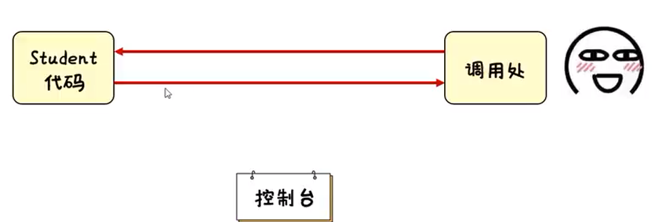
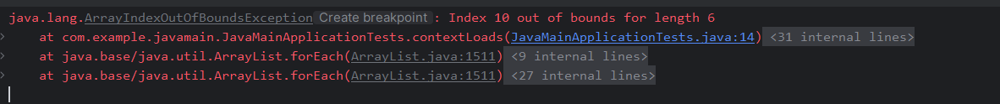

# 异常处理

### 定义

异常含义指的是程序在执行过程中，出现的非正常情况，最终会导致JVM的非正常停止

### 异常体系

异常机制其实是帮助我们找到程序中的问题，异常的根类是`java.lang.Throwable`，其下有两个子类：`java.lang.Error`与`java.lang.Exception`，平常所说的异常是指`java.lang.Exception`



- Error：代表的系统级别的错误（属于严重问题），系统一旦开始出现问题，sun公司会把这些错误封装成`Error`对象。`Error`是给sun公司自己用的，不是给我们程序员用的。因此开发人员不用管他。
- Exception：叫做异常，代表程序可能出现的问题。我们通常会用`Exception`以及他的子类来封装程序出现的问题。
- 运行时异常：`RuntimeException`及其子类，编译阶段不会出现异常提醒。运行时出现的异常（如：数组索引越界异常）
- 编译时异常：编译阶段就会出现异常提醒的。（如：日期解析异常）

### 异常分类



- **编译时期异常：**`checked`异常。在编译时期，就会检查，如果没有处理异常，则编译失败。（如日期格式化异常）
- **运行时期异常：**`runtime`异常。在运行时期，检查异常，在编译时期，运行异常不会被编译器检测（不报错）。（如数学异常）

### 异常处理机制

JVM默认处理异常的方式

- 把异常的名称、异常原因及异常出现的位置等信息输出在了控制台
- 程序停止执行、、异常下面的代码不会再执行了

示例：

```java
System.out.println("狂踹瘸子那条好腿");
System.out.println(2/0);//算术异常 ArithmeticException
System.out.println("是秃子终会发光");
System.out.println("火鸡味锅巴");
```

**打印效果：**



## 作用

- 异常是用来查询bug的关键参考信息

  

- 异常可以作为方法内部的一种特殊返回值，以便通知调用者底层的执行情况



> 简单来说，就是抛出异常

## 异常捕获

**try-catch**的方式就是捕获异常

> - **try**：该代码块中编写可能产生异常的代码。
> - **catch**：用来进行某种异常的捕获，实现对捕获到的异常进行处理。
> - **捕获异常：**java中对有异常有针对性的语句进行捕获，可以对出现的异常进行指定方式的处理。

::: warning

`try`和`catch`都不能单独使用，必须连用。

:::

```java
/* 格式：
try{
     编写可能会出现异常的代码
}catch(异常类型  e){
     处理异常的代码
     //记录日志/打印异常信息/继续抛出异常
} */

int[] arr = {1, 2, 3, 4, 5, 6};
try{
    //可能出现异常的代码;
    System.out.println(arr[10]);//此处出现了异常，程序就会在这里创建一个ArrayIndexOutOfBoundsException对象
    //new ArrayIndexOutOfBoundsException();
    //拿着这个对象到catch的小括号中对比，看括号中的变量是否可以接收这个对象
    //如果能被接收，就表示该异常就被捕获（抓住），执行catch里面对应的代码
    //当catch里面所有的代码执行完毕，继续执行try...catch体系下面的其他代码
}catch(ArrayIndexOutOfBoundsException e){
    //如果出现了ArrayIndexOutOfBoundsException异常，我该如何处理
    System.out.println("索引越界了");
}

System.out.println("看看我执行了吗？");
```

## 异常处理常见问题


1. 如果`try`中没有遇到问题，怎么执行？

   - 会把`try`里面所有的代码全部执行完毕，不会执行`catch`中的代码

     ```java
     int[] arr = {1, 2, 3, 4};
     try {
         System.out.println(arr[10]);
     } catch (ArrayIndexOutOfBoundsException e) {
         System.out.println("索引越界");
     }
     System.out.println("我会执行");
     ```

2. 如果`try`中可能会遇到多个问题，怎么执行？

   - 会写多个`catch`与之对应

   - ```java
     // JDK7
     int[] arr = {1, 2, 3, 4};
     try {
         System.out.println(arr[10]); // ArrayIndexOutOfBoundsException
         System.out.println(2/0); // ArithmeticException，报错则跳过这句
         String s = null;
         System.out.println(s.equals("abc"));
     } catch (ArrayIndexOutOfBoundsException | ArithmeticException e) {
         System.out.println("索引越界了");
     } catch (NullPointerException e) {
         System.out.println("空指针异常");
     } catch (Exception e) {
         System.out.println("Exception");
     }
     
     System.out.println("看看我执行了吗？");
     ```

     ::: tip

     如果我们要捕获多个异常，这些异常中如果存在父子关系的话，那么父类一定要写在下面

     `try`中的代码，如果保证了，`try`内下面的代码也不会执行，会直接进到`catch`中

     :::

     > 在JDK7之后，我们可以在`catch`中同时捕获多个异常，中间用`|`进行隔开

3. 如果`try`中遇到的问题没有被捕获，怎么执行？

   - 相当于`try...catch`的代码白写了，最终还是会交给虚拟机进行处理。

     ```java
     int[] arr = {1, 2, 3, 4, 5};
     try {
       System.out.println(arr[10]); // new ArrayIndexOutOfBoundsException();
         System.out.println("空指针异常");
     } 
     System.out.println("看看我执行了吗？");
     ```

4. 如果`try`中遇到了问题，那么`try`下面的其他代码还会执行吗？

   - 下面的代码就不会执行了，直接跳转到对应的`catch`当中，执行`catch`里面的语句体。但是如果没有对应`catch`与之匹配，那么还是会交给虚拟机进行处理

     ```java
     int[] arr = {1, 2, 3, 4, 5};
     try {
         System.out.println(arr[10]);
         System.out.println("看看我执行了吗？...try"); // 没有
     } catch (ArrayIndexOutOfBoundsException e) {
         System.out.println("索引越界");
     }
     System.out.println("看看我执行了吗？...其他代码"); // 执行了
     ```

## 异常常用方法

| 方法名称                        | 说明                              |
| ------------------------------- | --------------------------------- |
| `public String getMessage()`    | 返回此`throwable`的详细消息字符串 |
| `public String toString()`      | 返回此可抛出的简短描述            |
| `public void printStackTrace()` | 把异常的错误信息输出在控制台      |

### getMessage

```java
// 返回此throwable的详细信息字符串
int[] arr = {1, 2, 3, 4, 5};
try {
    System.out.println(arr[10]);
} catch (ArrayIndexOutOfBoundsException e) {
    String message = e.getMessage();
    System.out.println(message);//Index 10 out of bounds for length 6 
}
```

### printStackTrace

```java
// 把异常的错误信息输出在控制台
int[] arr = {1, 2, 3, 4, 5, 6};
try {
    System.out.println(arr[10]);
} catch (ArrayIndexOutOfBoundsException e) {
    e.printStackTrace();
}
```



## 异常抛出处理

**异常处理：**

- 编译时异常`throws`
- 运行时异常`throw`

### 声明异常`throws`关键字

::: tip 

写在方法定义出，表示生命一个异常，告诉调用者，使用本方法可能会有哪些异常

:::

**格式：**

```java
public void 方法() throws 异常类名1，异常类名2... {
    ...
}
```

### 抛出异常`throw`关键字

::: tip

写在方法内，结束方法，手动抛出异常对象，交给调用者方法中下面的代码不再执行了 

:::

**格式：**

```java
public void 方法() {
    throw new Nul1PointerException();
}
// 例如
if (arr == null) {
    // 手动创建一个异常对象，并把这个异常交给方法的调用者处理
    // 此时方法就会结束，下面的代码就不会再执行了
    // 就相当于正常报错，如果没有使用catch捕获错误，将会打印在控制台
    throw new Nul1PointerException();
}
```

## 自定义异常

**含义：**在开发中根据自己业务的异常情况来定义异常类

### 使用步骤

1. 定义异常类

   ```java
   // 业务逻辑异常
   public class LoginException  {
     // 登陆异常
   }
   ```

   > 通常将类名，命名为`xxxException`，以`Exception`结尾，同时类名见名知义最好

2. 写继承关系

   ```java
   // 业务逻辑异常
   public class LoginException extends Exception {
       
   }
   ```

   > 若此自定义异常用于编译时期异常，则继承`Exception`
   >
   > 若此自定义异常用于运行时期异常，则继承`RuntimeException`

3. 空参构造

   ```java
   // 业务逻辑异常
   public class LoginException extends Exception {
       // 空参构造
       public LoginException() {}
   }
   ```

   > 通常实现空参构造和带参构造方法

4. 带参构造

   ```java
   // 业务逻辑异常
   public class LoginException extends Exception {
       // @param message 表示异常提示
       public LoginException(String message) {
           super(message);
       }
   }
   ```

   > 带参构造的目的是为了更好的描述错误信息

## 最终执行

在Java中，`finally`是一个关键字，用于定义在`try...catch`代码块中必须执行的代码。无论`try`代码块中是否抛出异常，`finall`代码块都会被执行。

**格式：**

```java
try {
    // 编写可能会出现异常的代码
} catch(异常类型 e) {
    // 处理异常的代码
    // 记录日志/打印异常信息/继续抛出异常
} finally {
    // 无论如何都会执行的代码
}
```

> 当只有在`try`或者`catch`中调用退出JVM的相关方法，此时`finally`才不会执行，否则永远会执行。

**示例：**

```java
try {
    read("a.txt");
} catch (FileNotFoundException e) {
    //抓取到的是编译期异常  抛出去的是运行期 
    throw new RuntimeException(e);
} finally {
    System.out.println("不管程序怎样，这里都将会被执行。");
}
```


## 小结

> 1. 概述
>
>    - 异常：指的是程序在执行过程中，出现的非正常的情况，最终会导致JVM的非正常停止。
>    - 异常的体系机构
>
>    
>
>    - 异常分类
>      - 编译时异常：除了`RuntimeExcpetion`和他的子类，其他都是编译时异常。编译阶段需要进行处理，作用在于提醒程序员。
>      - 运行时异常：`RuntimeExcpetion`本身和所有子类，都是运行时异常。编译阶段不报错，是程序运行时出现的。
>    - 异常的机制
>      - 把异常的名称、异常原因及异常出现的位置等信息输出在了控制台
>      - 把程序停止执行、异常下面的代码不会再执行了
>
> 2. 异常的作用
>
>    - 异常是用来查询bug的关键参考信息
>    - 异常可以作为方法内部的一种特殊返回值，以便通知调用者底层的执行情况
>
> 3. 捕获异常
>
>    ```java
>    try{
>         编写可能会出现异常的代码
>    }catch(异常类型  e){
>         处理异常的代码
>         //记录日志/打印异常信息/继续抛出异常
>    }
>    ```
>
> 4. 灵魂四问
>
>    
>
> 5. 异常方法
>
>    | 方法名称                        | 说明                              |
>    | ------------------------------- | --------------------------------- |
>    | `public String getMessage()`    | 返回此`throwable`的详细消息字符串 |
>    | `public String toString()`      | 返回此可抛出的简短描述            |
>    | `public void printStackTrace()` | 把异常的错误信息输出在控制台      |
>
> 6. 抛出异常
>
>    - 声明异常throws关键字
>    - 抛出异常throw关键字
>
> 7. 自定义异常类：
>
>    - 定义异常类
>
>      ```java
>      // 业务逻辑异常
>      public class LoginExcepetion extends Exception {
>          // @param message 表示异常提示
>          public LoginException(String message) {
>              super(message);
>          }
>      } 
>      ```
>
>      > 异常名以Exception结尾
>      >
>      > 异常类继承Esception
>      >
>      > 异常类可生成无参、带参构造方法
>
> 8. 最终执行：finally关键字