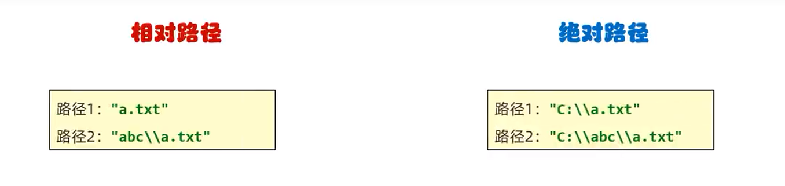

# File 类

`java.io.File`类是文件和目录路径名的抽象表示，主要用于文件和目录的创建、查找和删除等操作

## 路径



## 作用

Java中的`File`类是一个用于表示文件或目录的类。他可以用来**操作文件或目录**，如创建、读取、写入、删除等操作。

`File`类还是Java I/O库中的一部分，他提供了多种方法来获取有关文件和目录信息，例如文件名、路径、大小、修改时间等等。

`File`类还可以用于文件和目录的遍历，以及文件和目录的过滤。他是Java程序中常用的一个类之一

## 构造方法

| 方法名称                                   | 说明                                             |
| ------------------------------------------ | ------------------------------------------------ |
| `public File(String pathname)`             | 根据文件路径创建文件对象                         |
| `public File(String parent, String child)` | 根据父路径字符串和子路径字符串创建文件对象       |
| `public File(File parent, String child)`   | 根据父路径对应文件对象和子路径字符串创建文件对象 |

**示例：**

```java
// 都是根据不同信息，创建文件对象
// 文件路径名
String pathname = "D:\\aaa.txt";
File file1 = new File(pathname);

// 文件路径名
String pathname2 = "D:\\aaa\\bbb.txt";

// 通过父路径和子路径字符串
Sting parent = "d:\\aaa";
String child = "bbb.txt";
File file3 = new File(parent, child);

// 通过父级File对象和子路径字符串
File parentDir = new File("d:\\aaa");
String child = "bbb.txt";
File file4 = new File(parentDir, child);
```

> 1. 一个`File`对象代表硬盘中实际存在的一个文件或者目录。
> 2. 无论该路径下是否存在文件或者目录，都不影响`File`对象的创建。

## 常用成员方法

### 判断、获取

| 方法名称                          | 说明                               |
| --------------------------------- | ---------------------------------- |
| `public boolean isDirectory()`    | 判断此路径名表示的File是否是文件夹 |
| `public boolean isFile()`         | 判断此路径名表示的File是否为文件   |
| `public boolean exists()`         | 判断此路径名表示的File是否存在     |
| `public long length()`            | 返回文件的大小(字节数量)           |
| `public String getAbsolutePath()` | 返回文件的绝对路径                 |
| `public String getPath()`         | 返回定义文件时使用的路径           |
| `public String getName()`         | 返回文件的名称，带后缀             |
| `public long lastModified()`      | 返回文件的最后修改时间(时间毫秒值) |

#### isDirectory()、isFile()、exists()

- `isDirectory`：判断此路径名表示的File是否是文件夹
- `isFile`：判断此路径名表示的File是否为文件
- `exists`：判断此路径名表示的File是否存在

```java
//1.对一个文件的路径进行判断
File f1 = new File("D:\\aaa\\a.txt");
System.out.println(f1.isDirectory());//false
System.out.println(f1.isFile());//true
System.out.println(f1.exists());//true
System.out.println("--------------------------------------");
//2.对一个文件夹的路径进行判断
File f2 = new File("D:\\aaa\\bbb");
System.out.println(f2.isDirectory());//true
System.out.println(f2.isFile());//false
System.out.println(f2.exists());//true
System.out.println("--------------------------------------");
//3.对一个不存在的路径进行判断
File f3 = new File("D:\\aaa\\c.txt");
System.out.println(f3.isDirectory());//false
System.out.println(f3.isFile());//false
System.out.println(f3.exists());//false	
```

#### length()

- `length`：返回文件的大小(字节数量)

```java
File f1 = new File("D:\\aaa\\a.txt");
long len = f1.length();
System.out.println(len); // 返回文本内容的大小，英文字母占一个字节，中文占3个，返回12(字节)

File f2 = new File("D:\\aaa\\bbb");
long len2 = f2.length();
System.out.println(len2); // 0 通常返回0或文件夹本身的大小，不会遍历子目录
```

> - 该方法只能获取文件的大小，单位是字节，如果单位我们要是M,G,可以不断的除以1024
> - 该方法无法获取文件夹的大小。如果我们要获取一个文件夹的大小，需要把这个文件夹里面所有的文件大小都累加在一起

#### getAbsolutePath()

- `getAbsolutePath`：将当前**项目的根路径**和当前`this`的路径进行拼接得到新的路径

```java
File f3 = new File("./a.txt");
System.out.println(f3.getAbsolutePath()); // D:\learn\JavaBasic\file\.\a.txt
File f4 = new File("a.txt");
System.out.println(f4.getAbsolutePath()); // D:\learn\JavaBasic\file\a.txt
```

#### getPath()

- `getPath`：返回定义文件时使用的路径

```java
File f5 = new File("D:\\aaa\\a.txt");
String path3 = f5.getPath();
System.out.println(path3);//D:\aaa\a.txt

File f6 = new File("myFile\\a.txt");
String path4 = f6.getPath();
System.out.println(path4);//myFile\a.txt
```

#### getName()

- `getName`：返回文件的文件名，包含扩展名

```java
File f7 = new File("D:\\aaa\\a.txt");
String name1 = f7.getName();
System.out.println(name1);//a.txt

File f8 = new File("D:\\aaa\\bbb");
String name2 = f8.getName();
System.out.println(name2);//bbb
```

> - **当FIle对象表示的是一个文件时：**`getName`方法返回该**文件的名称**(包含文件夹-hello.txt)
> - **当File对象表示的是一个文件夹时：**`getName`方法返回该文件夹的名称-bbb

#### lastModified()

- `lastModifi`：返回文件的最后修改时间(时间毫秒值)

```java
File f9 = new File("D:\\aaa\\a.txt");
long time = f9.lastModified();
System.out.println(time); //1667380952425
```

### 创建、删除

| 方法名称                         | 说明               |
| -------------------------------- | ------------------ |
| `public boolean createNewFile()` | 创建一个新的空文件 |
| `public boolean mkdir()`         | 创建单级文件夹     |
| `public boolen mkdirs()`         | 创建多级文件夹     |
| `public boolean delete()`        | 删除文件、空文件夹 |

::: tip

`delete`方法默认只能删除文件和空文件夹，`delete`方法直接删除，不会再走回收站

:::

#### createNewFile()

- `createNewFile`：根据路径创建空文件，创建的文件的路径就是File对象的路径

```java
File f = new File("D:\\learn\\JavaBasic\\file\\src\\com\\code\\method\\b.txt");
try {
    System.out.println(f.createNewFile()); // true
} catch (IOException e) {
    System.out.println(e);
}
```

> - 创建文件
>   - 如果当前路径表示的文件**不存在**，则创建成功，方法返回true
>   - 如果当前路径表示的文件是**存在的**，则创建失败，方法返回false
> - 如果父级路径是不存在的，那么方法会有异常的`IOException`
> - `createNewFile`方法创建的一定是文件，如果路径中不包含后缀名，则创建一个没有后缀的文件--在系统中显示的文件类型就是-文件

#### mkdir()

- `mkdir`：创建单级文件夹--返回的布尔值表示创建是否成功

```java
File f2 = new File("D:\\aaa\\aaa\\bbb\\ccc");
boolean b = f2.mkdir();
System.out.println(b); // true
```

> - windows当中路径是唯一的，如果当前路径已经存在，则创建失败，返回false
> - mkdir方法只能创建单级文件夹，无法创建多级文件夹。

#### mkdirs()

- `mkdirs`：创建多级文件夹

```java
File f3 = new File("D:\\aaa\\ggg");
boolean b = f3.mkdirs();
System.out.println(b);//true
```

> 既可以创建单级的，又可以创建多级的文件夹

#### delete()

- `delete`：删除指定路径的文件/文件夹

```java
//1.创建File对象
File f1 = new File("D:\\aaa\\eee");
//2.删除
boolean b = f1.delete();
System.out.println(b);
```

> - 如果删除的是文件，则直接删除，不走回收站
> - 如果删除的是文件夹
>   - 如果文件夹为空，则直接删除，不走回收站
>   - 如果文件夹有东西，则删除失败，返回false

### 获取并遍历

| 方法名称                                         | 说明                                   |
| ------------------------------------------------ | -------------------------------------- |
| `public static File[] listRoots()`               | 列出可用的文件系统根                   |
| `public String[] list()`                         | 获取当前该路径下所有内容               |
| `public String[] list(FilenameFilter filter)`    | 利用文件名过滤器获取当前路径下所有内容 |
| `public File[] listFiles()`                      | 获取当前路径下所有内容                 |
| `public File[] listFiles(FileFilter filter)`     | 利用文件名过滤器获取当前路径下所有内容 |
| `public File[] listFiles(FilenameFilter filter)` | 利用文件名过滤器获取当前路径下所有内容 |

#### listRoots()

- `listRoots`：列出当前设备上可用所有的文件系统根	

```java
File[] arr = File.listRoots();
System.out.println(Arrays.toString(arr)); // [C:\, D:\]
```

#### list()

- `list`：列出指定路径下所有的文件和文件夹;return String[];

```java
File f1 = new File("D:\\aaa");
String[] arr = f1.list();
System.out.println(Arrays.toString(arr)); // [io, Main.java, method]
```

#### list(FilenameFilter filter)

- `list`：使用文件名过滤器获取当前该路径下所有的内容

```java
//3.list(FilenameFilter filter)  利用文件名过滤器获取当前该路径下所有内容
//需求：我现在要获取D：\\aaa文件夹里面所有的txt文件
File f2 = new File("D:\\aaa");
//accept方法的形参，依次表示aaa文件夹里面每一个文件或者文件夹的路径
//参数一：父级路径
//参数二：子级路径
//返回值：如果返回值为true，就表示当前路径保留
//        如果返回值为false，就表示当前路径舍弃不要
String[] arr3 = f2.list(new FilenameFilter() {
    @Override
    public boolean accept(File dir, String name) {
        File src = new File(dir,name);
        return src.isFile() && name.endsWith(".txt");
    }
});

System.out.println(Arrays.toString(arr3));
```

#### listFiles()--掌握

- `listFiles`：获取指定路径文件夹下所有的文件和文件夹信息，return File[]

```java
//1.创建File对象
File f = new File("D:\\aaa");
//2.需求：打印里面所有的txt文件
File[] arr = f.listFiles();
System.out.println(Arrays.toString(arr)); // [D:\learn\JavaBasic\file\src\com\code\method\a.txt, D:\learn\JavaBasic\file\src\com\code\method\b.txt, D:\learn\JavaBasic\file\src\com\code\method\c, D:\learn\JavaBasic\file\src\com\code\method\dir, D:\learn\JavaBasic\file\src\com\code\method\Test1.java, D:\learn\JavaBasic\file\src\com\code\method\Test2.java, D:\learn\JavaBasic\file\src\com\code\method\Test3.java, D:\learn\JavaBasic\file\src\com\code\method\Test4.java, D:\learn\JavaBasic\file\src\com\code\method\Test5.java]
```

> - 当调用者File表示的路径不存在时，返回null
> - 当调用者File表示的路径是文件时，返回null
> - 当调用者File表示的路径是一个空文件夹时，返回一个长度为0的数组
> - 当调用者File表示的路径是一个有内容的文件夹时，将里面所有文件和文件夹的路径放在FIle数组中返回
> - 当调用者File表示的路径是一个有隐藏文件的文件夹时，将里面所有文件和文件夹的路径放在File数组中返回，也包含隐藏文件。如果访问的文件夹是需要权限才能访问时，返回null

#### listFiles(FileFilter filter)

- `listFiles`：使用文件筛选器过滤返回数组，return File[]

```java
//创建File对象
File f = new File("D:\\aaa");
//调用listFiles(FileFilter filter)
File[] arr1 = f.listFiles(new FileFilter() {
    @Override
    public boolean accept(File pathname) {
        return pathname.isFile() && pathname.getName().endsWith(".txt");
    }	
});
```

#### listFiles(FilnameFilter filter)

- `listFiles`：使用文件过滤器筛选，return File[]

```java
//调用listFiles(FilenameFilter filter)
File[] arr2 = f.listFiles(new FilenameFilter() {
    @Override
    public boolean accept(File dir, String name) {
        File src = new File(dir, name);
        return src.isFile() && name.endsWith(".txt");
    }
});
System.out.println(Arrays.toString(arr2));
```


## 小结

> 1. File类：文件的抽象表示
>    1. 构造方法：能直接使用路径，或父加子的形式
>    2. 常用成员方法
>       1. isDirectory 判断是否是文件夹
>       2. isFile 判断是否是文件
>       3. exists 判断是否存在
>       4. length 获取文件的大小，单位字符--英文占一个字符，中文占是三个字符
>       5. getName 获取文件名称，格式 aaa.txt --- 包含后缀
>       6. getAbsolutePath 将当前项目的跟路径和指定路径拼接
>       7. getPath 返回定义文件时使用的路径，就是new File时构造函数的传参
>       8. lastModified 获取指定路径文件的最后修改时间
>       9. createNewFile 根据指定路径创建文件
>       10. mkdir 创建单层文件夹
>       11. mkdirs 创建多层文件夹，也可以创建单层文件夹
>       12. delete 删除指定文件或文件夹
>           1. 如果删除成功，那么直接删除，不会再走回收站
>       13. listRoots 列出当期设备上所有可用的根目录 return ["C:", "D:] ，返回的其实是String类型的
>       14. list 获取指定路径目录下所有的文件 return ["aaa.java", "ccc"]  返回的也是String类型的
>       15. list 可以使用文件筛选器过滤筛选
>       16. listFiles 获取指定路径文件夹下所有的文件和文件夹
>       17. listFiles 可以使用两种文件筛选器进行筛选返回
