# IO流

Java中I/O操作主要是指会用`java.io`包下的内容、进行输入、输出操作。**输入**也叫做**读取**数据，**输出**也叫做**写出**数据。

Java中的IO流指的是一组用于处理输入输出操作的类和接口，可以让程序读取和写入数据，实现与文件、网络和其他设备的交互。

### 分类


### 输入流和输出流

- 输入流：

  在Java中的IO流中，输入流式用于**读取数据**的流。输入流可以从文件、网络连接、标准输入等各种数据源中读取数据

  

- 输出流：

  在Java的IO流中，输出流是指从程序中向外部写数据的流。输出流通常用于将程序中的数据写入到文件、、网络连接、管道等地方

  

### 字节流与字符流

- 字节流

  一切文件数据(文件、图片、、视频等)在存储时，都是以**二进制数字**的形式保存，都是一个一个的字节，那么传输时一样如此。所以，**字节流可以传输任意文件数据**。在操作流的时候，我们要时刻明确，无论使用什么样的流对象，**底层传输的始终为二进制数据**。

  

- 字符流

  在Java中的IO流中，字符流是一种**处理字符数据**的IO流，即按字符读取或写入数据的流。和字节流不同，字符流是安装字符（Unicode码）来处理的

  

### 流体系


## 字节基本流

### 输入流-FileInputStream

`FileInputStream`是Java IO库中用于读取文件数据的类，用于从文件中读取字节流数据。

#### 基本用例

```java
//1.创建对象
FileInputStream fis = new FileInputStream("myio\\a.txt");
//2.读取数据
int b1 = fis.read();
System.out.println((char)b1);
int b2 = fis.read();
System.out.println((char)b2);
int b3 = fis.read();
System.out.println((char)b3);
int b4 = fis.read();
System.out.println((char)b4);
int b5 = fis.read();
System.out.println((char)b5);
int b6 = fis.read();
System.out.println(b6);//-1
//3.释放资源
fis.close();
```

> `read()`方法，每读取一个数据，就会移动一次指针，返回的是UTF-8的数字编码0-128。

#### 构造方法

- `FileInputStream(File file)`：通过打开与实际文件的连接来创建一个**FileInputStream**，该文件系统中的`File`对象命名
- `FileInputStream(String name)`：通过打开与实际文件的连接来创建一个**FileInputStream**，该文件由文件系统中的路径名`name`命名

##### FileInputStream(File file)

```java
File file = new File("a.txt");
FileInputStream fis = new FileInputStream(file);
```

> 如果文件不存在，就直接报错，因为创建出来的文件是没有数据的，没有意义，所以Java就没有设计这种无意义的逻辑，文件不存在直接报错。

##### FileInputStream(String name)

```java
FileInputStream fis = new FileInputStream("b.txt");
```

> 细节同上

#### 常用成员方法

| 方法名称                         | 说明                   |
| -------------------------------- | ---------------------- |
| `public int read()`              | 一次读一个字节数据     |
| `public int read(byte[] buffer)` | 一次读一个字节数组数据 |

::: tip

一次读一个字节数组的数据，每次读取会尽可能把数组装满

`1024的整数倍	1024*1024*5`

:::

##### read()

```java
int b = fis.read();
```

> - 一次读一个字节，读出来的是数据在ASCLL上对应的数字
> - 读到文件末尾了，read返回的是-1

##### read(byte[] b) 

```java
byte[] b = new byte[1024 * 1024];
int len = fis.read(b);		// 一次读取1M的数据
```

> 使用数组读取，每次读取多个字节，减少了系统间的IO操作次数，从而提高了读写效率

##### close()

```java
fis.close();	// 释放资源，接触资源占用
```

#### 一次读取多个字节

```java
//1.创建对象
FileInputStream fis = new FileInputStream("myio\\a.txt");
//2.读取数据
byte[] bytes = new byte[2];
//一次读取多个字节数据，具体读多少，跟数组的长度有关
//返回值：本次读取到了多少个字节数据
int len1 = fis.read(bytes);
System.out.println(len1);//2
String str1 = new String(bytes,0,len1);
System.out.println(str1);

int len2 = fis.read(bytes);
System.out.println(len2);//2
String str2 = new String(bytes,0,len2);
System.out.println(str2);

int len3 = fis.read(bytes);
System.out.println(len3);// 1
String str3 = new String(bytes,0,len3);
System.out.println(str3);// ed 

//3.释放资源
fis.close();
```

> 
>
> - 此时每次读取都会将从文件内读取到的字节放入字节数组中
> - 当读取到最后一个字节时，此时只会覆盖数组中的第一个数，因此数据中会残留上一次读取的数据
> - 现在通过`new String(字节流数组, 索引, 长度)`，这个`String`的构造方法可以合理避免此读取问题

#### 循环读取

```java
//1.创建对象
FileInputStream fis = new FileInputStream("myio\\a.txt");
//2.循环读取
int b;
while ((b = fis.read()) != -1) {
    System.out.println((char) b);
}
//3.释放资源
fis.close();
```

#### 原理

**输入工作流原理**


```java
FileInputStream fis = new FileInputStream();
```


```java
int b1 = fis.read();
```


```java
fis.close();
```

### 输出流-FileOutputStream

#### 概述

`FileOutputStream`是Java I/O包中的一个类，又叫字节输出流。用于操作本地文件的字节输出流，可以把程序中的数据写到本地文件中。

#### 基本用例

```java
// 创建对象
// 写出输出流 OutputStream
// 本地文件 File
FileOutputStream fos = new FileOutputStream("a.txt");
// 写数据
fos.write(100);
// 释放资源
fos.close(); // 无论是写还是读完成后都要释放资源，才能进行另一项操作
```

#### 构造方法

- `public FileOutputStream(File file)`：创建文件输出流以写入由指定的File对象表示的文件。
- `public FileOutputStream(String name)`：创建文件输出流以指定的名称写入文件。

##### FileOutputStream(File file)

```jva
File file = new File("a.txt");
FileOutputStream fos = new FileOutputStream(file);
```

> - 如果文件不存在会创建一个新文件，但是要保证父级路径是存在的
> - 如果文件已存在，则会清空文件

##### FileOutputStream(String name)

```java
FileOutputStream fos = new FileOutputStream("b.txt");
```

#### 常用成员方法

| 方法名称                                        | 说明                         |
| ----------------------------------------------- | ---------------------------- |
| `pubilc void write(int b)`                      | 一次写一个字节数据           |
| `public void write(byte[] b)`                   | 一次写一个字节数组数据       |
| `public void write(byte[] b, int off, int len)` | 一次写一个字节数组的部分数据 |

##### write(int b)

```java
fos.write(97); // 一次写入一个字节数据
```

> `write`方法的参数是整数，但是实际上写到文件中的是整数在ASCII上对应的字符

##### write(byte[] b)

```java
byte[] bytes = {97, 98, 99, 100, 101};
fos.write(bytes); // 一次写一个字节数组
```

> 使用数组写入，每次写入多个字节，减少了系统间的IO操作次数，从而提高了读写的效率

##### write(byte[] b, int off, int len)

```java
byte[] bytes = {97, 98, 99, 100, 101}; // 一次写一个字节数组的部分数据
// 从索引1位开始，写入2为字节数
fos.write(bytes, 1, 2); // b c
```

##### close()

```java
fis.close(); // 释放资源
```

> 每次使用完流之后都要释放资源

#### 换行和续写

```java
// 创建对象
FileOutputStream fos = new FileOutputStream("myio\\aa.txt", true); // 第二个参数为续写开关
// 写出数据
String str = "你好啊，李银河！";
byte[] bytes1 = str.getBytes();
fos.write(bytes1);

// 再写出一个换行符就可以了
String wrap = "\r\n";
byte[] bytes2 = wrap.getBytes();
fos.write(bytes2);

String str2 = "666";
byte[] bytes3 = str2.getBytes();
fos.write(bytes3);

// 释放资源
fos.close();
```

**小知识：**

> 1. 换行写：
>    - 再次写出一个换行符就行了
>    - windows：\r\n
>    - Linux: \n
>    - Mac: \r
> 2. 细节：
>    - 在windows操作系统重，java对回车换行进行了优化。
>    - 虽然完整的是\r\n，但是我们写其中一个\\r或者\n，java也可以实现换行，因为java在底层补全
> 3. 续写：
>    - 如果想要续写，打开续写开关即可
>    - 开关位置：创建对象的第二个参数
>    - 默认false：表示关闭续写，此时创建对象会清空文件
>    - 手动传递true：表示打开续写，此时创建对象不会清空文件

#### 原理

**输出流工作原理**

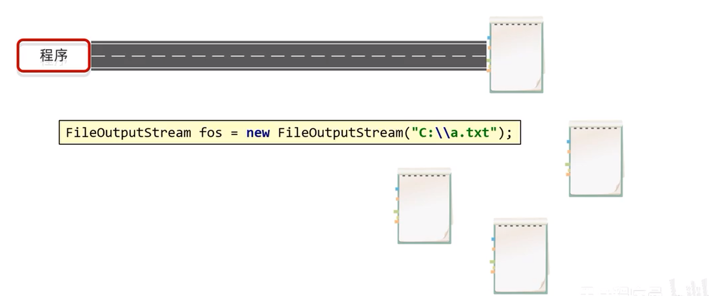


说明：

> 通过write方法进行数据的传输


说明：

> 通过close方法将数据传输的通道销毁掉

### 案例-文件拷贝

```java
// 一个读，一个写
FileInputStream fis = new FileInputStream("text1.txt"); // 读取流
FileOutputStream fos = new FileOutputStream("text2.txt"); // 写入流

try {
    int b;
    while((b = fis.read()) != -1) {
        fos.write(b);
    };
    // 规则：先开的最后关闭
    fos.close(); // 后开先关
    fis.close(); // 先开后关
    sout("拷贝成功且关闭读取和写入流");
} catch(Exception e) {
    sout(e)
}
```

小知识：

> 流的关闭原则，先开后关，后开先关

弊端:

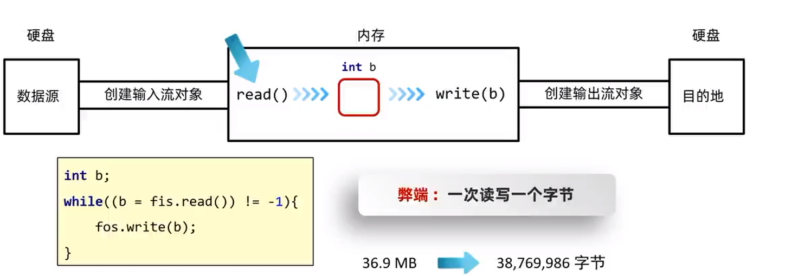

> 若是大文件读取，则会非常的缓慢

```java
// 创建读取和写入流
FileInputStream fis = new FileInputStream("text1.txt");
FileOutputStream fos = nwe FileOutputStream("text2.txt");

int b;
byte[] bytes = new byte[1024 * 1024 * 5]; // 5MB
while((b = fis.read(bytes)) != -1) {
    fos.write(b);
}
// 释放资源
fos.close();
fis.close();
```

> 此时使用数组进行读取和写入，可以减少系统间的IO操作次数，从而提高了读写的效率

## 字符基本流

> 1. 概述
>    - 含义：从文件中读取字符数据
>    - 体系结构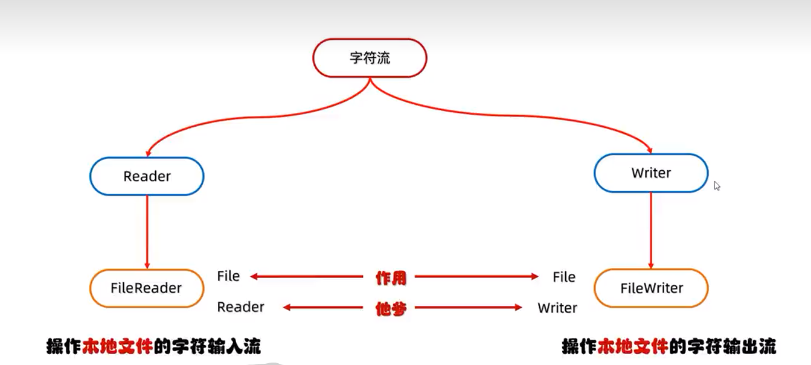
> 2. 构造方法
>    1. 输入流
>       - FileReader(File file)
>       - FileReader(String fileName)
>    2. 输出流
>       - FileWrite(File file)
>       - FileWrite(String fileName)
> 3. 原理：底层读取数据后，会将4字节的数据保存到缓冲区，加快读取速度

**特点：**

- 输入流：一次读一个字节，遇到中文时，一次读多个字节
- 输出流：底层会把数据按照指定的编码方式进行编码，变成字节再写到文件中。

字符编码：字节与字符的对应规则。windows系统的中文编码默认是GBK编码表。IDEA中的编码默认是UTF-8编码表。

### 输入流-FileReader

#### 概述

`FileReader`是Java I/O包中的一个类，用于从文件中读取字符数据。他的作用是把字符输入流换成字节输入流，读取文件中的字符数据，常用于读取文本文件。

#### 基本用例

```java
//1.创建对象并关联本地文件
FileReader fr = new FileReader("myio\\a.txt");
//2.读取数据 read()
//字符流的底层也是字节流，默认也是一个字节一个字节的读取的。
//如果遇到中文就会一次读取多个，GBK一次读两个字节，UTF-8一次读三个字节

//read（）细节：
//1.read():默认也是一个字节一个字节的读取的,如果遇到中文就会一次读取多个
//2.在读取之后，方法的底层还会进行解码并转成十进制。
//  最终把这个十进制作为返回值
//  这个十进制的数据也表示在字符集上的数字
//  英文：文件里面二进制数据 0110 0001
//          read方法进行读取，解码并转成十进制97
//  中文：文件里面的二进制数据 11100110 10110001 10001001
//          read方法进行读取，解码并转成十进制27721

// 我想看到中文汉字，就是把这些十进制数据，再进行强转就可以了

int ch;
while((ch = fr.read()) != -1){
    System.out.print((char)ch);
}

//3.释放资源
fr.close();
```

#### 构造方法

- `FileReader(File file)`：创建一个新的FileReader，给定要读的File对象。
- `FileReader(string fileName)`：创建一个新的FileReader，给定要读取的文件的名称。

##### FileReader(File file)

```java
// 使用File对象创建流对象
FileReader fr = new FileReader("b.txt");
```

#### 常用成员方法

- `read`：每次可以读取一个字符的数据，提升为int类型，读取到文件末尾，返回`-1`
- `read(char[] cbuf)`：每次读取b长度个字符到数组中，返回读取到的有效字符个数，读取到文件末尾，返回`-1`。

##### read()  每次读取一个字符，结尾返回-1

```java
int b = fr.read();
```

> 每次读取一个字符，都会自动提升为int类型，因此需要强制转换才可得到数据

##### read(char[] cbuf)

```java
// 作用：每次读取b长度个字符到数组中
char[] cbuf = new char[2];
// 循环读取
int len = fr.read(cbuf);
```

说明：

> 读取数据，解码，强转三步合并了，把强转之后的字符放到数组中

##### close() 关闭读取流

```> 
// 释放资源
fis.close();
```

> 解除资源占用

#### 循环读取

**循环单字符读取**

```java
// 使用文件名称创建流对象
FileReader fr = new FileReader("text.txt");
// 定义变量，保存数据
int b;
// 循环读取
while ((b = fr.read()) != -1) {
    sout((char)b); // 每次一个字输出
}
// 关闭资源
fr.close();
```

**循环-字符数组读取**

```java
// 使用文件名称创建流对象
FileReader = fr = new FileReader("text.txt");
// 保存读取字符有效个数
int len;
// 定义字符数组，作为装字符数据的容器
char[] cbuf = new char[2];
// 循环读取
while((len = fr.read(cbuf)) != -1) {
    sout(len); // 这次读取的字符数
    sout(new String(cbuf)); // 这次读取的字符
}
fr.close(); // 关闭资源
```

#### 原理

**字符输入流底层原理**

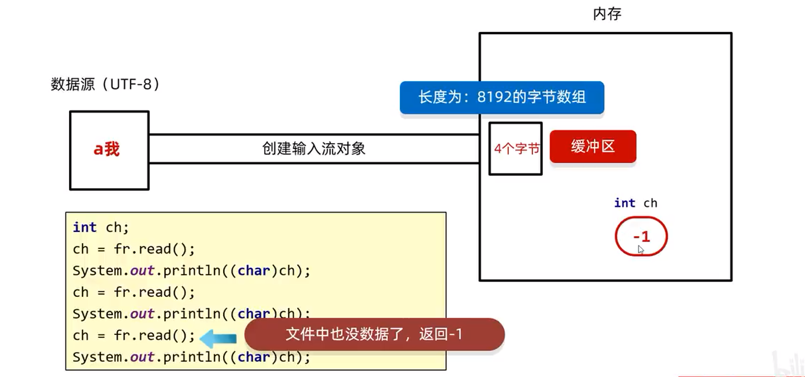

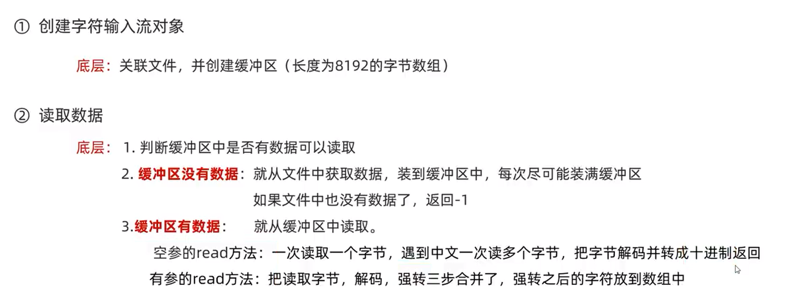

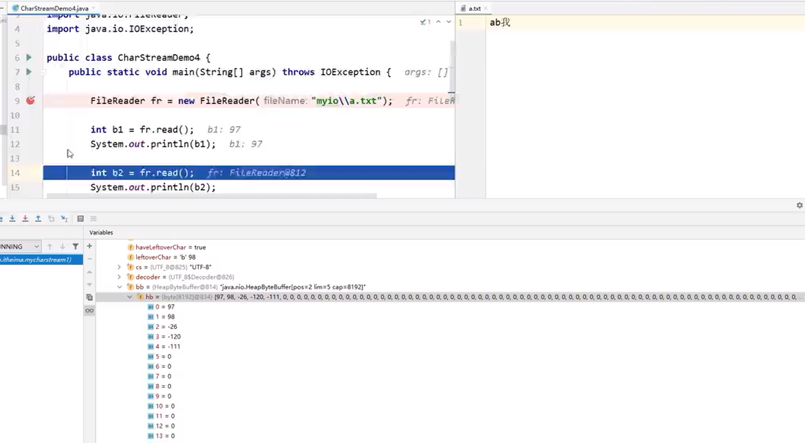

> 代码执行时，打断点调试即可

```java
FileReader fr = new FileReader("text.txt");
fr.read(); // 会把文件中的数据放到缓冲区当中
// 清空文件
FileWrite fw = new FileWriter("text.txt");
// 请问，如果我再次使用fr进行读取
// 会读取到数据吗？
// 会把缓冲区的数据全部读取完毕
// 正确答案：但是只能读取缓冲区的数据，文件中剩余的数据无法再次读取
int ch;
while((ch = fr.read()) != -1) {
    sout((char)ch);
}
fw.close();
fr.close();
```

### 输出流-FileWriter

#### 概述

`java.io.Writer`抽象类是用于写出字符流的所有类的超类，将指定的字符信息写出到目的地。他定义了字节输出流的基本共性功能方法。

#### 基本用例

```java
// 创建写入输出流  true 表示续写
FileWriter fw = new FileWriter("test5.txt", true);
// 写数据
fw.write(25105);
// 释放资源
fw.close();
```

#### 构造方法

| 构造方法                                              | 说明                             |
| ----------------------------------------------------- | -------------------------------- |
| `public FileWriter(File file)`                        | 创建字符输出流关联本地文件       |
| `public FileWriter(String pathname)`                  | 创建字符输出流关联本地文件       |
| `public FileWriter(File file, boolean append)`        | 创建字符输出流关联本地文件，续写 |
| `public FileWriter(String patchname, boolean append)` | 创建字符输出流关联本地文件，续写 |

##### FileWriter(File file)

```java
// 使用File对象创建流
File file = new File("text.txt");
FileWriter fw = new FileWriter(file);
```

> - 如果文件不存在会创建一个新的文件，但是要保证父级路径是存在的
> - 如果文件已经存在，则会清空文件，如果不想清空可以打开续写开关

##### FileWriter(String pathName)

```java
// 作用：使用文件名称创建流对象
FileWriter fw = new FileWriter("text.txt");
```

#### 常用成员方法

| 成员方法                                    | 说明                               |
| ------------------------------------------- | ---------------------------------- |
| `void write(int c)`                         | 写出一个字符                       |
| `void write(String str)`                    | 写出一个字符串                     |
| `void write(String str, int off, int len)`  | 写出一个字符串的一部分             |
| `void write(char[] cbuf)`                   | 写出一个字符数组                   |
| `void write(char[] cbuf, int off, int len)` | 写出字符数组的一部分               |
| `public void flush()`                       | 将缓冲区中的数据，刷新到本地文件中 |
| `public void close()`                       | 释放资源/关流                      |

##### write(int/string c) 写出一个字符或字符串

> - 未调用`close`方法，数据只是保存到了缓冲区，并未写出到文件中
> - 如果`write`方法的参数是整数，但是实际上写到本地文件中的是整数在字符集上对应的字符

##### write(char[] cbuf) 写出一个字符数组

```java
char[] chars = "你好啊，李银河".toCharArray();
fw.write(chars); // 你好啊，李银河
```

##### write(char[] cbuf,int off, int len) 写出字符数组的一部分

```java
char[] chars = "你好啊，李银河".toCharArray();
fw.write(b, 2, 4); // 啊，李银
```

##### flush() 不会等流关闭或者缓存区满了再写入，而是强制直接写入

```java
// 不会等流关闭或者缓存区满了再写入，而是强制直接写入
// close是关闭时再写入，flush不会关闭流
public class Test {
	public static void main(Sting[] args) thows IOException{
		FileWrite fw = new FileWrite("text.txt");
		fw.write('开');		
        fw.flush(); // 不会管java的优化机制，直接将现在缓存区的内容写入文件
         fw.flush();
        fw.write('新'); // 继续写出第2个字符，写出成功
        fw.flush();
      
      	// 写出数据，通过close
        fw.write('关'); // 写出第1个字符
        fw.close();
        fw.write('闭'); // 继续写出第2个字符,【报错】java.io.IOException: Stream closed
        fw.close();
	}
}
```

> `FileWriter`自带缓冲区，不是一个字、立刻就往文件里存，先放入缓冲区，在缓冲区装满或调用`flush/close`时才会一次性将当前缓冲区到的内容写入文件。
>
> 即便是flush方法写出了数据，操作的最后还是要调用close方法，释放系统资源

##### close() 关闭流、释放资源

#### 续写和换行

```java
public class FWWrite {
    public static void main(String[] args) throws IOException {
        // 使用文件名称创建流对象，可以续写数据
        FileWriter fw = new FileWriter("fw.txt"，true);     
      	// 写出字符串
        fw.write("黑马");
      	// 写出换行
      	fw.write("\r\n");
      	// 写出字符串
  		fw.write("程序员");
      	// 关闭资源
        fw.close();
    }
}
输出结果:
黑马
程序员
```

> 在程序中手动写入换行符

#### 原理

**字符基础流的输出流原理**

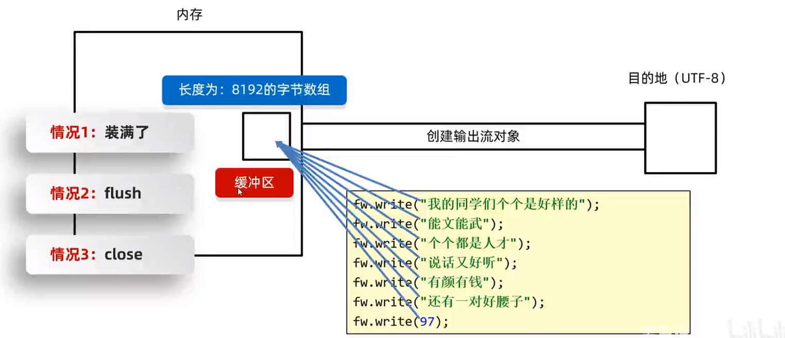

> - 当写入数据时，java会先将数据写入内存缓冲区
> - 当缓冲区长度满8192个字节时，则会自动写入文件
> - 当IO流关闭时，也会将缓冲区的内容写入文件

## 字符集

**字符集是将一个字符集中字符的映射为一个或多个数字的方法**


### 乱码产生的原因

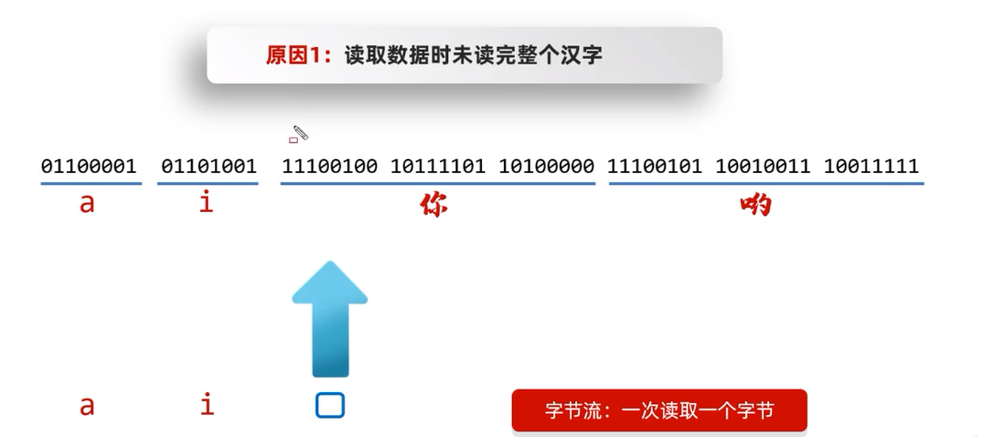

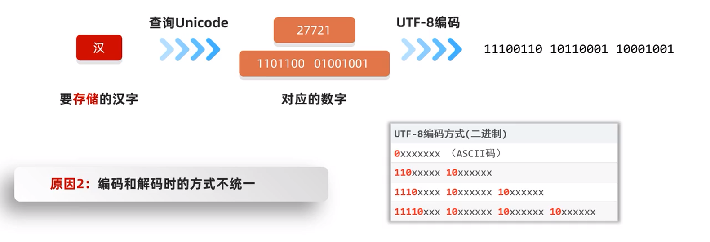

### Java中编码与解码

**编码的方法**

| String类中的方法                             | 说明                 |
| -------------------------------------------- | -------------------- |
| `public byte[] getBytes()`                   | 使用默认方式进行编码 |
| `public byte[] getBytes(String charsetName)` | 使用指定方式进行编码 |

**解码的方法**

| String类中的方法                            | 说明                 |
| ------------------------------------------- | -------------------- |
| `String(byte[] bytes)`                      | 使用默认方式进行解码 |
| `String(byte[] byytes, String charsetName)` | 使用指定方式进行解码 |

```java
String s = "你好啊，李银河";
byte[] bytes1 = s.getBytes(); // 默认编码
byte[] bytes2 = s.getBytes("GBK"); // 指定编码

String s1 = new String(bytes1); // 默认解码
System.out.println(s1); // 你好啊，李银河

String s2 = new String(bytes2, "GBK"); // 指定解码
System.out.println(s2); // 你好啊，李银河
```

> - GBK编码使用两个字节来存储一个中文字符
> - UTF-8编码使用三个字节来存储一个中文字符

## 缓冲流

### 概述

#### 定义

缓冲流，也叫高效流，是对4个基本的`FileXxx`流的增强，把基本流包装成高级流，提高**读取/写出**数据的性能。

按照数据类型分类

- **字节缓冲流：**`BufferedInputStream`，`BufferedOutputStream`
- **字符缓冲流：**`BufferedReader`，`BufferedWriter`

#### 体系结构

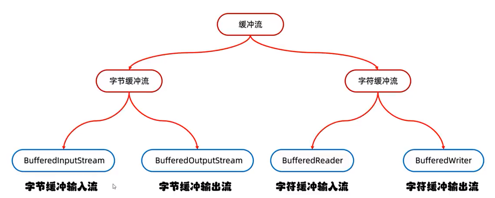

### 字节缓冲流

#### 输入流-BufferedInputStream

##### 概述

`BufferedINputStream`是Java I/O库提供的一个输入流类，它使用了内部缓冲区的方式提高了读取文件的效率

##### 基本用例

```java
// 创建流对象
BufferedInputStream bis = new BufferedInputStream(new FileInputStream("jdk.exe"));
// 读取数据
int b = bis.read();
// 关闭资源
bis.close();
```

##### 构造方法

`public BufferdInputStream(InputStream in)：`创建一个新的缓冲输入流。

```java
// 创建字节缓冲输入流
BufferedInputStream bis = new BufferedInputStream(new FileINputStream("bis.txt"));
```

> 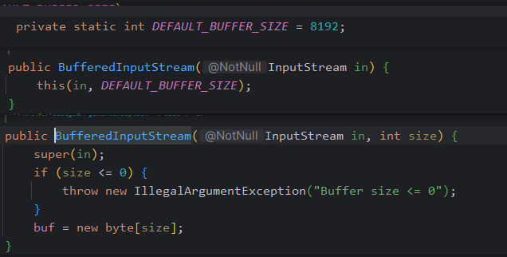
>
> 当使用此构造方法时，Java会在底层执行new一个长度为8192的数组

##### 常用成员方法

**同字节基本流的输入流**

#### 输出流-BufferedOutputStream

##### 基本用例

```java
// 创建流对象
BufferedOutputStream bos = new BufferedOutputStream(new FileOutputStream("a.exe"));
int len;
byte[] bytes = new [1024 * 8]; // 8KB
bos.write(bytes, 0, len);
bos.close();
```

##### 构造方法

```java
/* 格式：
	public BufferedOutputStream(OutputStream os)
    作用：创建字节缓冲输出流对象*/
 BufferedOutputStream bos = new BufferedOutputStream(new FileOutputStream("myio\\a.txt"));
```

> 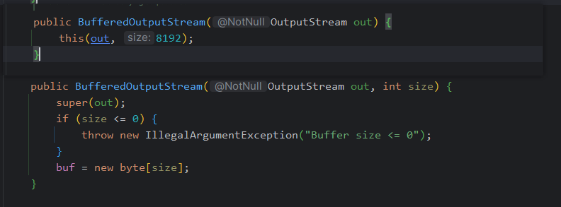
>
> 当使用此构造方法时，Java会在底层执行new一个长度为8192的数组

##### 常用成员方法

**同字节基本流的输出流**

#### 案例-文件拷贝

```
// 方式一：
//1.创建缓冲流的对象
BufferedInputStream bis = new BufferedInputStream(new FileInputStream("myio\\a.txt"));
BufferedOutputStream bos = new BufferedOutputStream(new FileOutputStream("myio\\a.txt"));
//2.循环读取并写到目的地
int b;
while ((b = bis.read()) != -1) {
    bos.write(b);
}
//3.释放资源
bos.close();
bis.close();

// -----------------------

// 方式二：
//1.创建缓冲流的对象
BufferedInputStream bis = new BufferedInputStream(new FileInputStream("myio\\a.txt"));
BufferedOutputStream bos = new BufferedOutputStream(new FileOutputStream("myio\\copy2.txt"));
//2.拷贝（一次读写多个字节）
byte[] bytes = new byte[1024];
int len;
while((len = bis.read(bytes)) != -1){
    bos.write(bytes,0,len);
}
//3.释放资源
bos.close();
bis.close();
```

> 当使用缓冲流来创建对象时，只需要释放缓冲流对象的资源，不需要释放文件输入和输出流的资源。因为Java会在底层进行自动的关闭操作。
>
> 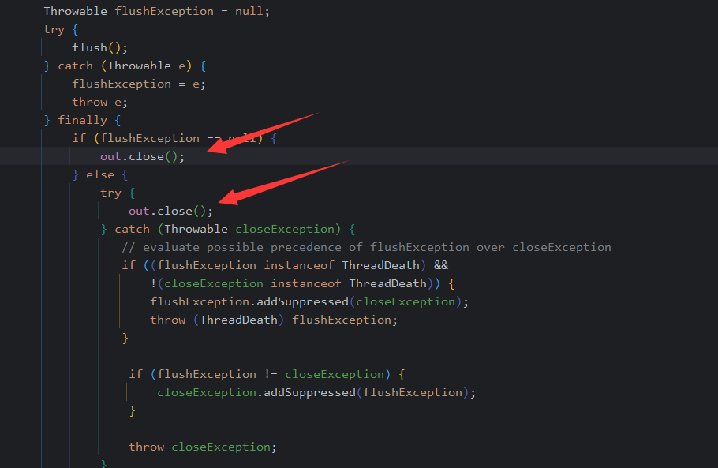

#### 原理

字节缓冲流高效率原理

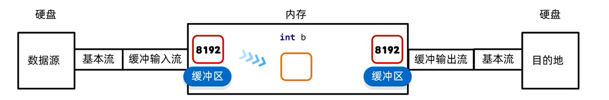

> 缓冲区调高效率，是在内存中开辟了一块区域，命名为缓冲区。缓冲区的作用，减少了内存与硬盘的频繁读写，从而提高了硬盘区域的读写效率

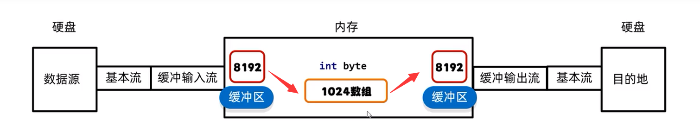

> 当通过定义数组的方式来进行读写数据时，实际上是加快了数据在内存中的频繁读写，从而提高了内存区域的读写效率。

### 字符缓冲流

#### 输入流-BufferedReader

##### 概述

`BufferedReader`是Java中的一个字符缓冲输入流，可以提供一次读取一行或多行文本数据的方法，并且能够保证输入流的顺序读取

##### 基本用例

```java
// 1.创建流对象
BufferedReader br = new BufferedReader(new FileReader("in.txt"));
// 2.读取数据
String line = bis.readLine();
// 3.关闭资源
br.close();
```

##### 构造方法

```java
/* 格式：
	public BufferedReader(Reader in) 
	作用：创建字符缓冲输入流对象*/
// 示例
BufferedReader br = new BufferedReader(new FileReader("br.txt"));
```

##### 常用成员方法

- `public String readLine()：`读一行文字。
- 其余常用方法，参见字符基本输入流。

###### readLine() 一次性读取一整行数据

```java
/* 格式：
	BufferedReader对象.readLine()
	作用：一次性读取一整行数据，读到换行符为止
	读不到内容（文件末尾） → 返回 null
 String line = br.readLine()
```

#### 输出流-BufferedWriter

`BufferdWriter`是Java IO中的一种字符输出流，可以将文本数据，写入到字符输出流中，提供缓冲区，可以提高写入的效率

##### 基本用例

```java
// 1.创建流对象
BufferedWriter bw = new BufferedWriter(new FileWriter("out.txt"));
// 2.写出数据
bw.write("黑马");
// 3.写出换行
bw.newLine();
// 4.关闭资源
bw.close();
```

##### 构造方法

```java
/* 格式：
	public BufferedReader(Reader in) 
	作用：创建字符缓冲输出流对象*/
BufferedWriter bw = new BufferedWriter(new FileWriter("bw.txt"))
```

##### 常用成员方法

- `public void newLine()：写入系统自带的换行符，不同系统不一样
- 


 


