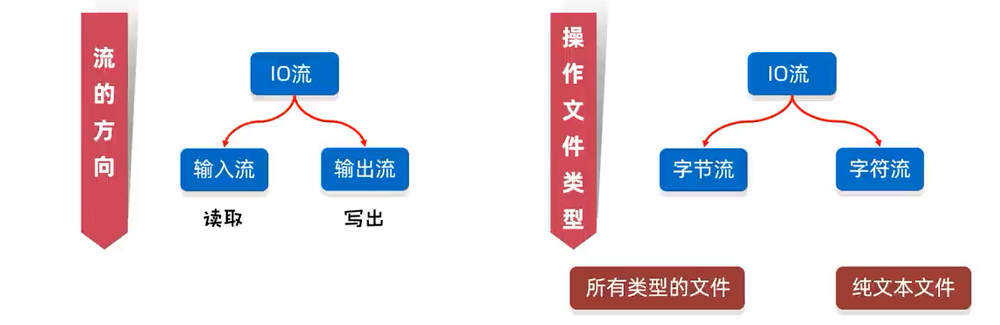
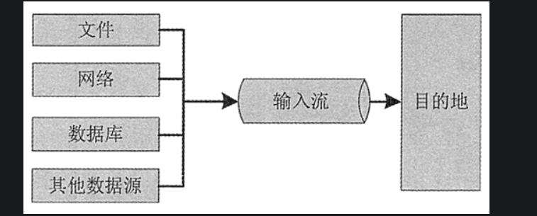
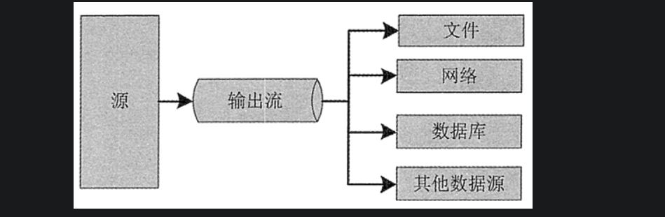
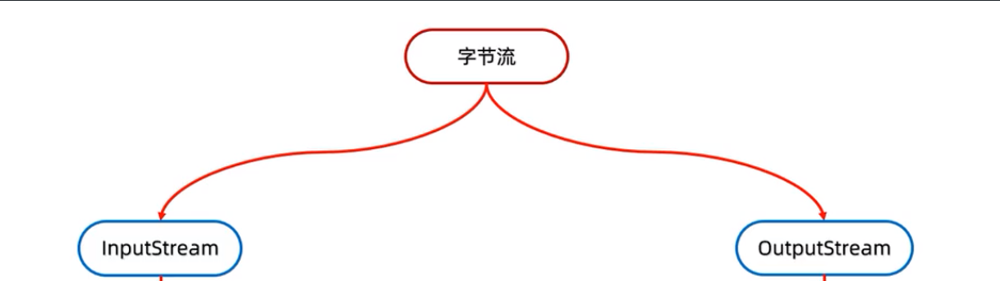
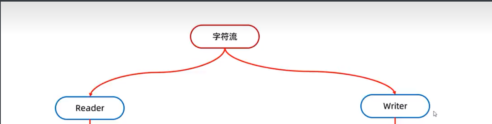
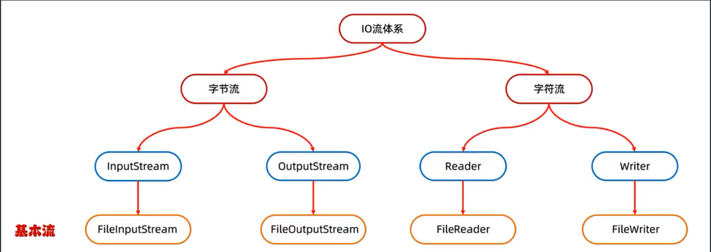
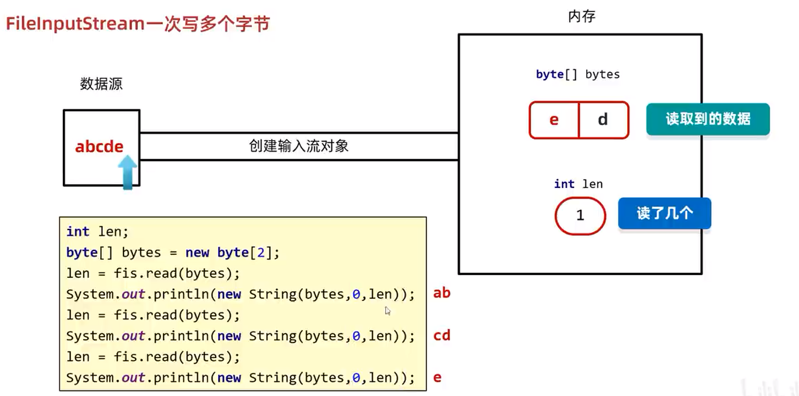

# IO流

Java中I/O操作主要是指会用`java.io`包下的内容、进行输入、输出操作。**输入**也叫做**读取**数据，**输出**也叫做**写出**数据。

Java中的IO流指的是一组用于处理输入输出操作的类和接口，可以让程序读取和写入数据，实现与文件、网络和其他设备的交互。

### 分类



### 输入流和输出流

- 输入流：

  在Java中的IO流中，输入流式用于**读取数据**的流。输入流可以从文件、网络连接、标准输入等各种数据源中读取数据

  

- 输出流：

  在Java的IO流中，输出流是指从程序中向外部写数据的流。输出流通常用于将程序中的数据写入到文件、、网络连接、管道等地方

  

### 字节流与字符流

- 字节流

  一切文件数据(文件、图片、、视频等)在存储时，都是以**二进制数字**的形式保存，都是一个一个的字节，那么传输时一样如此。所以，**字节流可以传输任意文件数据**。在操作流的时候，我们要时刻明确，无论使用什么样的流对象，**底层传输的始终为二进制数据**。

  

- 字符流

  在Java中的IO流中，字符流是一种**处理字符数据**的IO流，即按字符读取或写入数据的流。和字节流不同，字符流是安装字符（Unicode码）来处理的

  

### 流体系



## 字节基本流

### 输入流-FileInputStream

`FileInputStream`是Java IO库中用于读取文件数据的类，用于从文件中读取字节流数据。

#### 基本用例

```java
//1.创建对象
FileInputStream fis = new FileInputStream("myio\\a.txt");
//2.读取数据
int b1 = fis.read();
System.out.println((char)b1);
int b2 = fis.read();
System.out.println((char)b2);
int b3 = fis.read();
System.out.println((char)b3);
int b4 = fis.read();
System.out.println((char)b4);
int b5 = fis.read();
System.out.println((char)b5);
int b6 = fis.read();
System.out.println(b6);//-1
//3.释放资源
fis.close();
```

> `read()`方法，每读取一个数据，就会移动一次指针，返回的是UTF-8的数字编码0-128。

#### 构造方法

- `FileInputStream(File file)`：通过打开与实际文件的连接来创建一个**FileInputStream**，该文件系统中的`File`对象命名
- `FileInputStream(String name)`：通过打开与实际文件的连接来创建一个**FileInputStream**，该文件由文件系统中的路径名`name`命名

##### FileInputStream(File file)

```java
File file = new File("a.txt");
FileInputStream fis = new FileInputStream(file);
```

> 如果文件不存在，就直接报错，因为创建出来的文件是没有数据的，没有意义，所以Java就没有设计这种无意义的逻辑，文件不存在直接报错。

##### FileInputStream(String name)

```java
FileInputStream fis = new FileInputStream("b.txt");
```

> 细节同上

#### 常用成员方法

| 方法名称                         | 说明                   |
| -------------------------------- | ---------------------- |
| `public int read()`              | 一次读一个字节数据     |
| `public int read(byte[] buffer)` | 一次读一个字节数组数据 |

::: tip

一次读一个字节数组的数据，每次读取会尽可能把数组装满

`1024的整数倍	1024*1024*5`

:::

##### read()

```java
int b = fis.read();
```

> - 一次读一个字节，读出来的是数据在ASCLL上对应的数字
> - 读到文件末尾了，read返回的是-1

##### read(byte[] b) 

```java
byte[] b = new byte[1024 * 1024];
int len = fis.read(b);		// 一次读取1M的数据
```

> 使用数组读取，每次读取多个字节，减少了系统间的IO操作次数，从而提高了读写效率

##### close()

```java
fis.close();	// 释放资源，接触资源占用
```

#### 一次读取多个字节

```java
//1.创建对象
FileInputStream fis = new FileInputStream("myio\\a.txt");
//2.读取数据
byte[] bytes = new byte[2];
//一次读取多个字节数据，具体读多少，跟数组的长度有关
//返回值：本次读取到了多少个字节数据
int len1 = fis.read(bytes);
System.out.println(len1);//2
String str1 = new String(bytes,0,len1);
System.out.println(str1);

int len2 = fis.read(bytes);
System.out.println(len2);//2
String str2 = new String(bytes,0,len2);
System.out.println(str2);

int len3 = fis.read(bytes);
System.out.println(len3);// 1
String str3 = new String(bytes,0,len3);
System.out.println(str3);// ed 

//3.释放资源
fis.close();
```

> 
>
> - 此时每次读取都会将从文件内读取到的字节放入字节数组中
> - 当读取到最后一个字节时，此时只会覆盖数组中的第一个数，因此数据中会残留上一次读取的数据
> - 现在通过`new String(字节流数组, 索引, 长度)`，这个`String`的构造方法可以合理避免此读取问题

#### 循环读取

```java
//1.创建对象
FileInputStream fis = new FileInputStream("myio\\a.txt");
//2.循环读取
int b;
while ((b = fis.read()) != -1) {
    System.out.println((char) b);
}
//3.释放资源
fis.close();
```

#### 原理

**输入工作流原理**


```java
FileInputStream fis = new FileInputStream();
```


```java
int b1 = fis.read();
```


```java
fis.close();
```

### 输出流-FileOutputStream

#### 概述

`FileOutputStream`是Java I/O包中的一个类，又叫字节输出流。用于操作本地文件的字节输出流，可以把程序中的数据写到本地文件中。


