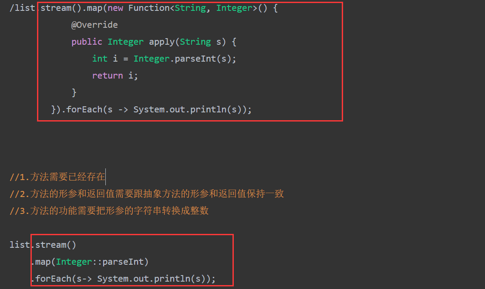

# 方法引用

### 定义

在Java中，方法引用是一种特殊的Lambda表达式，他是用来简化Lambda表达式的写法，特别是当Lambda表达式中只调用了一个已经存在的方法时。

### 规则

- 引用处必须是函数式接口
- 被引用的方法必须已经存在
- 被引用方法的形参和返回值需要跟抽象方法保持一致
- 被引用方法的功能要满足当前的需求

### 方法引用符

`::`该符号为引用运算符，而他所在的表达式被称为方法引用

```java
class JavaMainApplicationTests {
    public static int subtraction(int num1, int num2) {
        return num2 - num1;
    }

    @Test
    void contextLoads() {
        //需求：创建一个数组，进行倒序排列
        Integer[] arr = {3, 5, 4, 1, 6, 2};
        //方式一：匿名内部类

        /* Arrays.sort(arr, new Comparator<Integer>() {
            @Override
            public int compare(Integer o1, Integer o2) {
                return o2 - o1;
            }
        });*/


        //方式二：lambda表达式
        //因为第二个参数的类型Comparator是一个函数式接口
        /* Arrays.sort(arr, (Integer o1, Integer o2)->{
            return o2 - o1;
        });*/

        //方式三：lambda表达式简化格式
        //Arrays.sort(arr, (o1, o2)->o2 - o1 );


        //方式四：方法引用
        //1.引用处需要是函数式接口
        //2.被引用的方法需要已经存在
        //3.被引用方法的形参和返回值需要跟抽象方法的形参和返回值保持一致
        //4.被引用方法的功能需要满足当前的要求

        //表示引用FunctionDemo1类里面的subtraction方法
        //把这个方法当做抽象方法的方法体
        Arrays.sort(arr, JavaMainApplicationTests::subtraction);
        
        System.out.println(Arrays.toString(arr));
    }
}
```

### 分类

1. 引用静态方法
2. 引用成员方法
3. 引用构造方法
4. 类名引用成员方法
5. 引用数组的构造方法

## 作用

他是将方法作为一个对象来使用，而不是想Lambda表达式那样直接定义一个匿名方法。

方法引用可以使代码更加简洁易懂，提高代码的可读性和可维护性。另外，方法引用还可以用于提高代码的性能，因为他避免了Lambda表达式中的不必要的重复调用。



> 此处展示方法引用的作用区别

## 引用静态方法

**格式：**`类::方法名`

**示例**

```java
//1.创建集合并添加元素
ArrayList<String> list = new ArrayList<>();
Collections.addAll(list,"1","2","3","4","5");

//2.把他们都变成int类型
/* list.stream().map(new Function<String, Integer>() {
            @Override
            public Integer apply(String s) {
                int i = Integer.parseInt(s);
                return i;
            }
        }).forEach(s -> System.out.println(s));*/


//1.方法需要已经存在
//2.方法的形参和返回值需要跟抽象方法的形参和返回值保持一致
//3.方法的功能需要把形参的字符串转换成整数

list.stream()
    .map(Integer::parseInt)
    .forEach(s-> System.out.println(s));
```

> 当需要的方法已经存在时，可以根据`类名::方法名`，进行调用

## 引用成员方法

**格式**

```java
对象::成员方法
1. 其他类：
    对象::方法名
2. 本类:
	this::方法名
3. 父类:
	super::方法名
```

**示例(其他类)**

```java
class stringOpration {
public boolean stringJudge(String s){
        return s.startsWith("张") && s.length() == 3;
    }
}
```

```java
/* 格式：
	其他类:其他类对象::方法名*/
public static void main(String[] args) {
    //1.创建集合
    ArrayList<String> list = new ArrayList<>();
    //2.添加数据
    Collections.addAll(list,"张无忌","周芷若","赵敏","张强","张三丰");
    //3.其他类：
    list.stream().filter(new stringOpration()::stringJudge)
        .forEach(s-> System.out.println(s));
}
```

> 通过调用其他类实例对象的方法名进行调用

**示例(本类)**

```java
/* 格式：
	本类:this ::方法名*/
public class FunctionDemo3  {
    public static void main(String[] args) {
        //1.创建集合
        ArrayList<String> list = new ArrayList<>();
        //2.添加数据
        Collections.addAll(list,"张无忌","周芷若","赵敏","张强","张三丰");
        //3.本类，静态方法中是没有this的
        list.stream().filter(new FunctionDemo3()::stringJudge)
                .forEach(s-> System.out.println(s));
    }

    public boolean stringJudge(String s){
        return s.startsWith("张") && s.length() == 3;
    }
}
```

> 在静态方法中，是没有`this`的，因此需要调用`new`本类对象

**示例(父类)**

```java
/* 格式：
	父类:super::方法名*/
public class FunctionDemo3  {
    public static void main(String[] args) {
        //1.创建集合
        ArrayList<String> list = new ArrayList<>();
        //2.添加数据
        Collections.addAll(list,"张无忌","周芷若","赵敏","张强","张三丰");
        //3.本类，静态方法中是没有this的
        list.stream().filter(super::stringJudge)
                .forEach(s-> System.out.println(s));
    }
}
```

> 若本类`FunctionDemo3`有父类，则可以通过`super`的方法名进行调用

## 引用构造方法

```java
/* 格式：
	类名::new
*/
// 1.创建集合对象
ArrayList<String> list = new ArrayList<>();
// 2.添加数据
Collections.addAll(list, "张无忌,15", "周芷若,14", "赵敏,13", "张强,20", "张三丰,100", "张翠山,40", "张良,35", "王二麻子,37", "谢广坤,41");
//3.封装成Student对象并收集到List集合中
//String --> Student
/*  List<Student> newList = list.stream().map(new Function<String, Student>() {
            @Override
            public Student apply(String s) {
                String[] arr = s.split(",");
                String name = arr[0];
                int age = Integer.parseInt(arr[1]);
                return new Student(name, age);
            }
        }).collect(Collectors.toList());
        System.out.println(newList);*/


List<Student> newList2 = list.stream().map(Student::new).collect(Collectors.toList());
System.out.println(newList2);
```

```java
public class Student {
    private String name;
    private int age;

    public Student(String str) {
        String[] arr = str.split(",");
        this.name = arr[0];
        this.age = Integer.parseInt(arr[1]);
    }
}
```

> - 此时，通过`Student`类名进行`new`，就可以调用`Student`的构造方法。
> - 此时构造方法的返回值默认就是返回Student整个类对象

## 类名引用成员方法

```java
/*格式:
	类名::成员方法 */
public static void main(String[] args) {
    /* 

        方法引用的规则：
        1.需要有函数式接口
        2.被引用的方法必须已经存在
        3.被引用方法的形参，需要跟抽象方法的第二个形参到最后一个形参保持一致，返回值需要保持一致。
        4.被引用方法的功能需要满足当前的需求

        抽象方法形参的详解：
        第一个参数：表示被引用方法的调用者，决定了可以引用哪些类中的方法
                    在Stream流当中，第一个参数一般都表示流里面的每一个数据。
                    假设流里面的数据是字符串，那么使用这种方式进行方法引用，只能引用String这个类中的方法

        第二个参数到最后一个参数：跟被引用方法的形参保持一致，如果没有第二个参数，说明被引用的方法需要是无参的成员方法

        局限性：
            不能引用所有类中的成员方法。
            是跟抽象方法的第一个参数有关，这个参数是什么类型的，那么就只能引用这个类中的方法。

       */

    //1.创建集合对象
    ArrayList<String> list = new ArrayList<>();
    //2.添加数据
    Collections.addAll(list, "aaa", "bbb", "ccc", "ddd");
    //3.变成大写后进行输出
    //map(String::toUpperCase)
    //拿着流里面的每一个数据，去调用String类中的toUpperCase方法，方法的返回值就是转换之后的结果。
    list.stream().map(String::toUpperCase).forEach(s -> System.out.println(s));

    //String --> String
    /* list.stream().map(new Function<String, String>() {
            @Override
            public String apply(String s) {
                return s.toUpperCase();
            }
        }).forEach(s -> System.out.println(s));*/
}
```

::: tip

与引用成员方法做区分

:::

> 不能引用类中的所有成员方法，如果抽象方法的第一个参数是A类型的只能引用A类中的方法

## 引用数组的构造方法

```java
/*格式:
	数据类型[]::new */
 public static void main(String[] args) {
        /*
        细节：
            数组的类型，需要跟流中数据的类型保持一致。
       */

        //1.创建集合并添加元素
        ArrayList<Integer> list = new ArrayList<>();
        Collections.addAll(list, 1, 2, 3, 4, 5);
        //2.收集到数组当中

        Integer[] arr2 = list.stream().toArray(Integer[]::new);
        System.out.println(Arrays.toString(arr2));

        /*Integer[] arr = list.stream().toArray(new IntFunction<Integer[]>() {
            @Override
            public Integer[] apply(int value) {
                return new Integer[value];
            }
        });*/
     
        //3.打印
    }
```


## 小结

> 1. 概述：
>
>    1. 含义：把已经有的方法拿过来用，**当做函数式接口中抽象方法的方法体**
>    2. 规则：
>       - **引用处**必须是函数式接口
>       - **被引用的**方法必须**已经存在**
>       - **被引用**方法的形参和返回值需要跟**抽象方法保持一致**
>       - 被引用方法的功能**要满足当前的需求**
>    3. 引用符`::`(两个连续的冒号)
>
> 2. 作用：方法引用可以使代码更加简洁易懂，提高代码的可读性和可维护性。**避免了Lambda表达式中**的不必要的重复调用。
>
> 3. 分类：
>
>    - 引用**静态方法：**
>
>      ```java
>      // 格式: 类名::方法名
>      list.stream().maap(Integer::parseInt).forEach(s -> System.out.println(s));
>      ```
>
>    - 引用**成员方法：**
>
>      - **其他类**
>
>        ```java
>        /* 格式：
>        	new对象::方法名*/
>        list.stream().filter(new StringOpration()::stringJudge);
>        ```
>
>      - **本类**
>
>        ```java
>        /* 格式：
>        	this::方法名	
>        */
>        list.stream().filter(this::stringJudge)
>        ```
>
>        **细节：**若该方法用于静态方法中，则需要`new`对象，因为静态方法中无`this`
>
>      - **父类**
>
>        ```java
>        /* 格式：
>        	父类:super::方法名*/
>        list.stream().flter(super::stringJudge);
>        ```
>
>        **细节：**方法引用中没有super关键字
>
>    - 引用**构造方法：**
>
>      ```java
>      /*格式:
>      	类名::new */
>      List<Student> newList2 = list.stream().map(Student::new);
>      ```
>
>    - **类名引用成员方法：**
>
>      ```java
>      /*格式:
>      	类名::成员方法 */
>      list.stream().map(String::toUpperCase);
>      ```
>
>      **注意：**与引用成员方法区别
>
>      - 一个是对象进行引用，可以使用类中所有方法；
>      - 这个则是类名进行引用，他的参数需要与抽象方法中的第一个参数类型对应
>
>    - 引用**数组的构造方法：**
>
>      ```java
>      /*格式:
>      	数据类型[]::new */
>      list.stream().toArray(Integer[]::new);
>      ```
>
>      
