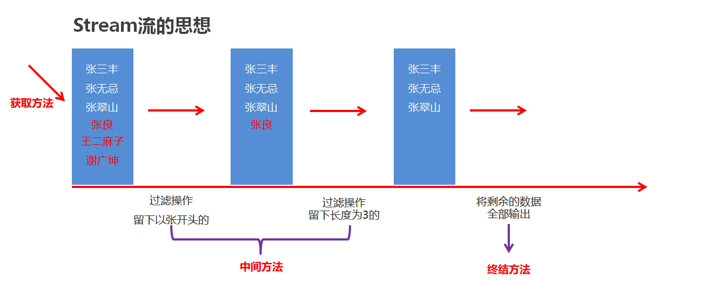
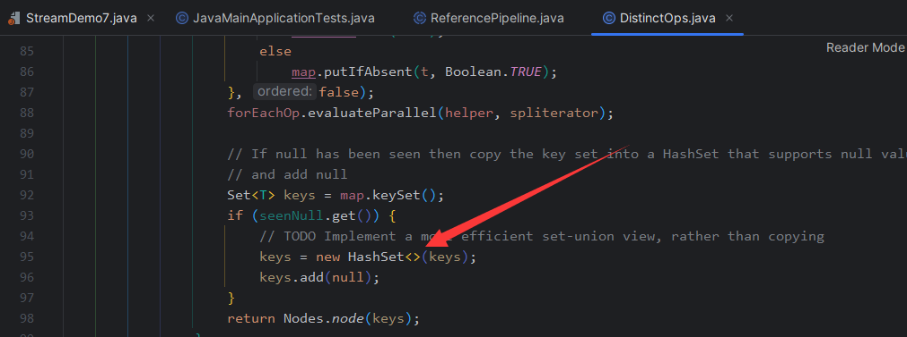
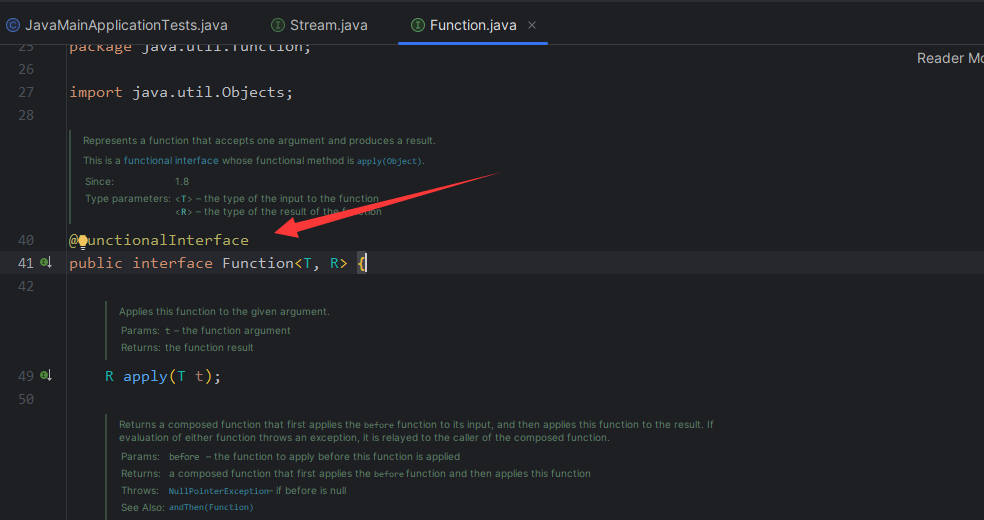
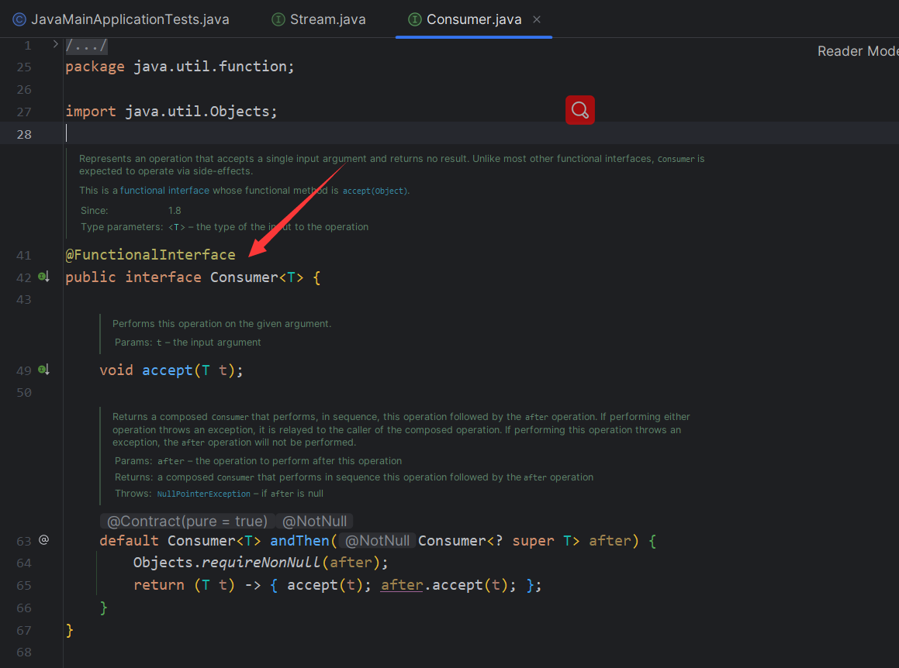

# Stream流

### 定义

在Java8中，Stream是一种处理集合的机制，他可以对集合进行各种操作（过滤、映射、排序等）并生成新的集合，同时支持并行处理。

简单来说，Stream流就是一个可以被多次处理的容器，可以通过一些链式操作来实现对元素的转换和处理。Stream流的操作分为中间操作和结束嘈操作，中间操作返回的是另一个流，结束操作返回的不是流，而是一个计算结果。

使用Stream流可以简化代码实现，并且由于其并行处理能力，可以大大提升代码运行效率

### 思想



> 一层一层过滤，最终获取想要的结果

### 使用步骤

- **获取Stream流**
  - 创建一条流水线，并把数据放到流水线上准备进行操作
- **中间方法**
  - 流水线上的操作
  - 一次操作完毕之后，还可以继续进行其他操作
- **终结方法**
  - 一个Stream流只能有一个终结方法
  - 是流水线上的最后一个操作

## 作用

Stream流的主要作用是对数据进行集合操作和函数式编程，可以实现高效的数据筛选、排序、过滤、分组、统计等操作

## 获取流

| 获取方式     | 方法名                                      | 说明                   |
| ------------ | ------------------------------------------- | ---------------------- |
| 单列集合     | `default Stream<E> stream()`                | Collection中的默认方法 |
| 双列集合     | `无`                                        | 无法直接使用stream流   |
| 数组         | `public static<T> Stream(T[] array)`        | Arrays工具类的静态方法 |
| 一堆零散数据 | `public static<T> Stream<T> of(T...values)` | Stream接口中的静态方法 |

**获取方式：**

- **`Collection`体系集合：**使用默认方法`stream()`生成流，`defaukt Stream stream()`
- **`Map`体系集合：**把`Map`转换成`Set`集合，间接的生成流
- **数组：**通过`Arrays中的静态方法`stream`生成流
- **同种数据类型的多个数据：**通过`Stream`接口的静态方法`of(T...values)`生成流

**示例代码**

```java
public class StreamDemo {
    public static void main(String[] args) {
        //Collection体系的集合可以使用默认方法stream()生成流
        List<String> list = new ArrayList<String>();
        Stream<String> listStream = list.stream();

        Set<String> set = new HashSet<String>();
        Stream<String> setStream = set.stream();

        //Map体系的集合间接的生成流
        Map<String,Integer> map = new HashMap<String, Integer>();
        Stream<String> keyStream = map.keySet().stream();
        Stream<Integer> valueStream = map.values().stream();
        Stream<Map.Entry<String, Integer>> entryStream = map.entrySet().stream();

        //数组可以通过Arrays中的静态方法stream生成流
        String[] strArray = {"hello","world","java"};
        Stream<String> strArrayStream = Arrays.stream(strArray);
      
      	//同种数据类型的多个数据可以通过Stream接口的静态方法of(T... values)生成流
        Stream<String> strArrayStream2 = Stream.of("hello", "world", "java");
        Stream<Integer> intStream = Stream.of(10, 20, 30);
    }
}
```

::: tip

在集合中，单列集合可以通过`.stream()`方法获取`Stream`流。双列集合可以先转换为单列集合，再进行获取在数组中，可以通过`Arrays`工具类的`.stream()`方法获取`Stream`流。

在零散数据中，可以通过`Stream.of()`方法获取`Stream`流。

注意：零散数据需要是同种数据类型。`Stream.of()`中的参数类型，一定是引用数据类型的，若是基本数据类型则不会完成自动装箱的操作，而是会将整个基本数据类型当成一个元素看待

:::

## 中间方法

| 名称                                               | 说明                                 |
| -------------------------------------------------- | ------------------------------------ |
| `Stream<T> filter(Predicate<? super T> predicate)` | 过滤                                 |
| `Stream<T> limit(long maxSize)`                    | 获取前几个元素                       |
| `Stream<T> skip(long n)`                           | 跳过前几个元素                       |
| `Stream<T> distinct()`                             | 元素去重，依赖(hashCode和equals方法) |
| `static<T> Stream<T> concat(Stream a, Stream b)`   | 合并a和b两个流为一个流               |
| `Stream<R> map(Function<T, R> mapper)`             | 转换流中的数据类型                   |

::: warning

1. 中间方法，返回新的`Stream`流，原来的`Stream`流只能使用一次，建议使用链式编程
2. 修改`Stream`流中的数据，不会影响原来集合或者数组中的数据

:::

### filter

```java
ArrayList<String> list = new ArrayList<>();
Collections.addAll(list, "张无忌", "周芷若", "赵敏", "张强", "张三丰", "张翠山", "张良", "王二麻子", "谢广坤");
// filter   过滤  把张开头的留下，其余数据过滤不要
list.stream().filter(new Predicate<String>() {
    @Override
    public boolean test(String s) {
        //如果返回值为true，表示当前数据留下
        //如果返回值为false，表示当前数据舍弃不要
        return s.startsWith("张");
    }
}).forEach(s -> System.out.println(s));

/*	因为filter中的参数类型为函数式接口，
	而Predicate接口中又只有一个抽象方法test，
	因此可以通过Lambda方式进行简化	*/
list.stream()
    .filter(s -> s.startsWith("张"))
    .filter(s -> s.length() == 3)
    .forEach(s -> System.out.println(s)
```

### limit

```java
ArrayList<String> list = new ArrayList<>();
Collections.addAll(list, "张无忌", "周芷若", "赵敏", "张强", "张三丰", "张翠山", "张良", "王二麻子", "谢广坤");
list.stream().limit(3).forEach(s -> System.out.println(s)); // "张无忌", "周芷若", "赵敏"
```

### distinct

```java
// 元素去重
ArrayList<String> list1 = new ArrayList<>();
Collections.addAll(list1, "张无忌","张无忌","张无忌", "张强", "张三丰", "张翠山", "张良", "王二麻子", "谢广坤");

// 此处并没有重写equals和hashCode方法，因为list的类型为String，Java已经完成了这两个方法的重写
list1.stream().distinct().forEach(s -> System.out.println(s));
```

distinct()方法底层是new 了 HashSet,而HashSet进行去重需要依赖equals和hashCode方法。



::: tip

若需要将自定义对象进行去重，需要重写`equals`和`hashCode`方法

:::

### concat

```java
// 合并
ArrayList<String> list1 = new ArrayList<>();
Collections.addAll(list1, "张无忌","张无忌","张无忌", "张强", "张三丰", "张翠山", "张良", "王二麻子", "谢广坤");

ArrayList<String> list2 = new ArrayList<>();
Collections.addAll(list2, "周芷若", "赵敏");
Stream.concat(list1.stream(),list2.stream()).forEach(s -> System.out.println(s));
```

### map

```java
ArrayList<String> list = new ArrayList<>();
Collections.addAll(list, "张无忌-15", "周芷若-14", "赵敏-13", "张强-20", "张三丰-100", "张翠山-40", "张良-35", "王二麻子-37", "谢广坤-41");

// new Function<原本数据类型，需要转换到的数据类型>
list.stream().map(new Function<String, Integer>() {
    @Override
    public Integer apply(String s) {
        String[] arr = s.split("-");
        String ageString = arr[1];
        int age = Integer.parseInt(ageString);
        return age;
    }
}).forEach(s-> System.out.println(s));

System.out.println("------------------------");

// 同样，因为map中的参数为函数式接口，并且函数中只有一个抽象类方法，因此可以使用Lambda表达式进行简化
list.stream()
    .map(s-> Integer.parseInt(s.split("-")[1]))
    .forEach(s-> System.out.println(s));
```

说明：底层源码



::: warning 

- 中间方法，返回新的`Stream`流，原来的`Stream`流只能使用一次(流再使用一次后会进行自动关闭)，建议使用链式编程
- 修改`Stream`流中的数据，不会影响原来集合或者数组中的数据

:::

## 终结方法

| 名称                             | 说明                       |
| -------------------------------- | -------------------------- |
| `voidd forEach(Consumer action)` | 遍历                       |
| `long count()`                   | 统计                       |
| `toArray()`                      | 收集流中的数据，放到数组中 |
| `collect(Collector collector)`   | 收集流中的数据，放到集合中 |

### forEach

```java
ArrayList<String> list = new ArrayList<>();
Collections.addAll(list, "张无忌", "周芷若", "赵敏", "张强", "张三丰", "张翠山", "张良", "王二麻子", "谢广坤");


//void forEach(Consumer action)           遍历

//Consumer的泛型：表示流中数据的类型
//accept方法的形参s：依次表示流里面的每一个数据
//方法体：对每一个数据的处理操作（打印）
/*list.stream().forEach(new Consumer<String>() {
            @Override
            public void accept(String s) {
                System.out.println(s);
            }
        });*/

list.stream().forEach(s -> System.out.println(s));
```



### count

```java
ArrayList<String> list = new ArrayList<>();
Collections.addAll(list, "张无忌", "周芷若", "赵敏", "张强", "张三丰", "张翠山", "张良", "王二麻子", "谢广坤");
long count = list.stream().count();
System.out.println(count);
```

> `.count()`方法的返回值是`long`，因此调用完之后，`Stream`流就会终止

### toArray

```java
Object[] arr1 = list.stream().toArray();
System.out.println(Arrays.toString(arr1));

//IntFunction的泛型：具体类型的数组
//apply的形参:流中数据的个数，要跟数组的长度保持一致
//apply的返回值：具体类型的数组
//方法体：就是创建数组
// toArray()                               收集流中的数据，放到数组中
Object[] arr1 = list.stream().toArray();
System.out.println(Arrays.toString(arr1));

	/* String[] arr = list.stream().toArray(new IntFunction<String[]>() {
            @Override
            public String[] apply(int value) {
                return new String[value];
            }
        });

        System.out.println(Arrays.toString(arr));*/

String[] arr2 = list.stream().toArray(value -> new String[value]);
System.out.println(Arrays.toString(arr2));
```

> - `toArray`方法的参数的作用：负责创建一个指定类型的数组
> - `toArray`方法的底层，会依次得到流里面的每一个数据，并把数据放到数组中
> - `toArray`方法的返回值：是一个装着流里面所有数据的数组

**细节**

> - 问题：`String[] arr2`，字符串数组，打印出来的为地址值。
> - 原因：在Java中打印引用类型的对象是地址，默认是调用`toString()`方法，`toString()`方法，打印为地址值
> - 解决：此时可以重写`toString()`方法，也可以使用`Arrays`工具类中的`toString`方法
> - 补充：`Arrays.toString`方法，会帮我们重写Java中的`toString`方法 

### collect

```java
```

