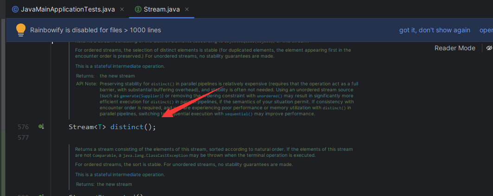
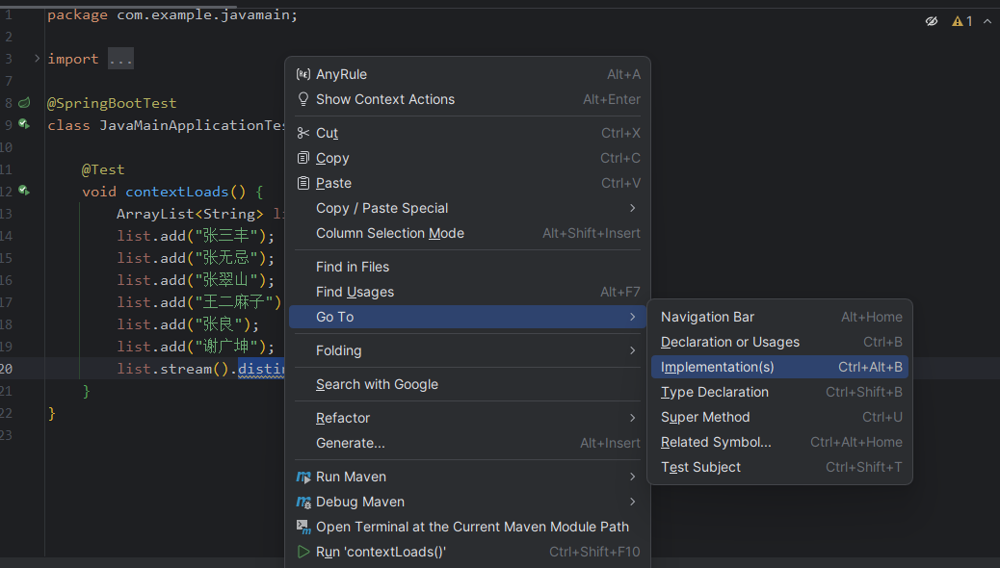
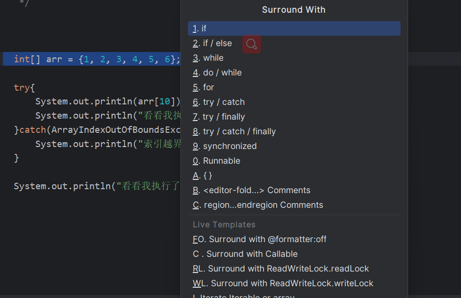
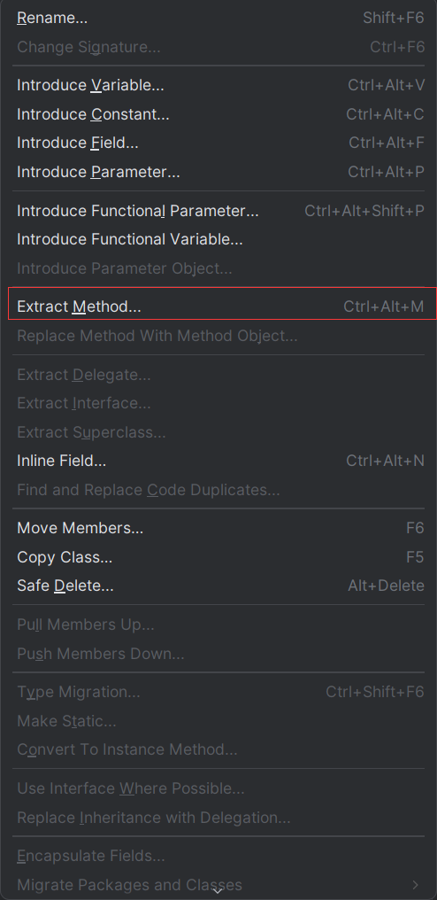
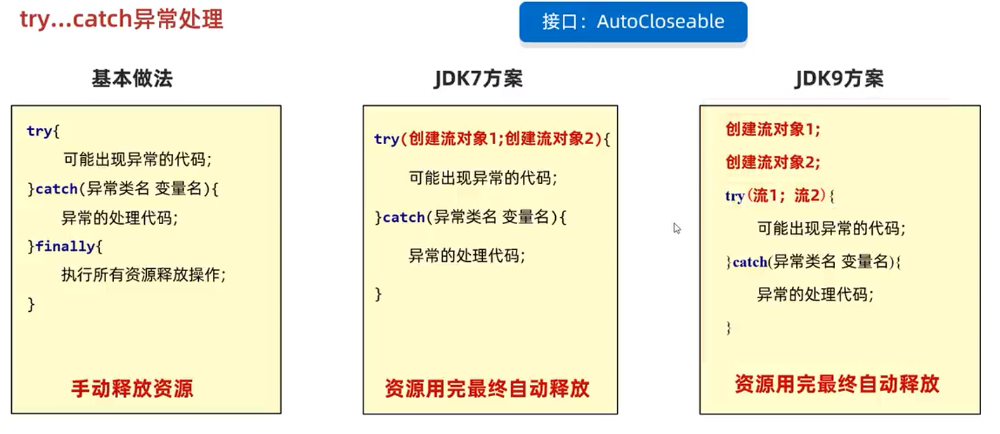
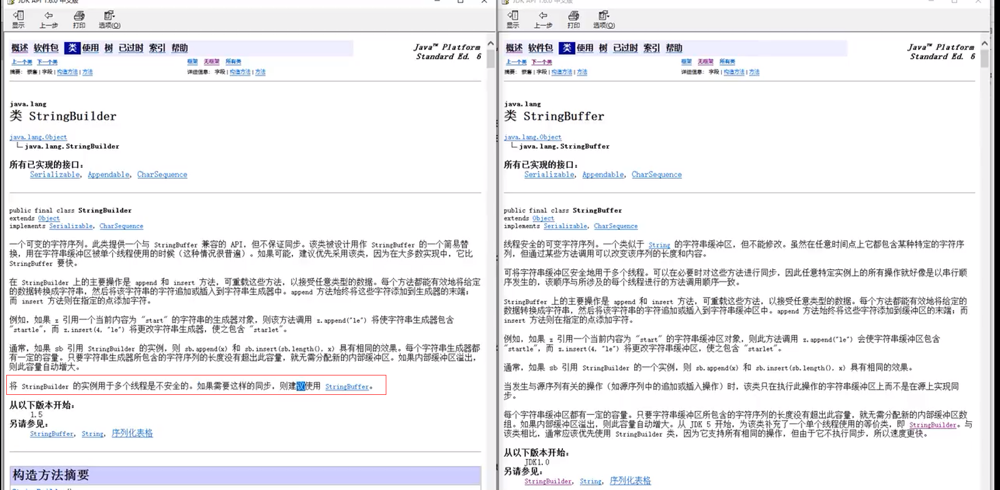
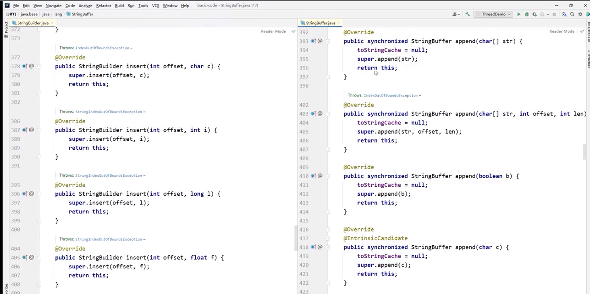

# 知识加油站

## IDEA中查看此方法的源码

若IDEA中进行Ctrl+B查看的是此方法的接口

那么我们可以选中方法，进行实现方法的查看。

## IDEA中包裹代码快捷键

若IDEA中使用Ctrl+Alt+T快捷键，可选择操作项进行包裹代码

## IDEA中提取代码快捷键

**Ctrl + Alt + M**

## Java中异常处理的扩展方式

## StringBuilder和StringBuffer区别

::: tip 说明

`StringBuilder`和`StringBuffer`在java中的方法都是一样的，区别就在于，`StringBuffer`为每个方法添加了同步方法，这样在操作方法时，保证只有一个方法来操作，从而提升了代码安全性

:::

> 若只是单线程，则使用`StringBuilder即可，若是在多线程环境下，需要考虑线程安全，则使用StringBuffer`

## Arrays数组工具类

**操作数组的工具类**

| 方法名                                                       | 说明                     |
| ------------------------------------------------------------ | ------------------------ |
| `public static String toString(数组)`                        | 把数组拼接成一个字符串   |
| `public static int binarySearch(数组，查找的元素)`           | 二分查找法查找元素       |
| `public static int[] copyOf(原数组，新数组长度)`             | 拷贝数组                 |
| `publci static int[] copyOfRange(原数组，起始索引，结束索引)` | 拷贝数组（指定范围）     |
| `public static void fill(数组，元素)`                        | 填充数组                 |
| `public static void sort(数组)`                              | 按照默认方式进行数组排序 |
| `public static void sort(数组，排序规则)`                    | 按照指定的规则排序       |

在Java中，`Arrays`是一个提供了许多有用的静态方法的类，可以用于操作和处理数组。

以下是`Arrays`类的一个常见用法：

1. `Arrays.fill()`方法：用于将数组的所有元素设置为指定的值。
2. `Arrays.equals()`方法：用于比较两个数组是否相等。
3. `Arrays.asList()`方法：用于将数组转换为列表。

需要注意的是，`Arrays`类的大多数方法都是静态方法，因此不需要创建`Arrays`对象就可以调用它们。另外，`Arrays`类中的方法适用于所有基本数据类型的数组，已经对象数组。