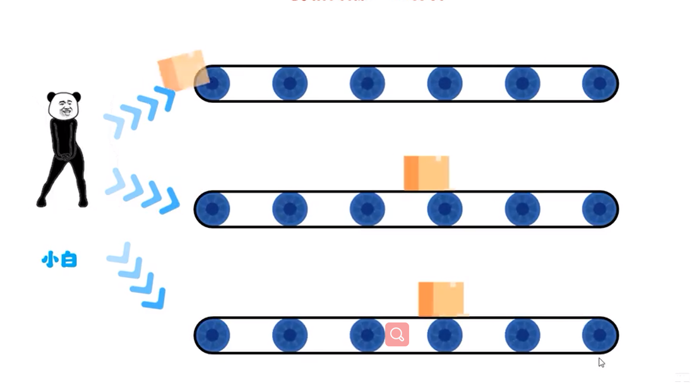
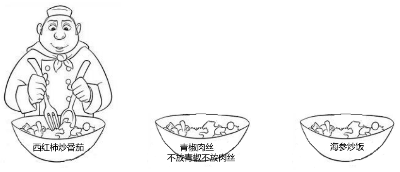
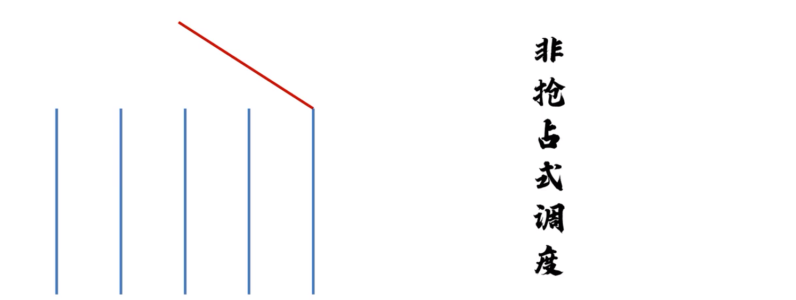

# 多线程

## 概述

### 进程和线程

**进程：是正在运行的程序**

- 独立性：进程是一个能独立运行的基本单位，同时也是系统分配资源和调度的独立单位
- 动态性：进程的实质是程序的一次执行过程，进程是动态产生，动态消亡的
- 并发性：任何进程都可以同其他进程一起并发执行

**线程：是进程中的单个顺序控制流，是一条执行路径**

- 单线程：一个进程如果只有一条执行路径，则称为单线程程序
- 多线程：一个程序有多条执行路径，则称为多线程程序

**线程是操作系统能够运行调度的最小单位，他包含在进程中，是进程的实际运行单位**

### 并发和并行

- 并行：在同一时刻，有多个指令在多个CPU上同时执行。

- 并发：在同一时刻，有各个指令在CPU上交替执行。

### 线程调度

**抢占式调度模型：**

优先让优先级高的线程使用CPU，如果线程的优先级相同，那么会随机选择一个，优先级高的线程获取的CPU时间片相对多一点

> CPU调用线程的几率是随机饿，调用时长也不确定

**分时调度模型：**

所有线程轮流使用CPU的使用权，平均分配每个线程占用CPU的时间片

> CPU调用线程是依次的，调用时长也比较固定

### 守护线程

在Java中，是一种特殊的线程，他在后台提供一种通用的服务。当Java虚拟机中只剩下守护线程时，JVM会退出。与用户线程不同，守护线程并不会阻止JVM的退出

> 当聊天时，还可以传输文件

## 实现方式

### 概述

|                | 优点 | 缺点 |
| -------------- | ---- | ---- |
| 继承`Thread`类 |      |      |
|                |      |      |
|                |      |      |

