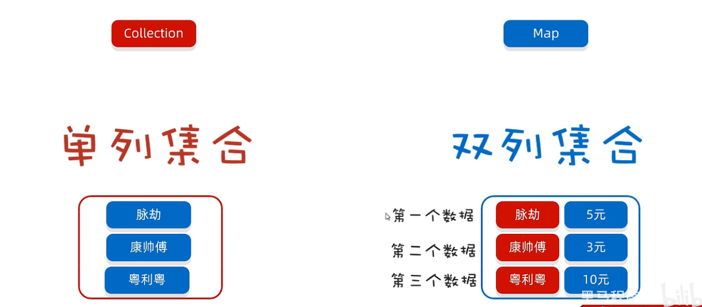
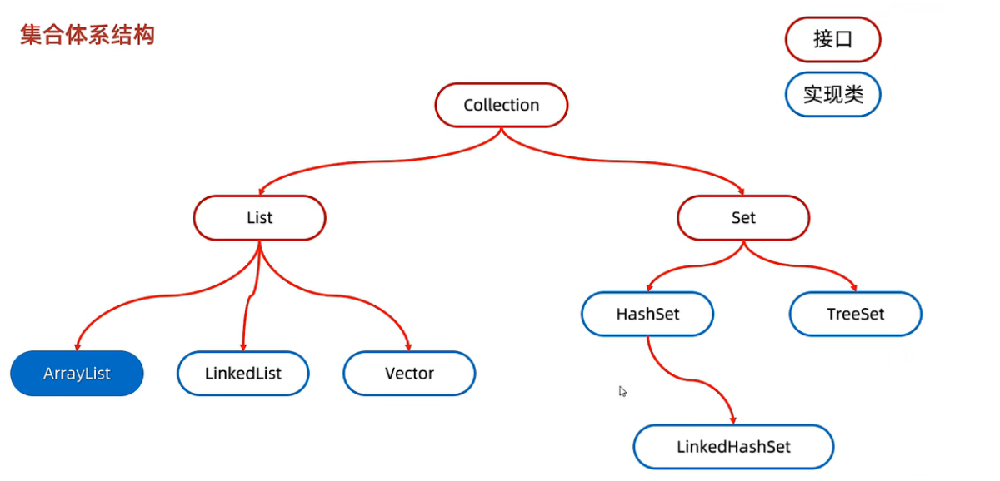
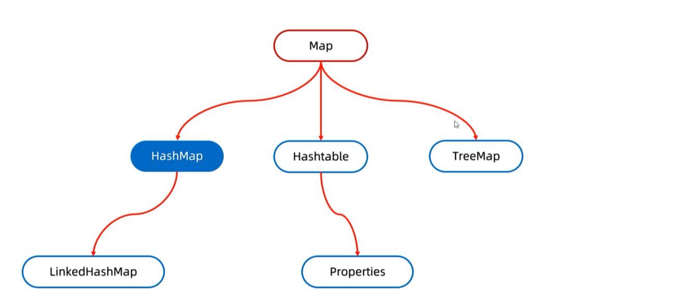

# 集合类

## 集合体系结构

Java中的集合类是用于操作、存储和管理一组对象的容器。其中集合可以分为，单列集合和双列集合。

在Java中，单列合集值得是只能保存一个元素序列的集合，例如List、Set和Queue等。双列合集则是指可以保存键值对的集合，例如Map等。单列集合和双列集合在保存和操作数据时的方式和目的有所不同。

### 单列集合

单列集合又分为：List系列集合、Set系列集合

> - List系列集合：有序、可重复的集合。可以通过索引来访问其中的元素，可以存储重复的数据。
> - Set系列集合：无需、不可重复的集合。不可以通过索引来访问其中的元素，不可以存储重复的数据。

### 双列集合

Java中的双列集合是指可以存储键值对数据结构的集合，也称为映射表或关联数组

> - 双列集合，一个键对应一个值
> - 键不可以重复，值可以重复

## Collection集合

Collection是单列集合的祖宗接口，他的功能是全部单列集合都可以继承使用的

::: warning

Collection是一个接口，我们不能直接创建他的对象。所以，我们现在学习他的方法时，只能创建他实现类的对象

:::

### 常用成员方法

| 方法名                     | 说明                                 |
| -------------------------- | ------------------------------------ |
| boolean add(E e)           | 添加元素                             |
| boolean remove(Object o)   | 从集合中移除指定的元素               |
| boolean removeIf(Object o) | 根据条件进行移除                     |
| void clear()               | 清空集合中的元素                     |
| boolean contains(Object o) | 判断集合中是否存在指定的元素         |
| boolean isEmpty()          | 判断集合是否为空                     |
| int size()                 | 集合的长度，也就是集合中元素的总个数 |