# 集合类

## 集合体系结构

Java中的集合类是用于操作、存储和管理一组对象的容器。其中集合可以分为，单列集合和双列集合。


在Java中，单列合集值得是只能保存一个元素序列的集合，例如List、Set和Queue等。双列合集则是指可以保存键值对的集合，例如Map等。单列集合和双列集合在保存和操作数据时的方式和目的有所不同。

### 单列集合

单列集合又分为：List系列集合、Set系列集合


> - List系列集合：有序、可重复的集合。可以通过索引来访问其中的元素，可以存储重复的数据。
> - Set系列集合：无需、不可重复的集合。不可以通过索引来访问其中的元素，不可以存储重复的数据。

### 双列集合    

Java中的双列集合是指可以存储键值对数据结构的集合，也称为映射表或关联数组


> - 双列集合，一个键对应一个值
> - 键不可以重复，值可以重复

## Collection集合

Collection是单列集合的祖宗接口，他的功能是全部单列集合都可以继承使用的

::: warning

Collection是一个接口，我们不能直接创建他的对象。所以，我们现在学习他的方法时，只能创建他实现类的对象

:::

### 常用成员方法

| 方法名                     | 说明                                 |
| -------------------------- | ------------------------------------ |
| boolean add(E e)           | 添加元素                             |
| boolean remove(Object o)   | 从集合中移除指定的元素               |
| boolean removeIf(Object o) | 根据条件进行移除                     |
| void clear()               | 清空集合中的元素                     |
| boolean contains(Object o) | 判断集合中是否存在指定的元素         |
| boolean isEmpty()          | 判断集合是否为空                     |
| int size()                 | 集合的长度，也就是集合中元素的总个数 |

#### add

```java
Collection<String> coll = new ArrayList<>();
coll.add("aaa");
coll.add("bbb");
coll.add("ccc");
System.out.println(coll); // [aaa, bbb, ccc]
```

- 如果我们要往List系列集合中添加数据，那么方法永远返回true，因为List系列集合是允许元素重复的。
- 如果我们要往Set系列集合中添加数据，如果当前要添加的元素不存在，方法返回true，添加成功。如果当前添加的元素已经存在，方法返回false，表示添加失败。因为Set系列的集合不允许重复。

#### clear

``` java
Collection<String> coll = new ArrayList<>(Arrays.asList("aaa", "bbb", "ccc"));
coll.clear();
```

#### remove

```java
Collection<String> coll = new ArrayList<>(Arrays.asList("aaa", "bbb",, "ccc"));
sout(coll.remove("bbb")); // true
sout(coll); // [aaa, ccc]
```

- 因为Collection里面定义的是共性的方法，不是他的所有子类都有索引(如map)，所以此时不能通过索引进行删除。只能通过元素的对象进行删除
- 方法会有一个布尔类型的返回值，删除成功返回true，删除失败返回false
- 如果要删除的元素不存在，就会删除失败。

#### contains

```java
Collection<String> coll = new ArrayList<>(Arrays.asList("aaa", "bbb", "ccc"));
boolean result1 = coll.contains("bbb");
sout(result1); // true
```

- 底层是依赖equals方法进行判断是否存在的
- 所以，如果集合中存储的是自定义对象，也想通过contains方法来判断是否包含，那么在javaBean类中，一定要重写equals方法

#### isEmpty

```java
Collection<String> coll = new ArrayList<>();
boolean result = coll.isEmpty;
sout(result); // true
```

#### size

```java
Collection<String> coll = new ArrayList<>(Arrays.asList("aaa","bbb"));
coll.add("ccc");
int size = coll.size();
sout(size); // 3
```

#### 案例--学生查询

```java
package com.itcode.commonClass;

import java.util.Objects;

public class Student {
    private String name;
    private int age;

    public Student() {
    }

    public Student(String name, int age) {
        this.name = name;
        this.age = age;
    }

    public String getName() {
        return name;
    }

    public void setName(String name) {
        this.name = name;
    }

    public int getAge() {
        return age;
    }

    public void setAge(int age) {
        this.age = age;
    }

    @Override
    public boolean equals(Object o) {
        // 先判断对象的地址是不是一致
        if (o == this) return true;
        // 如果为空或者Class类型不一致，则返回false
        if (o == null || o.getClass() != this.getClass()) return false;
        // 在判断name和age是不是相同
        Student s = (Student)o;
        if (this.name.equals(s.getName()) && this.age == s.getAge()) return true;
        return false;
    }

    @Override
    public int hashCode() {
        return Objects.hash(name, age);
    }
}

//1.创建集合的对象
Collection<Student> coll = new ArrayList<>();

//2.创建三个学生对象
Student s1 = new Student("zhangsan",23);
Student s2 = new Student("lisi",24);
Student s3 = new Student("wangwu",25);

//3.把学生对象添加到集合当中
coll.add(s1);
coll.add(s2);
coll.add(s3);

//4.判断集合中某一个学生对象是否包含
Student s4 = new Student("zhangsan",23);
//因为contains方法在底层依赖equals方法判断对象是否一致的。
//如果存的是自定义对象，没有重写equals方法，那么默认使用Object类中的equals方法进行判断，而Object类中equals方法，依赖地址值进行判断。
//需求：如果同姓名和同年龄，就认为是同一个学生。
//所以，需要在自定义的Javabean类中，重写equals方法就可以了。
System.out.println(coll.contains(s4));
```

### 遍历方式

#### 迭代器

概述：迭代器在Java中的类是`Iterator`，迭代器是集合专用的遍历方式

- `Collection`集合获取迭代器
  - `Iterator<E> iterator()` 返回迭代器对象，默认指向当前集合的`0`索引
- `Iterator`中的常用成员方法
  - `boolean hasNext()`判断当前位置是否有元素，有元素返回`true`，没有返回`false`
  - `E next()`获取当前位置的元素，并将迭代器对象移向下一个位置。

**代码示例**

```java
public class IteratorDemo1 {
    public static void main(String[] args) {
        // 创建集合对象
        Collection<String> c = new ArrayList<>();
        
        // 添加元素
        c.add("hello");
        c.add("world");
        c.add("java");
        c.add("javaee");
        
        //Iterator<E> iterator()：返回此集合中元素的迭代器，通过集合的iterator()方法得到
        Iterator<String> it = c.iterator(); // 1.获取迭代器
        
        //用while循环改进元素的判断和获取
        while (it.hasNext()) { // 2.判断是否有元素
            // 先获取元素，再移动指针
            String s = it.next(); // 3.获取元素 // 4.移动指针
            System.out.println(s);
        }
    }
}
```

> 迭代器运行流程
>
> 1. 创建指针
> 2. 判断是否有元素
> 3. 获取指针
> 4. 移动指针

::: tip

1. 当迭代器中**无元素**或元素遍历完成，再次调用`it.next()`方法，则报错`NoSuchElementException`
2. 迭代器遍历完毕，指针不会复位
3. 循环中只能用一次`next()`方法（因为`next`方法会做两件事，分别是获取元素和移动指针）

:::

**迭代器删除**

`void remove()`删除迭代器对象当前指向的元素

```java
public class IteratorDemo2 {
    public static void main(String[] args) {
        ArrayList<String> list = new ArrayList<>();
        list.add("a");
        list.add("b");
        list.add("b");
        list.add("c");
        list.add("d");

        Iterator<String> it = list.iterator();
        while(it.hasNext()){
            String s = it.next();
            if("b".equals(s)){
                //指向谁,那么此时就删除谁.
                it.remove();
            }
        }
        System.out.println(list);
    }
}
```

::: warning

迭代器遍历时，不能用集合的方法进行增加或删除，否则报错`ConcurrentModificationException`

:::

#### 增强for循环

**格式：**

```java
for(集合/数组中元素的数据类型 变量名 : 集合/数组名) {
    // 已经将当前遍历到的元素封装到变量中了，直接使用变量即可
}
// 例如
for(String s : list) {
    sout(s);
}
```

**示例：**

```java
public class MyCollectonDemo1 {
    public static void main(String[] args) {
        ArrayList<String> list =  new ArrayList<>();
        list.add("a");
        list.add("b");
        list.add("c");
        list.add("d");
        list.add("e");
        list.add("f");

        //1,数据类型一定是集合或者数组中元素的类型
        //2,str仅仅是一个变量名而已,在循环的过程中,依次表示集合或者数组中的每一个元素
        //3,list就是要遍历的集合或者数组
        for(String str : list){
            System.out.println(str);
        }
    }
}
```

::: tip

修改增强`for`中的变量，不会改变集合中原本的数据，因为是通过第三方变量进行赋值

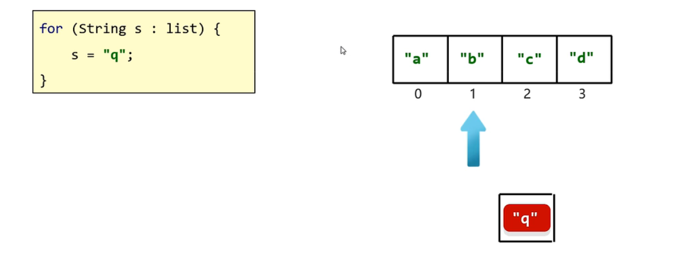

:::

#### Lambda表达式

概述：得益于JDK 8开始的新技术`Lambda`表达式，提供了一种更简单、更直接的遍历集合的方式。

**常用成员方法：**

`default void forEach(Consumer<? super > action);`结合`lambda`遍历集合

```java
Collection<String> coll = new ArrayList<>(Arrays.asList(
	new Student("张三" ,17),
    new Student("李四" ,18),
    new Student("王五" ,19),
    new Student("赵六" ,20)
));
coll.add("zhangsan");
coll.add("lisi");
coll.add("wangwu");
coll.forEach(s -> System.out.println(s));
```

::: tip

底层原理：其实也会自己遍历集合，依次得到每一个元素。把得到的每一个元素，传递给下面的accept方法。s依次表示集合中的每一个数据

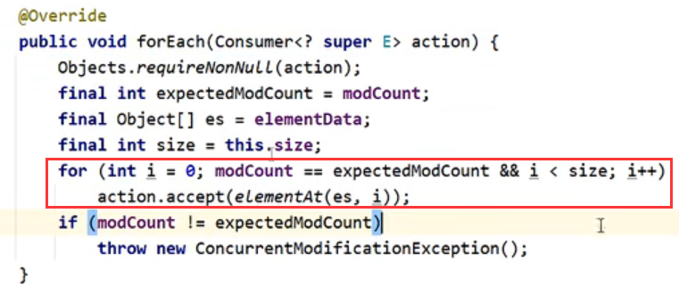

:::

## List集合

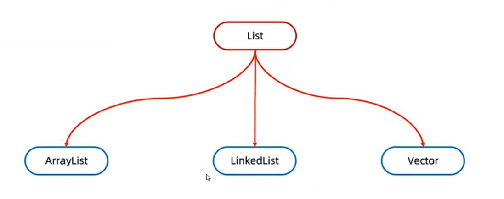

`Collection`的方法`List`都继承了，集合的方法列表也都继承了，`List`集合因为有索引，所以多了很多操作索引的方法。

- 有序集合，这里的有序指的是存取顺序
- 用户可以精确控制列表中每个元素的插入位置，用户可以通过整数索引访问元素，并搜索列表中的元素
- 与`Set`集合不同，列表通常允许重复的元素

**特点**

- 存取有序
- 可以重复
- 有索引

### 常用成员方法

| 方法名                        | 描述                                   |
| ----------------------------- | -------------------------------------- |
| E remove(int index)           | 删除指定索引处的元素，返回被删除的元素 |
| void add(int index,E element) | 在此集合中的指定位置插入指定的元素     |
| E set(int index, E element)   | 修改指定索引处的元素，返回被修改的元素 |
| E get(int index)              | 返回指定索引处的元素                   |

#### add

```java
List<String> list = new ArrayList<>();
list.add("aaa");
list.add("bbb");//1
list.add("ccc");
// 或者
list.add(1,"QQQ") // 在此集合中的指定位置插入指定的元素
```

> 原来索引上的元素会依次往后移

#### remove

```java
List<String> list = new ArrayList<>();
String remove = list.remove(0); //删除指定索引处的元素，返回被删除的元素
System.out.println(remove);//aaa
```

#### set

```java
List<String> list = new ArrayList<>();
String result = list.set(0, "QQQ"); //修改指定索引处的元素，返回被修改的元素
System.out.println(result);
```

#### get

```java
List<String> list = new ArrayList<>();
String s = list.get(0); //返回指定索引处的元素
System.out.println(s); // bbb
```

#### 案例--基础操作

```java
public class MyListDemo {
    public static void main(String[] args) {
        List<String> list = new ArrayList<>();
        list.add("aaa");
        list.add("bbb");
        list.add("ccc");
        //method1(list);
        //method2(list);
        //method3(list);
        //method4(list);
    }

    private static void method4(List<String> list) {
        //        E get(int index)		返回指定索引处的元素
        String s = list.get(0);
        System.out.println(s);
    }

    private static void method3(List<String> list) {
        //        E set(int index,E element)	修改指定索引处的元素，返回被修改的元素
        //被替换的那个元素,在集合中就不存在了.
        String result = list.set(0, "qqq");
        System.out.println(result);
        System.out.println(list);
    }

    private static void method2(List<String> list) {
        //        E remove(int index)		删除指定索引处的元素，返回被删除的元素
        //在List集合中有两个删除的方法
        //第一个 删除指定的元素,返回值表示当前元素是否删除成功
        //第二个 删除指定索引的元素,返回值表示实际删除的元素
        String s = list.remove(0);
        System.out.println(s);
        System.out.println(list);
    }

    private static void method1(List<String> list) {
        //        void add(int index,E element)	在此集合中的指定位置插入指定的元素
        //原来位置上的元素往后挪一个索引.
        list.add(0,"qqq");
        System.out.println(list);
    }
}
```

### 遍历方式

此遍历方式，参考`Collection`集合遍历方式


```java
package com.itheima.a02mylist;

import java.util.ArrayList;
import java.util.List;
import java.util.ListIterator;

public class A03_ListDemo3 {
    public static void main(String[] args) {
        /*
            List系列集合的五种遍历方式：
                1.迭代器
                2.列表迭代器
                3.增强for
                4.Lambda表达式
                5.普通for循环
         */


        //创建集合并添加元素
        List<String> list = new ArrayList<>();
        list.add("aaa");
        list.add("bbb");
        list.add("ccc");

        //1.迭代器
        Iterator<String> it = list.iterator();
        while(it.hasNext()){
            String str = it.next();
            System.out.println(str);
        }


        //2.增强for
        //下面的变量s，其实就是一个第三方的变量而已。
        //在循环的过程中，依次表示集合中的每一个元素
       for (String s : list) {
            System.out.println(s);
        }

        //3.Lambda表达式
        //forEach方法的底层其实就是一个循环遍历，依次得到集合中的每一个元素
        //并把每一个元素传递给下面的accept方法
        //accept方法的形参s，依次表示集合中的每一个元素
        list.forEach(s->System.out.println(s) );


        //4.普通for循环
        //size方法跟get方法还有循环结合的方式，利用索引获取到集合中的每一个元素
        for (int i = 0; i < list.size(); i++) {
            //i:依次表示集合中的每一个索引
            String s = list.get(i);
            System.out.println(s);
        }

        // 5.列表迭代器
        //获取一个列表迭代器的对象，里面的指针默认也是指向0索引的

        //额外添加了一个方法：在遍历的过程中，可以添加元素
        ListIterator<String> it = list.listIterator();
        while(it.hasNext()){
            String str = it.next();
            if("bbb".equals(str)){
                //qqq
                it.add("qqq");
            }
        }
        System.out.println(list);
    }
}
```

## ArrayList集合

- 什么是集合

  提供一种存储空间可变的存储模型，存储的数据容量可以发生变化

- `ArrayList`集合的特点

  长度可以变化，只能存储引用数据类型--想存储基本数据类型可以使用包装类。

- 泛型的使用

  用于约束集合中存储元素的数据类型

### 常用成员方法

#### 构造方法

| 方法名             | 说明                 |
| ------------------ | -------------------- |
| public ArrayList() | 创建一个空的集合对象 |

#### 成员方法

| 方法名                              | 说明                                     |
| ----------------------------------- | ---------------------------------------- |
| public boolean add(要删除的元素)    | 将指定的元素追加到此集合的末尾           |
| public boolean remove(要删除的元素) | 删除指定元素，返回值表示是否删除成功     |
| public E remove(int index)          | 删除指定索引处的元素，返回被删除的元素   |
| public E set(int index, E e)        | 修改指定索引位置的元素，返回被修改的元素 |
| public E get(int index)             | 返回指定索引位置的元素                   |
| public int size()                   | 返回集合的总长度                         |

```java
public class ArrayListDemo02 {
    public static void main(String[] args) {
        //创建集合
        ArrayList<String> array = new ArrayList<String>();

        //添加元素
        array.add("hello");
        array.add("world");
        array.add("java");

        //public boolean remove(Object o)：删除指定的元素，返回删除是否成功
        //        System.out.println(array.remove("world"));
        //        System.out.println(array.remove("javaee"));

        //public E remove(int index)：删除指定索引处的元素，返回被删除的元素
        //        System.out.println(array.remove(1));

        //IndexOutOfBoundsException
        //        System.out.println(array.remove(3));

        //public E set(int index,E element)：修改指定索引处的元素，返回被修改的元素
        //        System.out.println(array.set(1,"javaee"));

        //IndexOutOfBoundsException
        //        System.out.println(array.set(3,"javaee"));

        //public E get(int index)：返回指定索引处的元素
        //        System.out.println(array.get(0));
        //        System.out.println(array.get(1));
        //        System.out.println(array.get(2));
        //System.out.println(array.get(3)); //？？？？？？ 自己测试

        //public int size()：返回集合中的元素的个数
        System.out.println(array.size());

        //输出集合
        System.out.println("array:" + array);
    }
}
```

### 底层原理

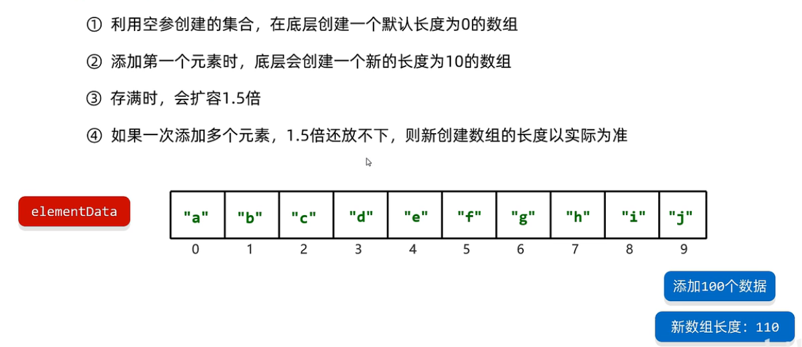

> - 当长度为m(m<=10)的数组，添加少于n(n<10)个数据时，数组长度是10。
> - 当长度为m(m<=10)的数组，添加大于n(n>10)个数据时，数组长度为n+10
> - 当长度为m(m>10)的数组，添加少于n(n<10)个数据时，数组长度是m*1.5
> - 当长度为m(m>10)的数组，添加大于n(n>10)个数据时，数组长度是m+n

源码分析

> ```java
> transient Object[] elementData; // non-private to simplify nested class access
> ```
>
> **ArrayList底层是一个数组**
>
> 添加一个元素
>
> 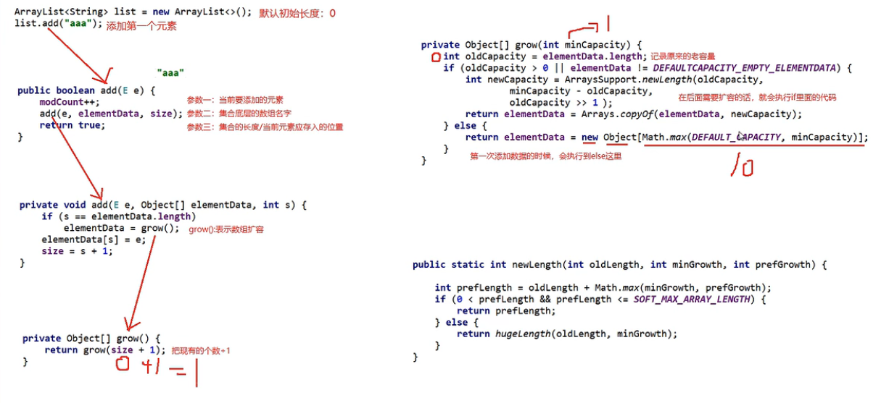
>
> 添加十个元素
>
> 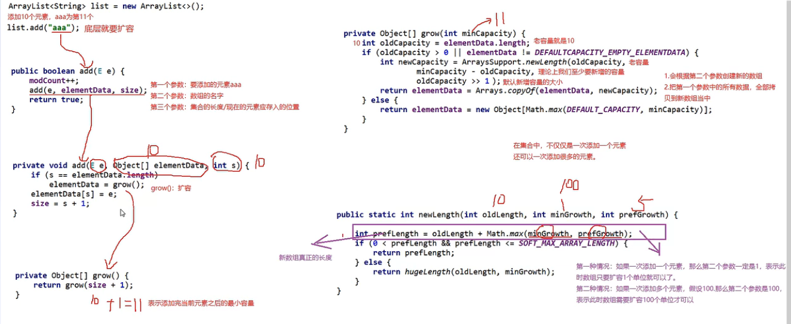

## LinkedList集合

`LinkedList`是Java集合框架中的一个双向链表实现类，可以用来存储一组**有序的元素**。`LinkedList`的元素是通过链表连接在一起的，每个元素都包含了一个指向前一个元素和后一个元素的引用。因此，**插入和删除**元素的时间复杂度是`O(1)`的，而随机访问元素的时间复杂度是`O(n)`的，其中`n`是`LinkedList`中元素的个数。

> **结构形式**
>
> 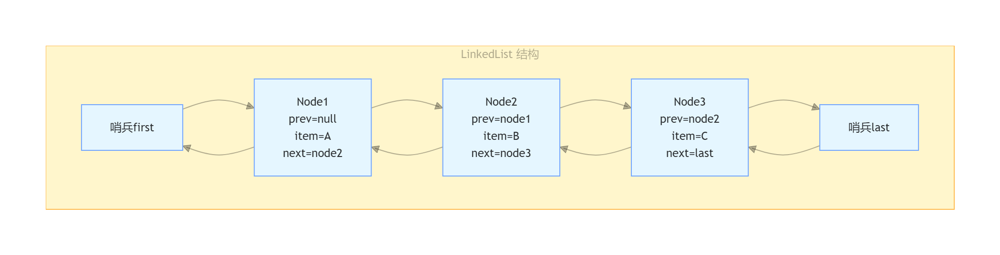
>
> **查找算法**
>
> 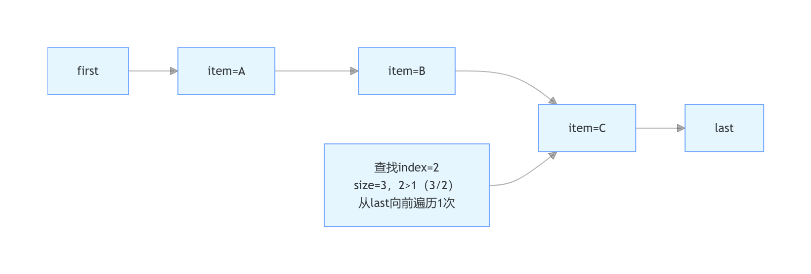

### 常用成员方法

| 方法名                    | 说明                                   |
| ------------------------- | -------------------------------------- |
| public void addFirst(E e) | 在该列表的开头插入指定的元素           |
| public void addLast(E e)  | 将指定元素追加到列表的末尾             |
| public E getFirst()       | 获取列表开头的元素                     |
| public E getLast()        | 获取列表结尾的元素                     |
| public E removeFirst()    | 删除列表开头的元素，且返回被删除的元素 |
| public E removeLast()     | 删除列表结尾的元素，且返回被删除的元素 |

```java
public class MyLinkedListDemo4 {
    public static void main(String[] args) {
        LinkedList<String> list = new LinkedList<>();
        list.add("aaa");
        list.add("bbb");
        list.add("ccc");
//        public void addFirst(E e)	在该列表开头插入指定的元素
        //method1(list);

//        public void addLast(E e)	将指定的元素追加到此列表的末尾
        //method2(list);

//        public E getFirst()		返回此列表中的第一个元素
//        public E getLast()		返回此列表中的最后一个元素
        //method3(list);

//        public E removeFirst()		从此列表中删除并返回第一个元素
//        public E removeLast()		从此列表中删除并返回最后一个元素
        //method4(list);
      
    }

    private static void method4(LinkedList<String> list) {
        String first = list.removeFirst();
        System.out.println(first);

        String last = list.removeLast();
        System.out.println(last);

        System.out.println(list);
    }

    private static void method3(LinkedList<String> list) {
        String first = list.getFirst();
        String last = list.getLast();
        System.out.println(first);
        System.out.println(last);
    }

    private static void method2(LinkedList<String> list) {
        list.addLast("www");
        System.out.println(list);
    }

    private static void method1(LinkedList<String> list) {
        list.addFirst("qqq");
        System.out.println(list);
    }
}
```

### 底层原理

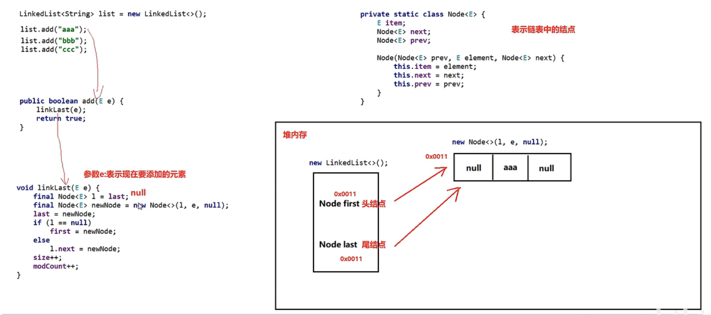

> 当添加第1个元素时，会将头结点和尾结点指向第1个元素，并且第1元素的前索引和后索引都为空

## Set集合

`Set`集合是Java集合框架中的一种，它用于存储不重复的元素，具有无序性。

**特点**

- **无序**：存取顺序不一致
- **不重复**：可以去除重复
- **无索引**：没有带索引的方法，所以不能使用普通`for`循环遍历，也不能通过索引来获取元素

### 常用成员方法


| **方法名**                 | **说明**                           |
| -------------------------- | ---------------------------------- |
| boolean add(E e)           | 添加元素                           |
| boolean remove(Object o)   | 从集合中移除指定的元素             |
| boolean removeIf(Object o) | 根据条件进行移除                   |
| void clear()               | 清空集合中的元素                   |
| boolean contains(Object o) | 判断集合中是否存在指定的元素       |
| boolean isEmpty()          | 判断集合是否为空                   |
| int size()                 | 集合的长度，也就是集合中元素的个数 |

> `Set`集合的方法基本上与`Collection`的API一致

### 遍历方式

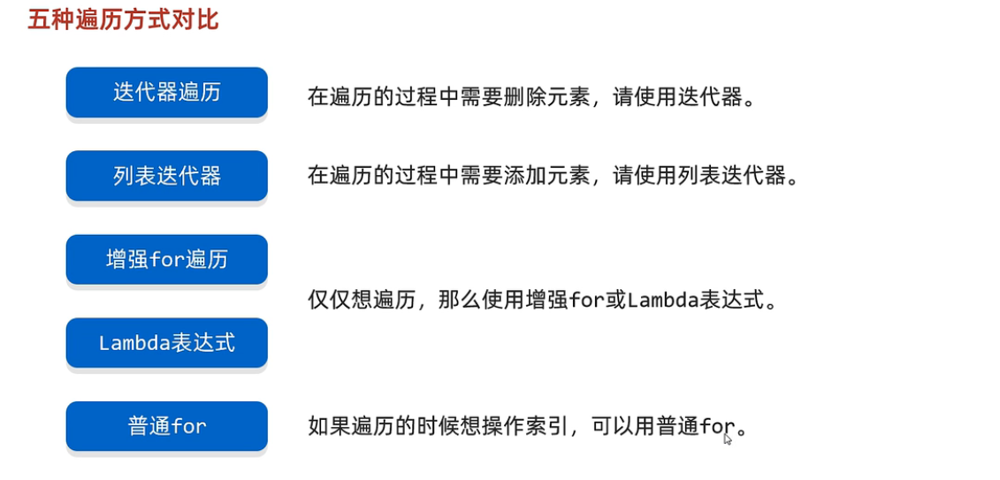

```java
public class A01_SetDemo1 {
    public static void main(String[] args) {
       /*
           利用Set系列的集合，添加字符串，并使用多种方式遍历。
            迭代器
            增强for
            Lambda表达式
        */


        //1.创建一个Set集合的对象
        Set<String> s = new HashSet<>();

        //2,添加元素
        //如果当前元素是第一次添加，那么可以添加成功，返回true
        //如果当前元素是第二次添加，那么添加失败，返回false
        s.add("张三");
        s.add("张三");
        s.add("李四");
        s.add("王五");

        //3.打印集合
        //无序
        System.out.println(s);//[李四, 张三, 王五]

        //迭代器遍历
      	Iterator<String> it = s.iterator();
        while (it.hasNext()){
            String str = it.next();
            System.out.println(str);
        }

        //增强for
       for (String str : s) {
            System.out.println(str);
        }

        // Lambda表达式
        s.forEach( str->System.out.println(str));
    }
}
```

## HashSet集合

**哈希值**

- 含义：对象的整数表现形式

  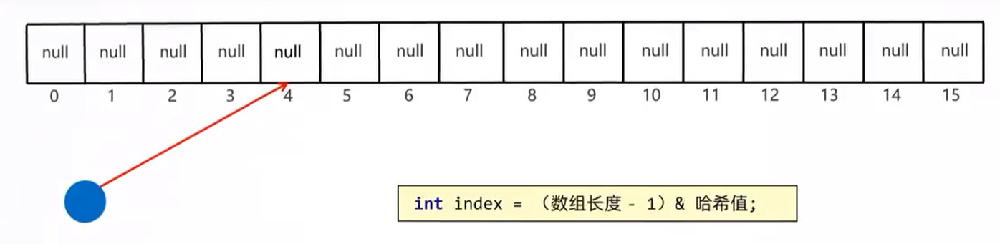

- 概述：
  - 根据`hashCode`方法算出来的`int`类型的整数
  - 该方法定义在`Object`类中，所有对象都可以调用，默认使用地址值进行计算
  - 一般情况下，会重写`hashCode`方法、利用对象内部的属性值计算哈希值

**对象的哈希特点：**

- 如果没有重写`hashCode`方法，不同对象计算出的哈希值是不同的

  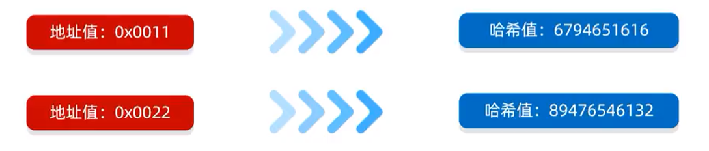

- 如果已经重写`hashCode`方式，不同的对象只要属性值相同，计算出的哈希值就是一样的

  

- 在小部分情况下，不同的属性值或者不同的地址值计算出来的哈希值也有可能一样。（哈希碰撞）

  

  `int`的取值范围用将近42亿中，如果此时创建20亿个对象，就有可能8亿hash值相同

**示例：**

```java
        //1.创建对象
        Student s1 = new Student("zhangsan",23);
        Student s2 = new Student("zhangsan",23);

        //2.如果没有重写hashCode方法，不同对象计算出的哈希值是不同的
        //  如果已经重写hashcode方法，不同的对象只要属性值相同，计算出的哈希值就是一样的
        System.out.println(s1.hashCode());//-1461067292
        System.out.println(s2.hashCode());//-1461067292


        //在小部分情况下，不同的属性值或者不同的地址值计算出来的哈希值也有可能一样。
        //哈希碰撞
        System.out.println("abc".hashCode());//96354
        System.out.println("acD".hashCode());//96354
```

### 底层原理

**`HashSet`底层原理**

- `HashSet`集合底层采取哈希表存储数据
- 哈希表是一种对增删改查数据性能都较好的结构

**哈希表组成**

- JDK8之前：数组+链表
- JDK8开始：数组+链表+红黑树

**JDK1.8以前：**

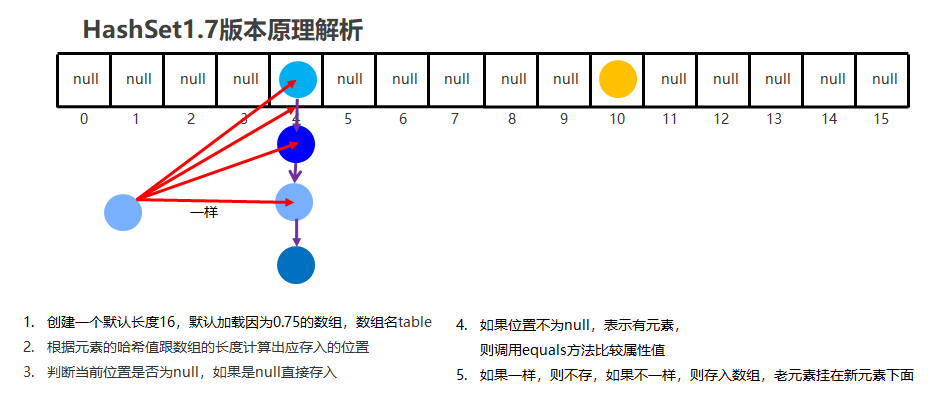

**JDK1.8以后：**

- 节点个数少于等于8个：数组+链表
- 节点个数多余8个：数组+红黑树

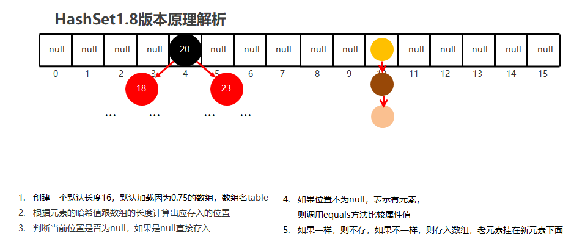

> 加载因子：又叫`HashSet`的扩容时机
>
> 当数组内存储了16*0.75=12个元素时，次数数组的长度会扩容到原来的两倍，也就是32
>
> 当链表长度大于8而且数组长度大于等于64，链表就是转换为红黑树

**底层流程：**

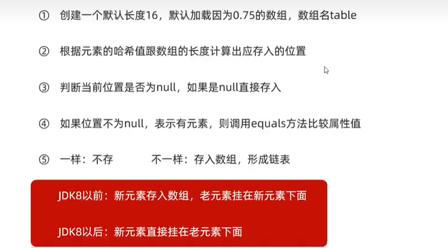

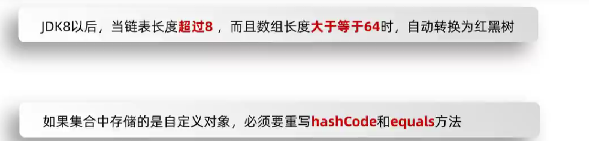

### HashSet的三个问题

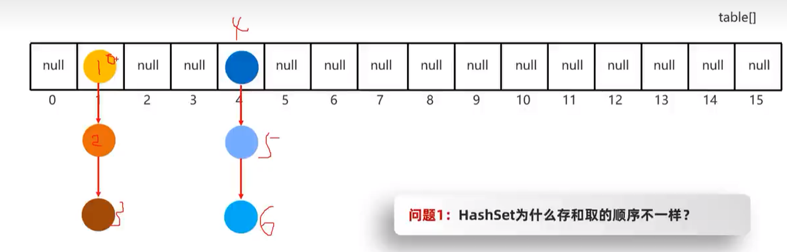

::: tip

当遍历数组时，下标为1索引时，存储为链表。链表中添加的数据不是按照指定的顺序存储的，数据在链表中的添加顺序不同，因此存和取的顺序不一样。`HashSet`的存储索引是 通过`hashCode`方法算出来的`int`类型的整数。

:::

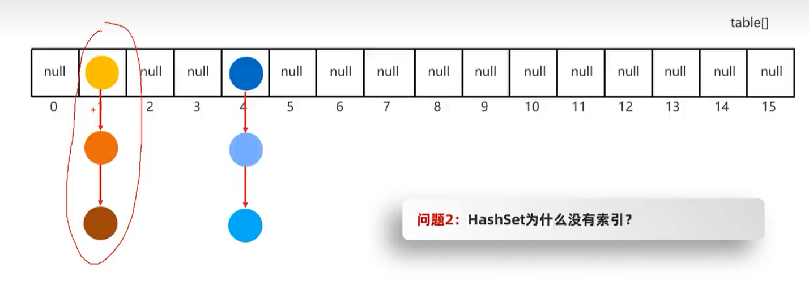

::: tip

`HashSet`底层是由数组、链表、红黑树组成。此时，在1索引的位置下挂着一个链表，如此多的元素都为1索引，看起来不合适，因此就取消掉了索引的机制

:::

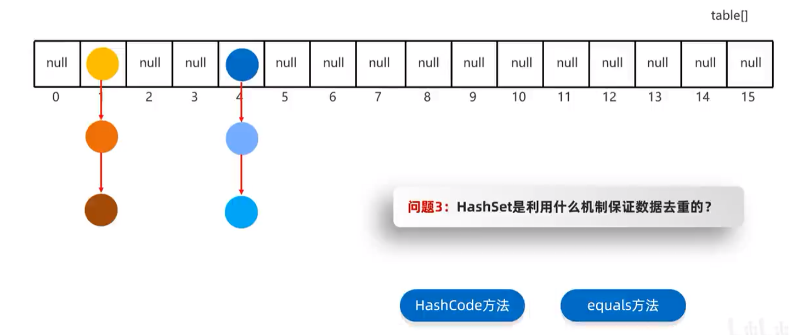

::: tip

`HashSet`是根据`HashCode`和`equals`方法，进行判断元素是否相同，若相同则不会添加到数组、链表或者红黑树当中。因此，在像`HashSet`中添加自定义对象是，一定要记得重写`HashCode`和`equals`方法，让底层的Hash值是根据对象的属性来生成

:::

**示例：**

```java
public class HashSetDemo02 {
    public static void main(String[] args) {
        //创建HashSet集合对象
        HashSet<Student> hs = new HashSet<Student>();

        //创建学生对象
        Student s1 = new Student("林青霞", 30);
        Student s2 = new Student("张曼玉", 35);
        Student s3 = new Student("王祖贤", 33);

        Student s4 = new Student("王祖贤", 33);

        //把学生添加到集合
        hs.add(s1);
        hs.add(s2);
        hs.add(s3);
        hs.add(s4);

        //遍历集合(增强for)
        for (Student s : hs) {
            System.out.println(s.getName() + "," + s.getAge());
        }
    }
}
```

::: tip 

`HashSet`集合存储自定义类型元素，想要实现元素的唯一要求，必须重写`hashCode`方法和`equals`方法

```java
@Override
 public boolean equals(Object o) {
     if (this == o) return true;
     if (o == null || getClass() != o.getClass()) return false;

     Student student = (Student) o;

     if (age != student.age) return false;
     return name != null ? name.equals(student.name) : student.name == null;
 }

 @Override
 public int hashCode() {
     int result = name != null ? name.hashCode() : 0;
     result = 31 * result + age;
     return result;
 }
```

:::

## LinkedHashSet集合

### 底层原理

- 有序、不重复、无索引。
- 这里的有序指的是保证存储和取出的元素顺序一致
- 原理：底层数据结构是依然是哈希表，只是每个元素又额外的多了一个双链表的机制记录存储的顺序

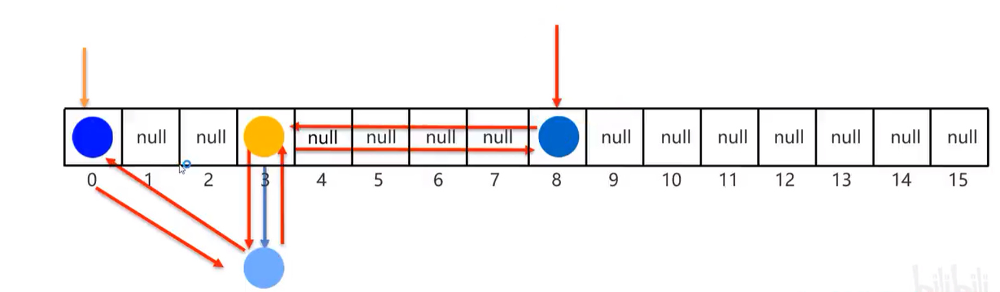
