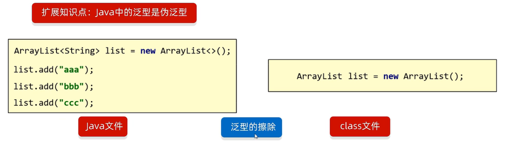
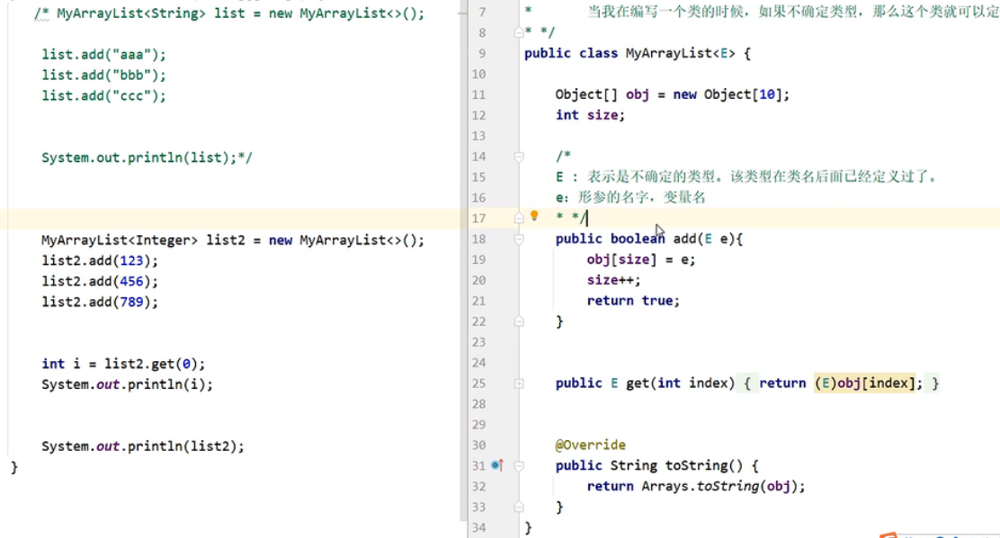
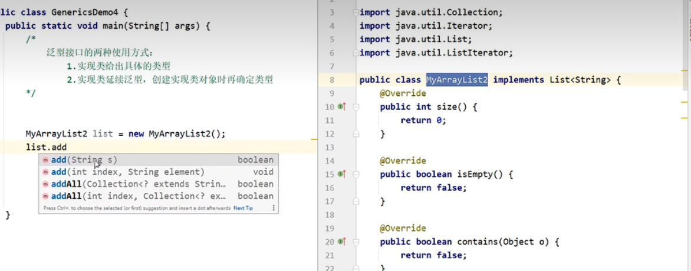
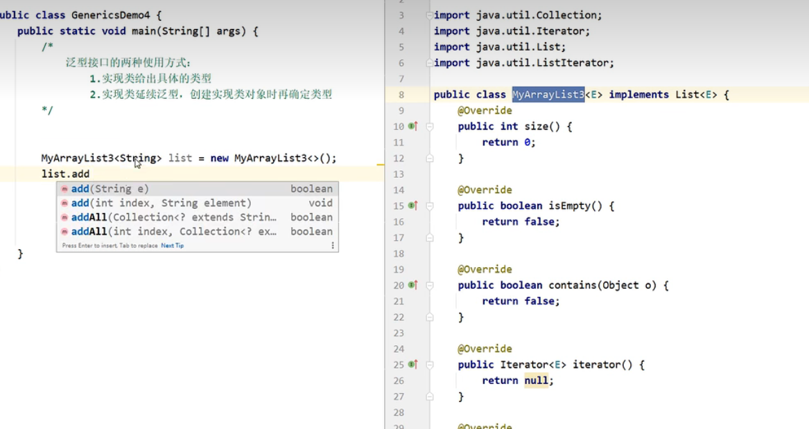

# 泛型

Java泛型是Java SE 5中引入的一种编程机制，它通过参数化类型来实现代码的重用。使用泛型可以让代码更加通用和类型安全，避免了在编译时期因类型转换错误引起的类型异常。

**格式：**

- <类型>：指定一种类型的格式，尖括号里面可以任意书写，一般只写一个字母，例如：`<T>`
- <类型1, 类型2...>：指定多种类型的格式，多种类型格式之间用逗号隔开，例如：`<E, T> <K, V>`

**好处：**

- 把运行时期的问题提前到了编译期间
- 避免了强制类型转换



**细节：**

- 泛型中不能写基本数据类型，必须使用对应的包装类
- 指定泛型的具体类型后，传递数据时，可以传递该类型和其子类型
- 如果不写泛型，默认是`<Object>`类型

::: tip 

因为java文件在编译时会转换为class文件，这是会檫除泛型，但泛型的基础类是`Object`类，而基本数据类型int不是`Object`的子类，没法自动转，而泛型需要`Object`来实现通用化，有点利用多态

:::

## 分类

### 泛型类

概念：泛型类指在类的定义中使用泛型类型参数的类，可以在类中使用泛型类型参数，从而增强代码的可复用性和类型安全性。

**格式：**

```java
// 格式：
修饰符 class 类名<类型> {
    
}
public class Arraylist<T> {
    	
}
```

> 此处的T可以理解为变量，但不是用来记录数据的，而是记录数据的类型，可以写成T、E、K、V等



### 泛型方法

概述：泛型方法指在方法定义中使用泛型类型参数的方法，可以在方法中使用泛型类型参数，从而增强代码的可复用性和类型安全性。在定义时，先使用`<T>`声明T泛型，才能在形参中使用T

```java
修饰符<类型> 返回值类型方法名(类型变量名){
}
// 例如
public<T> void show (T t){
}
```

**示例：**

```java
import java.util.ArrayList;

public class ListUtil {
    // 版本1：固定接收4个元素（和你截图里的调用匹配）
    public static <E> void addAll(ArrayList<E> list, E e1, E e2, E e3, E e4) {
        list.add(e1);
        list.add(e2);
        list.add(e3);
        list.add(e4);
    }

    // 版本2：可变参数版本（推荐！接收任意数量的元素）
    public static <E> void addAll2(ArrayList<E> list, E... elements) {
        // 底层：elements 是一个 E[] 数组，遍历添加即可
        for (E element : elements) {
            list.add(element);
        }
    }

    public void show() {
        System.out.println("尼古拉斯·纯情·天真·暖男·阿玮");
    }
}


public class GenericsDemo3 {
    public static void main(String[] args) {
        ArrayList<String> list1 = new ArrayList<>();
        ListUtil.addAll(list1, "aaa", "bbb", "ccc", "ddd");
        System.out.println(list1); // 输出: [aaa, bbb, ccc, ddd]

        ArrayList<Integer> list2 = new ArrayList<>();
        ListUtil.addAll(list2, 1, 2, 3, 4);
        System.out.println(list2); // 输出: [1, 2, 3, 4]
    }
}
```

> 当使用E...作为参数时，...表示可变参数，此时传入的参数个数也是不确定的。

### 泛型接口

概念：泛型接口指在接口的定义中使用泛型类型参数的接口，可以在接口中使用泛型类型参数，从而增强代码的可复用性和类型安全性。

```java
修饰符 interface 接口名<类型>{
}
// 例如
public interface List<E>{
}
```

**使用：**

- 实现类给出具体类型



- 实现类延续泛型，创建对象时再确定



## 通配符

概念：泛型的通配符指的是Java中的通配符类型，使用`?`表示。通配符类型是一种类型实参，可以用于表示某个泛型类型的类型参数，也可以是任何类型。通配符类型可以用于方法参数类型、变量类型、返回值类型等。

**通配符：? 也表示不确定的类型**

**分类：**

- `? extends E`：表示可以传递E或者E所有的子类类型
- `? super E`：表示可以传递E或者E所有的父类类型

**特点：**

- 泛型的集成和通配符
- 泛型不具备继承性，但是数据具备继承性

**应用场景：**

- 如果我们在定义类、方法、接口的时候，如果类型不确定，就可以定义泛型类、泛型方法、、泛型接口
- 如果类型不确定，但是能知道以后只能传递某个继承体系中的类，就可以使用泛型通配符

**意义：限定类型的范围**

```java
public class Test1 {
    public static void main(String[] args) {
        /*
            需求：
                定义一个继承结构：
                                    动物
                         |                           |
                         猫                          狗
                      |      |                    |      |
                   波斯猫   狸花猫                泰迪   哈士奇


                 属性：名字，年龄
                 行为：吃东西
                       波斯猫方法体打印：一只叫做XXX的，X岁的波斯猫，正在吃小饼干
                       狸花猫方法体打印：一只叫做XXX的，X岁的狸花猫，正在吃鱼
                       泰迪方法体打印：一只叫做XXX的，X岁的泰迪，正在吃骨头，边吃边蹭
                       哈士奇方法体打印：一只叫做XXX的，X岁的哈士奇，正在吃骨头，边吃边拆家

            测试类中定义一个方法用于饲养动物
                public static void keepPet(ArrayList<???> list){
                    //遍历集合，调用动物的eat方法
                }
            要求1：该方法能养所有品种的猫，但是不能养狗
            要求2：该方法能养所有品种的狗，但是不能养猫
            要求3：该方法能养所有的动物，但是不能传递其他类型
         */


        ArrayList<PersianCat> list1 = new ArrayList<>();
        ArrayList<LiHuaCat> list2 = new ArrayList<>();
        ArrayList<TeddyDog> list3 = new ArrayList<>();
        ArrayList<HuskyDog> list4 = new ArrayList<>();

        keepPet(list1);
        keepPet(list2);
        keepPet(list3);
        keepPet(list4);
    }

    // 该方法能养所有的动物，但是不能传递其他类型
    public static void keepPet(ArrayList<? extends Animal> list) {
        // 遍历集合，调用动物的eat方法
    }
    
    // 该方法能养所有品种的狗，但是不能养猫
    public static void keepPetDog(ArrayList<? extends Dog> list) {
        // 遍历集合，调用所有狗的eat
    }
    
    // 要求能养所有品种的猫，但是不能养狗
    public static void keepPetCat(ArrayList<? extends Cat> list) {
        // 遍历集合，调用所有猫的eat
    }
}

```


## 小结

> 1. 概述：泛型是Java中的一种特性，他可以将类或方法中的数据类型作为参数进行传递和使用
>
> 2. 格式:`<E> <T>`
>
> 3. 好处：
>
>    - 把运行时的类型问题提前到了编译时期
>    - 避免了强制类型转换
>
> 4. 细节：
>
>    - 泛型中不能写基本数据类型
>    - 制定泛型的具体类型后，传递数据时，可以传入该类型和其子类型
>    - 如果不写泛型，类型默认是Object
>
> 5. 注意：在java文件编译成class文件时，会将泛型檫除，但泛型的基础类是Object，所有不能传递int，只能传递其包装类，int不是Object的子类。泛型是依靠Object来实现通用的
>
> 6. 分类：
>
>    1. 泛型类
>
>       - 概念：在类后面定义泛型，创建该类对象的时候，确定类型
>
>         ```java
>         修饰符 class 类名<类型> {}
>         public class Dog<T> {}
>         ```
>
>    2. 泛型方法
>
>       - 概念：在修饰符后面定义方法，调用该方法的时候，确定类型
>
>         ```java
>         修饰符<类型> 返回值 方法名(类型 形参名) {}
>         public<T> void show(T t) {}
>         ```
>
>    3. 泛型接口
>
>       - 在接口名后面定义泛型，实现类来确定类型，实现类延续泛型
>
>         ```java
>         修饰符 interface 接口名<类型> {}
>         public interface List<E> {}
>         ```
>
> 7. 泛型通配符
>
>    - 泛型不具备继承性，但是数据具备继承性
>
>      ```java
>      public static void method(ArrayList<Animal> list) {}
>      // 此处method方法接收的任何参数只能时Animal类的集合，其余任何类的集合都不行，包括子类继承的类集合也不行
>      ```
>
>      ```java
>      ArrayList<Ye> list1 = new ArrayList<>();
>      list1.add(new Ye()); // 自己可以
>      list1.add(new Fu()); // 直接子类也可以
>      list1.add(new Zi()); // 间接子类就不行了
>      ```
>
>    - 泛型的通配符：`?`
>
>      ```java
>      // 格式
>      ? extend E // 传递子类
>      ? super E //传递父类
>      // 例如
>      // 可以传递Animal类和他的子类
>      public static void keepPet(ArrayList<? extends Animal> list){
>      }
>      // 可以传递Animal类和他的父类
>      public static void keepPet(ArrayList<? super Animal> list){
>      }
>      ```
>
> 8. 应用场景：
>    - 定义类，接口，方法时，类型不确定，就可以使用泛型
>    - 如果类型不确定，但能确定是那个类的继承体系的，可以使用`?`通配符