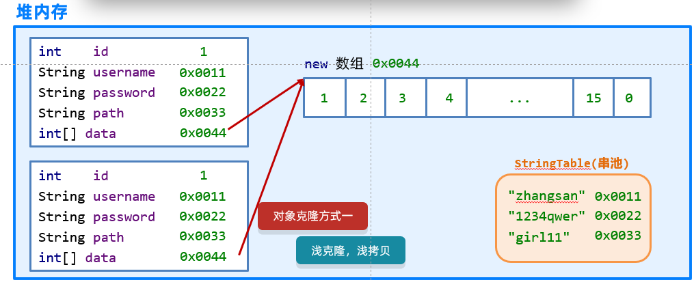
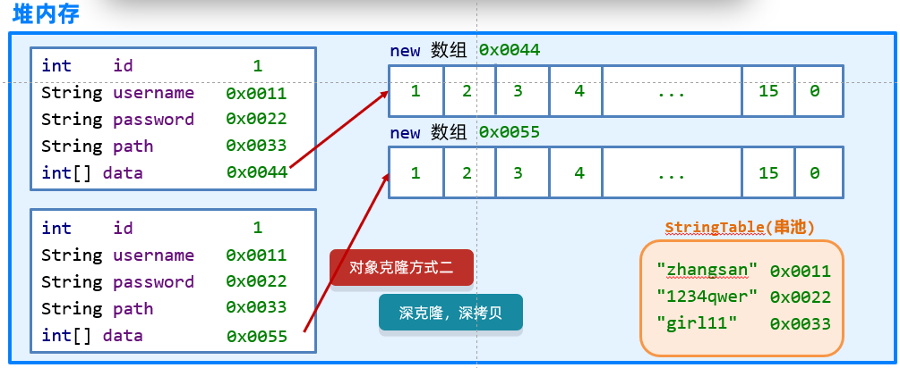

# 常用API

API (Application Programming Interface) ：应用程序编程接口。指的就是 JDK 中提供的各种功能的 Java类，这些类将底层的实现封装了起来，我们不需要关心这些类是如何实现的，只需要学习这些类如何使用即可，我们可以通过帮助文档来学习这些API如何使用。

## Math类

Math类包含执行基本数学运算的方法，我们可以使用Math类完成基本的数学运算

### 常用成员方法

```java
public static int abs(int a); 					// 返回参数的绝对值
public static double ceil(double a);			// 小数向上取整
public static double floor(double a);			// 向下取整
public static int round(float a);				// 按照四舍五入返回最接近参数的int类型的值
public static int max(ina a, int b);			// 比较返回两个值中的较大值
public static int min(int a ,int b);			// 比较返回两个值中的较小值
public static double pow(double a, double b);	// 计算a和b次幂的值
public static double random();					// 返回一个[0.0,1.0)的随机值
```

### 基本用例

```java
public class MathDemo01 {
    public static void main(String[] args) {
         // public static int abs(int a)         返回参数的绝对值
        System.out.println("-2的绝对值为：" + Math.abs(-2)); // 2
        System.out.println("2的绝对值为：" + Math.abs(2)); // 2
        
        // public static double ceil(double a)  向上取整
        System.out.println("大于或等于23.45的最小整数位：" + Math.ceil(23.45)); // 24.0
        System.out.println("大于或等于-23.45的最小整数位：" + Math.ceil(-23.45)); // -23.0
    
    	// public static double floor(double a) 向下取整
        System.out.println("小于或等于23.45的最大整数位：" + Math.floor(23.45)); // 23
        System.out.println("小于或等于-23.45的最大整数位：" + Math.floor(-23.45)); // -24
        
        // public static int round(float a)     按照四舍五入返回最接近参数的int
        System.out.println("23.45四舍五入的结果为：" + Math.round(23.45)); // 23
        System.out.println("23.55四舍五入的结果为：" + Math.round(23.55)); // 24
        
        // public static int max(int a,int b)   返回两个int值中的较大值
        System.out.println("23和45的最大值为: " + Math.max(23, 45)); // 45
        
        // public static int min(int a,int b)   返回两个int值中的较小值
        System.out.println("12和34的最小值为: " + Math.min(12 , 34)); // 12
        
        // public static double pow (double a,double b)返回a的b次幂的值
        System.out.println("2的3次幂计算结果为: " + Math.pow(2,3)); // 8.0
		
        // public static double random()返回值为double的正值，[0.0,1.0)
        System.out.println("获取到的0-1之间的随机数为: " + Math.random()); // 0.7322484131745958
    }
}
```

## System类

System类所在包为java.lang包，因此在使用的时候不需要进行导包。并且System类被final修饰了，因此该类是不能被继承的。

System包含了系统操作的一些常用的方法。比如获取当前时间所对应的毫秒值，再比如终止当前JVM等等。

### 常用成员方法

```java
public static long currentTimeMillis();		// 获取当前时间所对应时间戳（当前时间为0时区所对应的时间即就是英国格林尼治天文台旧址所在位置）
public static void exit(int status);		// 终止当前正在运行的java虚拟机，0表示正常退出，非零表示异常退出
public static native void arraycopy(Object src, int srcPos, Object dest, int destPos, int length);	// 进行数值元素copy
```

### 基本用例

```java
public class SystemDemo {
    public static void main(String[] args) {
        // 获取当前时间所对应的毫秒数
        long millis = System.currentTimeMillis();
        
        // 输出结果
        System.out.println("当前时间所对应的毫秒值：" + millis);
    }
}
```

```java
public class SystemDemo {
    public static void main(String[] atgs) {
        // 输出
        System.out.println("程序开始执行了......");
        
        // 终止JVM 
        System.exit(0);
        
        // 输出
        System.out.println("程序终止了......");
    }
}
```

```java
public class SystemDemo {
    public static void main(String[] args) {
        // 定义源数组
        int[] srcArray = {23, 45, 67, 89, 14, 56};
        
        // 定义目标组数
        int[] desArray = new int[10];
        
        // 进行数组元素的copy:把srcArray数组中从0开始的3个元素，从desArray数组中的1索引开始复制过去
        System.arraycopy(srcArray, 0, desArray, 1, 3);
        
        // 遍历数组
        for(int x = 0; x < desArray.length; x++) {
            if (x != desArray.length - 1) {
                System.out.print(desArray[x] + ",");
            } else {
                System.out.println(desArray[x]);
            }
        }
    }
}
```

## Runtime类

Runtime表示Java中运行时对象，可以获取到程序运行到设计的一些信息

### 常用成员方法

```java
public static Runtime getRuntime();		// 当前系统的运行环境对象
public void exit(int status);			// 停止虚拟机
public int availableProcessors();		// 获得CPU的线程数
public long maxMemory();				// JVM能从系统中分配的总内存大小（单位byte）
public long totalMemory(); 				// JVM已经从系统中分配的总内存大小（单位byte）
public long freeMemry();				// JVM已分配内存中剩余没用的内存大小（单位byte）
public Process exec(String command);	// 运行cmd命令
```

### 基本用例

```java
public class RunTimeDemo {
    public static void main(String[] args) throws IOException {
        /*
        	public static Runtime getRuntime() 当前系统的运行环境对象
        	public void exit(int status);			// 停止虚拟机
        	public int availableProcessors();		// 获得CPU的线程数
        	public long maxMemory();				// JVM能从系统中分配的总内存大小（单位byte）
        	public long totalMemory(); 				// JVM已经从系统中分配的总内存大小（单位byte）
        	public long freeMemry();				// JVM已分配内存中剩余没用的内存大小（单位byte）
        	public Process exec(String command);	// 运行cmd命令
        */
        
        //1.获取Runtime的对象
        //Runtime r1 =Runtime.getRuntime();
        
        //2.exit 停止虚拟机
        //Runtime.getRuntime().exit(0);
        //System.out.println("看看我执行了吗?");
        
        //3.获得CPU的线程数
        System.out.println(Runtime.getRuntime().availableProcessors());//8
        //4.总内存大小,单位byte字节
        System.out.println(Runtime.getRuntime().maxMemory() / 1024 / 1024);//4064
        //5.已经获取的总内存大小,单位byte字节
        System.out.println(Runtime.getRuntime().totalMemory() / 1024 / 1024);//254
        //6.剩余内存大小
        System.out.println(Runtime.getRuntime().freeMemory() / 1024 / 1024);//251
        
        //7.运行cmd命令
        //shutdown :关机
        //加上参数才能执行
        //-s :默认在1分钟之后关机
        //-s -t 指定时间 : 指定关机时间
        //-a :取消关机操作
        //-r: 关机并重启
        Runtime.getRuntime().exec("shutdown -s -t 3600");
    }
}
```

## Object类（重点）

Object类所在包时Java.lang。Object是类层次结构的的根，每个类都可以将Object作为超类。所有类都直接或间接的继承自该类；换句话说，该类所具备的方法，其他所有类都继承了。

### 常用成员方法

```java
public String toString();			//返回该对象的字符串表示形式（可以看做是对象的内存地址值）
public boolean equals(Object obj);	// 比较两个对象地址值是否相等；true表示相同，false表示不同
protected Object clone();			// 对象克隆（浅拷贝。基本类型复制值，引用类型复制索引）
```

**案例-演示-toString()方法**

实现步骤：

1. 创建一个学生类，提供两个成员变量(name, age);并且提供对应的无参构造方法和有参构造方法一级get/set方法
2. 创建一个测试类（ObjectDemo01），在测试类的main方法中去创建学生对象，然后调用该对象的toString方法获取该对象的字符串表现形式，并将结果进行输出

Student类

```java
public class Student {

    private String name ;       // 姓名
    private String age ;        // 年龄

    // 无参构造方法和有参构造方法以及get和set方法略
    ...
        
}
```

ObjectDemo01测试类

```java
public class ObjectDemo01 {

    public static void main(String[] args) {

        // 创建学生对象
        Student s1 = new Student("itheima" , "14") ;

        // 调用toString方法获取s1对象的字符串表现形式
        String result1 = s1.toString();

        // 输出结果
        System.out.println("s1对象的字符串表现形式为：" + result1);
    }
}
```

运行程序进行测试，控制台输出结果如下所示：

```java
s1对象的字符串表现形式为：com.itheima.api.system.demo04.Student@3f3afe78
```

为什么控制台输出的结果为：com.itheima.api.system.demo04.Student@3f3afe78； 此时我们可以查看一下Object类中toString方法的源码，如下所示：

```java
public String toString() {		// Object类中toString方法的源码定义
	return getClass().getName() + "@" + Integer.toHexString(hashCode());
}
```

**案例-演示equals方法**

> 1. **默认**情况下equals方法比较的是对象的**地址值**
> 2. 比较对象的地址值是没有意义的，因此一般情况下我们都会**重写Object类中的equals**方法

实现步骤：

1. 在测试类（ObjectDemo02）的main方法中，创建两个学生对象，然后比较两个对象是否相同

代码如下所示：

```java
public class ObjectDemo02 {

    public static void main(String[] args) {

        // 创建两个学生对象
        Student s1 = new Student("itheima" , "14") ;
        Student s2 = new Student("itheima" , "14") ;

        // 比较两个对象是否相等
        System.out.println(s1 == s2); // false
    }
}
```

因为"=="号比较的是对象的地址值，而我们通过new关键字创建了两个对象，它们的地址值是不相同的。因此比较结果就是false。

我们尝试调用Object类中的equals方法进行比较，代码如下所示：

```java
// 调用equals方法比较两个对象是否相等
boolean result = s1.equals(s2);

// 输出结果
System.out.println(result); // false
```

为什么结果还是false呢？我们可以查看一下Object类中equals方法的源码，如下所示：

```java
public boolean equals(Object obj) {		// Object类中的equals方法的源码
    return (this == obj);
}
```

通过源码我们可以发现默认情况下equals方法比较的也是对象的地址值。比较内存地址值一般情况下是没有意义的，我们希望比较的是对象的属性，如果两个对象的属性相同，我们认为就是同一个对象；

**案例-对象克隆**

把A对象的属性值完全拷贝给B对象，也叫对象拷贝,对象复制

**对象克隆的分类：**

- 深克隆
- 浅克隆

**浅克隆：**

 不管对象内部的属性是基本数据类型还是引用数据类型，都完全拷贝过来

 **基本**数据类型拷贝过来的是**具体**的数据，**引用**数据类型拷贝过来的是**地址值**。

 Object类默认的是浅克隆



**深克隆：**

 基本数据类型拷贝过来，**字符串复用**，**引用数据类型**会重新**创**建**新**的



代码实现：

```java
package com.itheima.a04objectdemo;

public class ObjectDemo4 {
    public static void main(String[] args) throws CloneNotSupportedException {
        // protected object clone(int a) 对象克隆 

        //1.先创建一个对象
        int[] data = {1, 2, 3, 4, 5, 6, 7, 8, 9, 10, 11, 12, 13, 14, 15, 0};
        User u1 = new User(1, "zhangsan", "1234qwer", "girl11", data);
	
        //2.克隆对象
        //细节:
        //方法在底层会帮我们创建一个对象,并把原对象中的数据拷贝过去。
        //书写细节:
        //1.重写Object中的clone方法
        //2.让javabean类实现Cloneable接口
        //3.创建原对象并调用clone就可以了
        //User u2 =(User)u1.clone();

        //验证一件事情：Object中的克隆是浅克隆
        //想要进行深克隆，就需要重写clone方法并修改里面的方法体
        //int[] arr = u1.getData();
        //arr[0] = 100;

        //System.out.println(u1);
        //System.out.println(u2);


        //以后一般会用第三方工具进行克隆
        //1.第三方写的代码导入到项目中
        //2.编写代码
        //Gson gson =new Gson();
        //把对象变成一个字符串
        //String s=gson.toJson(u1);
        //再把字符串变回对象就可以了
        //User user =gson.fromJson(s, User.class);

        //int[] arr=u1.getData();
        //arr[0] = 100;

        //打印对象
        //System.out.println(user);

    }
}

package com.itheima.a04objectdemo;

import java.util.StringJoiner;

//Cloneable
//如果一个接口里面没有抽象方法
//表示当前的接口是一个标记性接口
//现在Cloneable表示一旦实现了，那么当前类的对象就可以被克降
//如果没有实现，当前类的对象就不能克隆
public class User implements Cloneable {
    private int id;
    private String username;
    private String password;
    private String path;
    private int[] data;

    public User() {
    }

    public User(int id, String username, String password, String path, int[] data) {
        this.id = id;
        this.username = username;
        this.password = password;
        this.path = path;
        this.data = data;
    }

    /**
     * 获取
     *
     * @return id
     */
    public int getId() {
        return id;
    }

    /**
     * 设置
     *
     * @param id
     */
    public void setId(int id) {
        this.id = id;
    }

    /**
     * 获取
     *
     * @return username
     */
    public String getUsername() {
        return username;
    }

    /**
     * 设置
     *
     * @param username
     */
    public void setUsername(String username) {
        this.username = username;
    }

    /**
     * 获取
     *
     * @return password
     */
    public String getPassword() {
        return password;
    }

    /**
     * 设置
     *
     * @param password
     */
    public void setPassword(String password) {
        this.password = password;
    }

    /**
     * 获取
     *
     * @return path
     */
    public String getPath() {
        return path;
    }

    /**
     * 设置
     *
     * @param path
     */
    public void setPath(String path) {
        this.path = path;
    }

    /**
     * 获取
     *
     * @return data
     */
    public int[] getData() {
        return data;
    }

    /**
     * 设置
     *
     * @param data
     */
    public void setData(int[] data) {
        this.data = data;
    }

    public String toString() {
        return "角色编号为：" + id + "，用户名为：" + username + "密码为：" + password + ", 游戏图片为:" + path + ", 进度:" + arrToString();
    }

    public String arrToString() {
        StringJoiner sj = new StringJoiner(", ", "[", "]");

        for (int i = 0; i < data.length; i++) {
            sj.add(data[i] + "");
        }
        return sj.toString();
    }

    @Override
    protected Object clone() throws CloneNotSupportedException {
        //调用父类中的clone方法
        //相当于让Java帮我们克隆一个对象，并把克隆之后的对象返回出去。

        //先把被克隆对象中的数组获取出来
        int[] data = this.data;
        //创建新的数组
        int[] newData =new int[data.length];
        //拷贝数组中的数据
        for (int i = 0; i < data.length; i++) {
            newData[i] = data[i];
        }
        //调用父类中的方法克隆对象
        User u=(User)super.clone();
        //因为父类中的克隆方法是浅克隆，替换克隆出来对象中的数组地址值
        u.data =newData;
        return u;
    }
}
```

## Objects类

`java.util.Objects` 是 Java 7 中新增的一个工具类，包含了一些常用的静态方法，主要用于操作对象

### 常用成员方法

```java
// objects是一个对象工具类，提供了一些操作对象的方法
equals(对象1，对象2):先做非空判断，比较两个对象
isNull(对象):判断对象是否为空
nonNull(对象):判断对象是否不是空
```

## BigInteger类

平时在存储整数的时候，Java中默认是int类型，int类型有取值范围：-2147483648 ~ 2147483647。

> 如果数字过大，我们可以使用long类型，但是如果long类型也表示不下怎么办呢？
>
>  就需要用到BigInteger，可以理解为：大的整数。
>
>  有多大呢？理论上最大到42亿的21亿次方
>
>  基本上在内存撑爆之前，都无法达到这个上限。

BigInteger所在包是在java.math包下，因此在使用的时候就需要进行导包。我们可以使用BigInteger类进行大整数的计算

#### 构造方法

```java
public BigInteger(int num, Random rnd);	// 获取随机大整数，范围：[0~2的num次方-1] 2^num - 1
public BigInteger(String val);			// 获取指定的大整数
public BigInteger(String val, int radix);// 获取指定进制的大整数

// 下面这个不是构造，而是一个静态方法获取BigInteger对象
public static BigInteger valueOf(long val); // 静态方法获取BigInteger的对象，内部有优化
```

> 如果`BigInteger`表示的数字没有超出`long`的范围，可以用静态方法获取。
>
> 如果BigInteger表示的超出long的范围，可以用构造方法获取。
>
> 对象一旦创建，BigInteger内部记录的值不能发生gaibian只要进行计算都会产生一个新的BigInteger对象。

#### 成员方法

```java
public BigInteger add(BigInteger val);				// 加法
public BigInteger subtract(BigInteger val);			// 减法
public BigInteger multiply(BigInteger val);			// 乘法
public BigInteger divide(BigInteger val);			// 除法
public BigInteger[] divideAndRemainder(BigInteger val); // 除法，获取商和余数
public  boolean equals(Object x);					// 比较是否相同
public  BigInteger pow(int exponent);				// 次幂、次方
public  BigInteger max/min(BigInteger val);			// 返回较大值/较小值
```

