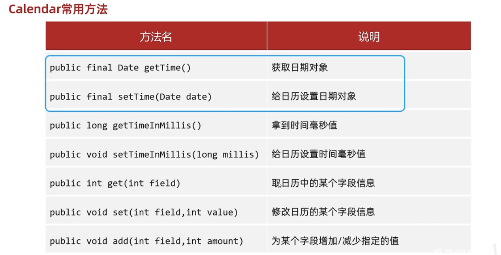
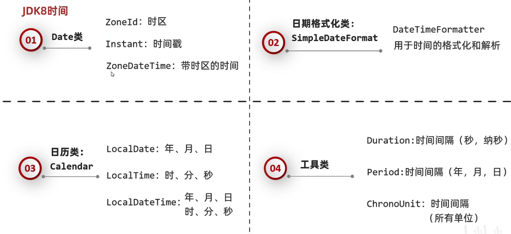
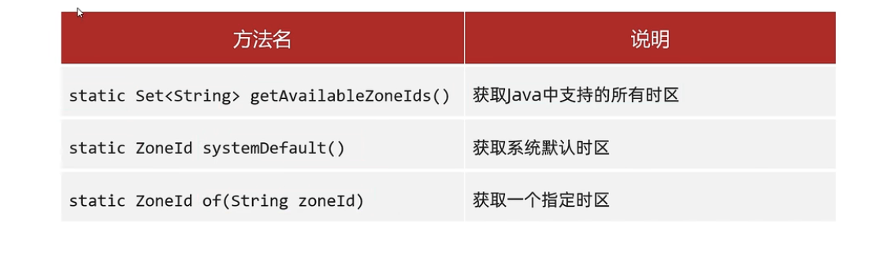

# 常用API

API (Application Programming Interface) ：应用程序编程接口。指的就是 JDK 中提供的各种功能的 Java类，这些类将底层的实现封装了起来，我们不需要关心这些类是如何实现的，只需要学习这些类如何使用即可，我们可以通过帮助文档来学习这些API如何使用。

## Math类

Math类包含执行基本数学运算的方法，我们可以使用Math类完成基本的数学运算

### 常用成员方法

```java
public static int abs(int a); 					// 返回参数的绝对值
public static double ceil(double a);			// 小数向上取整
public static double floor(double a);			// 向下取整
public static int round(float a);				// 按照四舍五入返回最接近参数的int类型的值
public static int max(ina a, int b);			// 比较返回两个值中的较大值
public static int min(int a ,int b);			// 比较返回两个值中的较小值
public static double pow(double a, double b);	// 计算a和b次幂的值
public static double random();					// 返回一个[0.0,1.0)的随机值
```

### 基本用例

```java
public class MathDemo01 {
    public static void main(String[] args) {
         // public static int abs(int a)         返回参数的绝对值
        System.out.println("-2的绝对值为：" + Math.abs(-2)); // 2
        System.out.println("2的绝对值为：" + Math.abs(2)); // 2
        
        // public static double ceil(double a)  向上取整
        System.out.println("大于或等于23.45的最小整数位：" + Math.ceil(23.45)); // 24.0
        System.out.println("大于或等于-23.45的最小整数位：" + Math.ceil(-23.45)); // -23.0
    
    	// public static double floor(double a) 向下取整
        System.out.println("小于或等于23.45的最大整数位：" + Math.floor(23.45)); // 23
        System.out.println("小于或等于-23.45的最大整数位：" + Math.floor(-23.45)); // -24
        
        // public static int round(float a)     按照四舍五入返回最接近参数的int
        System.out.println("23.45四舍五入的结果为：" + Math.round(23.45)); // 23
        System.out.println("23.55四舍五入的结果为：" + Math.round(23.55)); // 24
        
        // public static int max(int a,int b)   返回两个int值中的较大值
        System.out.println("23和45的最大值为: " + Math.max(23, 45)); // 45
        
        // public static int min(int a,int b)   返回两个int值中的较小值
        System.out.println("12和34的最小值为: " + Math.min(12 , 34)); // 12
        
        // public static double pow (double a,double b)返回a的b次幂的值
        System.out.println("2的3次幂计算结果为: " + Math.pow(2,3)); // 8.0
		
        // public static double random()返回值为double的正值，[0.0,1.0)
        System.out.println("获取到的0-1之间的随机数为: " + Math.random()); // 0.7322484131745958
    }
}
```

## System类

System类所在包为java.lang包，因此在使用的时候不需要进行导包。并且System类被final修饰了，因此该类是不能被继承的。

System包含了系统操作的一些常用的方法。比如获取当前时间所对应的毫秒值，再比如终止当前JVM等等。

### 常用成员方法

```java
public static long currentTimeMillis();		// 获取当前时间所对应时间戳（当前时间为0时区所对应的时间即就是英国格林尼治天文台旧址所在位置）
public static void exit(int status);		// 终止当前正在运行的java虚拟机，0表示正常退出，非零表示异常退出
public static native void arraycopy(Object src, int srcPos, Object dest, int destPos, int length);	// 进行数值元素copy
```

### 基本用例

```java
public class SystemDemo {
    public static void main(String[] args) {
        // 获取当前时间所对应的毫秒数
        long millis = System.currentTimeMillis();
        
        // 输出结果
        System.out.println("当前时间所对应的毫秒值：" + millis);
    }
}
```

```java
public class SystemDemo {
    public static void main(String[] atgs) {
        // 输出
        System.out.println("程序开始执行了......");
        
        // 终止JVM 
        System.exit(0);
        
        // 输出
        System.out.println("程序终止了......");
    }
}
```

```java
public class SystemDemo {
    public static void main(String[] args) {
        // 定义源数组
        int[] srcArray = {23, 45, 67, 89, 14, 56};
        
        // 定义目标组数
        int[] desArray = new int[10];
        
        // 进行数组元素的copy:把srcArray数组中从0开始的3个元素，从desArray数组中的1索引开始复制过去
        System.arraycopy(srcArray, 0, desArray, 1, 3);
        
        // 遍历数组
        for(int x = 0; x < desArray.length; x++) {
            if (x != desArray.length - 1) {
                System.out.print(desArray[x] + ",");
            } else {
                System.out.println(desArray[x]);
            }
        }
    }
}
```

## Runtime类

Runtime表示Java中运行时对象，可以获取到程序运行到设计的一些信息

### 常用成员方法

```java
public static Runtime getRuntime();		// 当前系统的运行环境对象
public void exit(int status);			// 停止虚拟机
public int availableProcessors();		// 获得CPU的线程数
public long maxMemory();				// JVM能从系统中分配的总内存大小（单位byte）
public long totalMemory(); 				// JVM已经从系统中分配的总内存大小（单位byte）
public long freeMemry();				// JVM已分配内存中剩余没用的内存大小（单位byte）
public Process exec(String command);	// 运行cmd命令
```

### 基本用例

```java
public class RunTimeDemo {
    public static void main(String[] args) throws IOException {
        /*
        	public static Runtime getRuntime() 当前系统的运行环境对象
        	public void exit(int status);			// 停止虚拟机
        	public int availableProcessors();		// 获得CPU的线程数
        	public long maxMemory();				// JVM能从系统中分配的总内存大小（单位byte）
        	public long totalMemory(); 				// JVM已经从系统中分配的总内存大小（单位byte）
        	public long freeMemry();				// JVM已分配内存中剩余没用的内存大小（单位byte）
        	public Process exec(String command);	// 运行cmd命令
        */
        
        //1.获取Runtime的对象
        //Runtime r1 =Runtime.getRuntime();
        
        //2.exit 停止虚拟机
        //Runtime.getRuntime().exit(0);
        //System.out.println("看看我执行了吗?");
        
        //3.获得CPU的线程数
        System.out.println(Runtime.getRuntime().availableProcessors());//8
        //4.总内存大小,单位byte字节
        System.out.println(Runtime.getRuntime().maxMemory() / 1024 / 1024);//4064
        //5.已经获取的总内存大小,单位byte字节
        System.out.println(Runtime.getRuntime().totalMemory() / 1024 / 1024);//254
        //6.剩余内存大小
        System.out.println(Runtime.getRuntime().freeMemory() / 1024 / 1024);//251
        
        //7.运行cmd命令
        //shutdown :关机
        //加上参数才能执行
        //-s :默认在1分钟之后关机
        //-s -t 指定时间 : 指定关机时间
        //-a :取消关机操作
        //-r: 关机并重启
        Runtime.getRuntime().exec("shutdown -s -t 3600");
    }
}
```

## Object类（重点）

Object类所在包时Java.lang。Object是类层次结构的的根，每个类都可以将Object作为超类。所有类都直接或间接的继承自该类；换句话说，该类所具备的方法，其他所有类都继承了。

### 常用成员方法

```java
public String toString();			//返回该对象的字符串表示形式（可以看做是对象的内存地址值）
public boolean equals(Object obj);	// 比较两个对象地址值是否相等；true表示相同，false表示不同
protected Object clone();			// 对象克隆（浅拷贝。基本类型复制值，引用类型复制索引）
```

**案例-演示-toString()方法**

实现步骤：

1. 创建一个学生类，提供两个成员变量(name, age);并且提供对应的无参构造方法和有参构造方法一级get/set方法
2. 创建一个测试类（ObjectDemo01），在测试类的main方法中去创建学生对象，然后调用该对象的toString方法获取该对象的字符串表现形式，并将结果进行输出

Student类

```java
public class Student {

    private String name ;       // 姓名
    private String age ;        // 年龄

    // 无参构造方法和有参构造方法以及get和set方法略
    ...
        
}
```

ObjectDemo01测试类

```java
public class ObjectDemo01 {

    public static void main(String[] args) {

        // 创建学生对象
        Student s1 = new Student("itheima" , "14") ;

        // 调用toString方法获取s1对象的字符串表现形式
        String result1 = s1.toString();

        // 输出结果
        System.out.println("s1对象的字符串表现形式为：" + result1);
    }
}
```

运行程序进行测试，控制台输出结果如下所示：

```java
s1对象的字符串表现形式为：com.itheima.api.system.demo04.Student@3f3afe78
```

为什么控制台输出的结果为：com.itheima.api.system.demo04.Student@3f3afe78； 此时我们可以查看一下Object类中toString方法的源码，如下所示：

```java
public String toString() {		// Object类中toString方法的源码定义
	return getClass().getName() + "@" + Integer.toHexString(hashCode());
}
```

**案例-演示equals方法**

> 1. **默认**情况下equals方法比较的是对象的**地址值**
> 2. 比较对象的地址值是没有意义的，因此一般情况下我们都会**重写Object类中的equals**方法

实现步骤：

1. 在测试类（ObjectDemo02）的main方法中，创建两个学生对象，然后比较两个对象是否相同

代码如下所示：

```java
public class ObjectDemo02 {

    public static void main(String[] args) {

        // 创建两个学生对象
        Student s1 = new Student("itheima" , "14") ;
        Student s2 = new Student("itheima" , "14") ;

        // 比较两个对象是否相等
        System.out.println(s1 == s2); // false
    }
}
```

因为"=="号比较的是对象的地址值，而我们通过new关键字创建了两个对象，它们的地址值是不相同的。因此比较结果就是false。

我们尝试调用Object类中的equals方法进行比较，代码如下所示：

```java
// 调用equals方法比较两个对象是否相等
boolean result = s1.equals(s2);

// 输出结果
System.out.println(result); // false
```

为什么结果还是false呢？我们可以查看一下Object类中equals方法的源码，如下所示：

```java
public boolean equals(Object obj) {		// Object类中的equals方法的源码
    return (this == obj);
}
```

通过源码我们可以发现默认情况下equals方法比较的也是对象的地址值。比较内存地址值一般情况下是没有意义的，我们希望比较的是对象的属性，如果两个对象的属性相同，我们认为就是同一个对象；

**案例-对象克隆**

把A对象的属性值完全拷贝给B对象，也叫对象拷贝,对象复制

**对象克隆的分类：**

- 深克隆
- 浅克隆

**浅克隆：**

 不管对象内部的属性是基本数据类型还是引用数据类型，都完全拷贝过来

 **基本**数据类型拷贝过来的是**具体**的数据，**引用**数据类型拷贝过来的是**地址值**。

 Object类默认的是浅克隆


**深克隆：**

 基本数据类型拷贝过来，**字符串复用**，**引用数据类型**会重新**创**建**新**的


代码实现：

```java
package com.itheima.a04objectdemo;

public class ObjectDemo4 {
    public static void main(String[] args) throws CloneNotSupportedException {
        // protected object clone(int a) 对象克隆 

        //1.先创建一个对象
        int[] data = {1, 2, 3, 4, 5, 6, 7, 8, 9, 10, 11, 12, 13, 14, 15, 0};
        User u1 = new User(1, "zhangsan", "1234qwer", "girl11", data);
	
        //2.克隆对象
        //细节:
        //方法在底层会帮我们创建一个对象,并把原对象中的数据拷贝过去。
        //书写细节:
        //1.重写Object中的clone方法
        //2.让javabean类实现Cloneable接口
        //3.创建原对象并调用clone就可以了
        //User u2 =(User)u1.clone();

        //验证一件事情：Object中的克隆是浅克隆
        //想要进行深克隆，就需要重写clone方法并修改里面的方法体
        //int[] arr = u1.getData();
        //arr[0] = 100;

        //System.out.println(u1);
        //System.out.println(u2);


        //以后一般会用第三方工具进行克隆
        //1.第三方写的代码导入到项目中
        //2.编写代码
        //Gson gson =new Gson();
        //把对象变成一个字符串
        //String s=gson.toJson(u1);
        //再把字符串变回对象就可以了
        //User user =gson.fromJson(s, User.class);

        //int[] arr=u1.getData();
        //arr[0] = 100;

        //打印对象
        //System.out.println(user);

    }
}

package com.itheima.a04objectdemo;

import java.util.StringJoiner;

//Cloneable
//如果一个接口里面没有抽象方法
//表示当前的接口是一个标记性接口
//现在Cloneable表示一旦实现了，那么当前类的对象就可以被克降
//如果没有实现，当前类的对象就不能克隆
public class User implements Cloneable {
    private int id;
    private String username;
    private String password;
    private String path;
    private int[] data;

    public User() {
    }

    public User(int id, String username, String password, String path, int[] data) {
        this.id = id;
        this.username = username;
        this.password = password;
        this.path = path;
        this.data = data;
    }

    /**
     * 获取
     *
     * @return id
     */
    public int getId() {
        return id;
    }

    /**
     * 设置
     *
     * @param id
     */
    public void setId(int id) {
        this.id = id;
    }

    /**
     * 获取
     *
     * @return username
     */
    public String getUsername() {
        return username;
    }

    /**
     * 设置
     *
     * @param username
     */
    public void setUsername(String username) {
        this.username = username;
    }

    /**
     * 获取
     *
     * @return password
     */
    public String getPassword() {
        return password;
    }

    /**
     * 设置
     *
     * @param password
     */
    public void setPassword(String password) {
        this.password = password;
    }

    /**
     * 获取
     *
     * @return path
     */
    public String getPath() {
        return path;
    }

    /**
     * 设置
     *
     * @param path
     */
    public void setPath(String path) {
        this.path = path;
    }

    /**
     * 获取
     *
     * @return data
     */
    public int[] getData() {
        return data;
    }

    /**
     * 设置
     *
     * @param data
     */
    public void setData(int[] data) {
        this.data = data;
    }

    public String toString() {
        return "角色编号为：" + id + "，用户名为：" + username + "密码为：" + password + ", 游戏图片为:" + path + ", 进度:" + arrToString();
    }

    public String arrToString() {
        StringJoiner sj = new StringJoiner(", ", "[", "]");

        for (int i = 0; i < data.length; i++) {
            sj.add(data[i] + "");
        }
        return sj.toString();
    }

    @Override
    protected Object clone() throws CloneNotSupportedException {
        //调用父类中的clone方法
        //相当于让Java帮我们克隆一个对象，并把克隆之后的对象返回出去。

        //先把被克隆对象中的数组获取出来
        int[] data = this.data;
        //创建新的数组
        int[] newData =new int[data.length];
        //拷贝数组中的数据
        for (int i = 0; i < data.length; i++) {
            newData[i] = data[i];
        }
        //调用父类中的方法克隆对象
        User u=(User)super.clone();
        //因为父类中的克隆方法是浅克隆，替换克隆出来对象中的数组地址值
        u.data =newData;
        return u;
    }
}
```

## Objects类

`java.util.Objects` 是 Java 7 中新增的一个工具类，包含了一些常用的静态方法，主要用于操作对象

### 常用成员方法

```java
// objects是一个对象工具类，提供了一些操作对象的方法
equals(对象1，对象2):先做非空判断，比较两个对象
isNull(对象):判断对象是否为空
nonNull(对象):判断对象是否不是空
```

## BigInteger类

平时在存储整数的时候，Java中默认是int类型，int类型有取值范围：-2147483648 ~ 2147483647。

> 如果数字过大，我们可以使用long类型，但是如果long类型也表示不下怎么办呢？
>
>  就需要用到BigInteger，可以理解为：大的整数。
>
>  有多大呢？理论上最大到42亿的21亿次方
>
>  基本上在内存撑爆之前，都无法达到这个上限。

BigInteger所在包是在java.math包下，因此在使用的时候就需要进行导包。我们可以使用BigInteger类进行大整数的计算

#### 构造方法

```java
public BigInteger(int num, Random rnd);	// 获取随机大整数，范围：[0~2的num次方-1] 2^num - 1
public BigInteger(String val);			// 获取指定的大整数
public BigInteger(String val, int radix);// 获取指定进制的大整数

// 下面这个不是构造，而是一个静态方法获取BigInteger对象
public static BigInteger valueOf(long val); // 静态方法获取BigInteger的对象，内部有优化
```

> 如果`BigInteger`表示的数字没有超出`long`的范围，可以用静态方法获取。
>
> 如果BigInteger表示的超出long的范围，可以用构造方法获取。
>
> 对象一旦创建，BigInteger内部记录的值不能发生gaibian只要进行计算都会产生一个新的BigInteger对象。

#### 成员方法

```java
public BigInteger add(BigInteger val);				// 加法
public BigInteger subtract(BigInteger val);			// 减法
public BigInteger multiply(BigInteger val);			// 乘法
public BigInteger divide(BigInteger val);			// 除法
public BigInteger[] divideAndRemainder(BigInteger val); // 除法，获取商和余数
public  boolean equals(Object x);					// 比较是否相同
public  BigInteger pow(int exponent);				// 次幂、次方
public  BigInteger max/min(BigInteger val);			// 返回较大值/较小值
```

### 基本用例

```java
package com.itheima.a06bigintegerdemo;

import java.math.BigInteger;

public class BigIntegerDemo1 {
    public static void main(String[] args) {
        /*
            public BigInteger(int num, Random rnd) 获取随机大整数，范围:[0~ 2的num次方-11
            public BigInteger(String val) 获取指定的大整数
            public BigInteger(String val, int radix) 获取指定进制的大整数

            public static BigInteger valueOf(long val) 静态方法获取BigInteger的对象，内部有优化

            细节:
            对象一旦创建里面的数据不能发生改变。
        */


        //1.获取一个随机的大整数
        /* Random r=new Random();
            for (int i = e; i < 100; i++) {
            BigInteger bd1 = new BigInteger(4,r);
            System.out.println(bd1);//[@ ~ 15]}
            }
        */

        //2.获取一个指定的大整数，可以超出long的取值范围
        //细节:字符串中必须是整数，否则会报错
        /* BigInteger bd2 = new BigInteger("1.1");
            System.out.println(bd2);
        */

        /*
            BigInteger bd3 = new BigInteger("abc");
            System.out.println(bd3);
         */

        //3.获取指定进制的大整数
        //细节:
        //1.字符串中的数字必须是整数
        //2.字符串中的数字必须要跟进制吻合。
        //比如二进制中，那么只能写日和1，写其他的就报错。
        BigInteger bd4 = new BigInteger("123", 2);
        System.out.println(bd4);

        //4.静态方法获取BigInteger的对象，内部有优化
        //细节:
        //1.能表示范围比较小，只能在long的取值范围之内，如果超出long的范围就不行了。
        //2.在内部对常用的数字: -16 ~ 16 进行了优化。
        //  提前把-16~16 先创建好BigInteger的对象，如果多次获取不会重新创建新的。
        BigInteger bd5 = BigInteger.valueOf(16);
        BigInteger bd6 = BigInteger.valueOf(16);
        System.out.println(bd5 == bd6);//true

        BigInteger bd7 = BigInteger.valueOf(17);
        BigInteger bd8 = BigInteger.valueOf(17);
        System.out.println(bd7 == bd8);//false

        //5.对象一旦创建内部的数据不能发生改变
        BigInteger bd9 =BigInteger.valueOf(1);
        BigInteger bd10 =BigInteger.valueOf(2);
        //此时，不会修改参与计算的BigInteger对象中的借，而是产生了一个新的BigInteger对象记录
        BigInteger result=bd9.add(bd10);
        System.out.println(result);//3

    }
}
```

```java
package com.itheima.a06bigintegerdemo;

import java.math.BigInteger;

public class BigIntegerDemo2 {
    public static void main(String[] args) {
        /*
            public BigInteger add(BigInteger val) 加法
            public BigInteger subtract(BigInteger val) 减法
            public BigInteger multiply(BigInteger val) 乘法
            public BigInteger divide(BigInteger val) 除法，获取商
            public BigInteger[] divideAndRemainder(BigInteger val) 除法，获取商和余数
            public boolean equals(Object x) 比较是否相同
            public BigInteger pow(int exponent) 次幂
            public BigInteger max/min(BigInteger val) 返回较大值/较小值
            public int intValue(BigInteger val) 转为int类型整数，超出范围数据有误
        */

        //1.创建两个BigInteger对象
        BigInteger bd1 = BigInteger.valueOf(10);
        BigInteger bd2 = BigInteger.valueOf(5);

        //2.加法
        BigInteger bd3 = bd1.add(bd2);
        System.out.println(bd3);

        //3.除法，获取商和余数
        BigInteger[] arr = bd1.divideAndRemainder(bd2);
        System.out.println(arr[0]);
        System.out.println(arr[1]);

        //4.比较是否相同
        boolean result = bd1.equals(bd2);
        System.out.println(result);

        //5.次幂
        BigInteger bd4 = bd1.pow(2);
        System.out.println(bd4);

        //6.max
        BigInteger bd5 = bd1.max(bd2);


        //7.转为int类型整数，超出范围数据有误
        /* BigInteger bd6 = BigInteger.valueOf(2147483647L);
         int i = bd6.intValue();
         System.out.println(i);
         */

        BigInteger bd6 = BigInteger.valueOf(200);
        double v = bd6.doubleValue();
        System.out.println(v);//200.0
    }
}
```

## BigDecimal类

### 概述

首先分析一下如下程序的执行结果：

```java
public class BigDecimalDemo01 {

    public static void main(String[] args) {
        System.out.println(0.09 + 0.01);
    }
}
```

这段代码比较简单，就是计算0.09和0.01之和，并且将其结果在控制台进行输出。那么按照我们的想法在控制台输出的结果应该为0.1。那么实际的运行结果是什么呢？我们来运行一下程序，控制台的输出

结果如下所示：

```java
0.09999999999999999
```

这样的结果其实就是一个丢失精度的结果。为什么会产生精度丢失呢？

在使用float或者double类型的数据在进行数学运算的时候，很有可能会产生精度丢失问题。我们都知道计算机底层在进行运算的时候，使用的都是二进制数据； 当我们在程序中写了一个十进制数据 ，在进行运算的时候，计算机会将这个十进制数据转换成二进制数据，然后再进行运算，计算完毕以后计算机会把运算的结果再转换成十进制数据给我们展示； 如果我们使用的是整数类型的数据进行计算，那么在把十进制数据转换成二进制数据的时候不会存在精度问题； 如果我们的数据是一个浮点类型的数据，有的时候计算机并不会将这个数据完全转换成一个二进制数据，而是将这个将其转换成一个无限的趋近于这个十进数的二进制数据；这样使用一个不太准确的数据进行运算的时候， 最终就会造成精度丢失；为了提高精度，Java就给我们提供了BigDecimal供我们进行数据运算。

BigDecimal所在包是在java.math包下，因此在使用的时候就需要进行导包。我们可以使用BigDecimal类进行更加**精准**的数据计算。

### 常用方法

#### 构造方法

- `BigDecimal(int val)` 将int转换为BigDecimal
- `BigDecimal(long val)` 将long转换为BigDecimal。
- `BigDecimal(String val)` 将BigDecimal的字符串表示形式转换为BigDecimal。

成员方法

```java
public static BigDecimal valueOf(double val);			// 获取对象
public BigDecimal add(BigDecimal val);					// 加法
public BigDecimal subtract(BigDecimal val);				// 减法
public BigDecimal multiply(BigDecimal val);				// 乘法
public BigDecimal divide(BigDecimal val);				// 除法
public BigDecimal divide(BigDecimal val, 精确几位，舍入模式)// 除法，更精确
```

### 使用

```java
public class BigDecimalDemo01 {

    public static void main(String[] args) {

        // 创建两个BigDecimal对象
        BigDecimal b1 = new BigDecimal("0.3") ;
        BigDecimal b2 = new BigDecimal("4") ;

        // 调用方法进行b1和b2的四则运算，并将其运算结果在控制台进行输出
        System.out.println(b1.add(b2));         // 进行加法运算
        System.out.println(b1.subtract(b2));    // 进行减法运算
        System.out.println(b1.multiply(b2));    // 进行乘法运算
        System.out.println(b1.divide(b2));      // 进行除法运算
    }
}
```

## Java JDK7

### SimpleDateFormat类

`java.text.SimpleDateFormat` 是日期/时间格式化类，我们通过这个类可以帮我们完成**日期和文本之间的转换**,也就是可以在**Date**对象与**String**对象之间进行来回转换。

- **格式化**：按照指定的格式，把Date对象转换为String对象。
- **解析**：按照指定的格式，把String对象转换为Date对象。

#### 常用成员方法

##### 构造方法

`public SimpleDateFormat(String pattern)`：用给定的模式和默认语言环境的日期格式符号构造SimpleDateFormat。参数pattern是一个字符串，代表**日期时间的自定义格式**。

**格式规则**

常用的格式规则为： 。

| 标识字母（区分大小写） | 含义 |
| :--------------------: | :--: |
|           y            |  年  |
|           M            |  月  |
|           d            |  日  |
|           H            |  时  |
|           m            |  分  |
|           s            |  秒  |

> 备注：更详细的格式规则，可以参考SimpleDateFormat类的API文档。

##### 成员方法

```java
public String format(Date date); // 将Date对象格式化为字符串
public Date prase(String source);// 将字符串解析为Date对象
```

#### 基本用例

```java
package com.itheima.a01jdk7datedemo;

import java.text.ParseException;
import java.text.SimpleDateFormat;
import java.util.Date;

public class A03_SimpleDateFormatDemo1 {
    public static void main(String[] args) throws ParseException {
        /*
            public simpleDateFormat() 默认格式
            public simpleDateFormat(String pattern) 指定格式
            public final string format(Date date) 格式化(日期对象 ->字符串)
            public Date parse(string source) 解析(字符串 ->日期对象)
        */

        //1.定义一个字符串表示时间
        String str = "2023-11-11 11:11:11";
        //2.利用空参构造创建simpleDateFormat对象
        // 细节:
        //创建对象的格式要跟字符串的格式完全一致
        SimpleDateFormat sdf = new SimpleDateFormat("yyyy-MM-dd HH:mm:ss");
        Date date = sdf.parse(str);
        //3.打印结果
        System.out.println(date.getTime());//1699672271000


    }

    private static void method1() {
        //1.利用空参构造创建simpleDateFormat对象，默认格式
        SimpleDateFormat sdf1 = new SimpleDateFormat();
        Date d1 = new Date(0L);
        String str1 = sdf1.format(d1);
        System.out.println(str1);//1970/1/1 上午8:00

        //2.利用带参构造创建simpleDateFormat对象，指定格式
        SimpleDateFormat sdf2 = new SimpleDateFormat("yyyy年MM月dd日HH:mm:ss");
        String str2 = sdf2.format(d1);
        System.out.println(str2);//1970年01月01日 08:00:00

        //课堂练习:yyyy年MM月dd日 时:分:秒 星期
    }
}
```

### Calendar类（重点）

- `java.util.Calendar`类表示一个'日历类'，可以进行日期运算。它是一个**抽象类，不能创建对象**，我们可以使用它的子类：`java.util.GregorianCalendar类`。
- 有两种方式可以获取`GregorianCalendar`对象：
  - 直接创建`GregorianCalendar`对象
  - 通过`Calendar`的静态方法`getInstance()`方法获取`GregorianCalendar`对象

#### 常用成员方法



|                方法名                 |                             说明                             |
| :-----------------------------------: | :----------------------------------------------------------: |
| public static Calendar getInstance()  |           获取一个它的子类GregorianCalendar对象。            |
|       public int get(int field)       | 获取某个字段的值。field参数表示获取哪个字段的值，<br/>可以使用Calender中定义的常量来表示：<br/>Calendar.YEAR : 年<br/>Calendar.MONTH ：月<br/>Calendar.DAY_OF_MONTH：月中的日期<br/>Calendar.HOUR：小时<br/>Calendar.MINUTE：分钟<br/>Calendar.SECOND：秒<br/>Calendar.DAY_OF_WEEK：星期 |
| public void set(int field,int value)  |                       设置某个字段的值                       |
| public void add(int field,int amount) |                 为某个字段增加/减少指定的值                  |

```java
// 使用get获取年月日等信息
Calendar c = Calendar.getInstance();

System.out.println(c.getTime());
System.out.println(c.get(Calendar.YEAR)); // 获取年份
System.out.println(c.get(Calendar.MONTH)); // 月份 ！=》 0表示1,11表示12
System.out.println(c.get(Calendar.DAY_OF_MONTH));

// 使用add计算日期
c.add(Calendar.YEAR, 1); // 年份加1
System.out.println(c.get((Calendar.YEAR)));
c.add(Calendar.MONTH, -2); // 月份-2 -- 0-1=>11
System.out.println(c.get(Calendar.MONTH));

// Calendar和Date类型转换
Calendar c1 = Calendar.getInstance();
Date date = c1.getTime(); // Caledar格式转为Date格式
System.out.println(date);

Date newDate = new Date();
Calendar c2 = Calendar.getInstance();
c2.setTime(newDate);
System.out.println(c2.get(Calendar.YEAR));
```

#### 	底层原理

> 会根据系统的不同时区来获取不同的日历对象。把会把时间中的纪元，年，月，日，时，分，秒，星期，等等的都放到一个数组当中

## Java JDK8



|  JDK8时间类类名   |          作用          |
| :---------------: | :--------------------: |
|      ZoneId       |          时区          |
|      Instant      |         时间戳         |
|   ZoneDateTime    |      带时区的时间      |
| DateTimeFormatter | 用于时间的格式化和解析 |
|     LocalDate     |       年、月、日       |
|     LocalTime     |       时、分、秒       |
|   LocalDateTime   | 年、月、日、时、分、秒 |
|     Duration      | 时间间隔（秒，纳，秒） |
|      Period       | 时间间隔（年，月，日） |
|    ChronoUnit     |  时间间隔（所有单位）  |

### ZoneId时区

#### 在Java中，`ZoneId`是表示时区的类。时区可以通过UTC(协调世界时)的偏移量来计算，`ZoneId`提供了许多方法来获取时区信息、转换时区、比较时区

#### 常用成员方法



#### 基本用例

```java
/*
	static Set<string>getAvailableZoneIds() 获取Java中支持的所有时区
	static ZoneId systemDefault()			获取系统默认时区
	static ZoneId of(String zoneId) 		获取一个指定时区
*/
//1.获取所有的时区名称
Set<String> zoneIds = ZoneId.getAvailableZoneIds();
System.out.println(zoneIds.size());//600
System.out.println(zoneIds);// Asia/Shanghai

//2.获取当前系统的默认时区
ZoneId zoneId = ZoneId.systemDefault();
System.out.println(zoneId);//Asia/Shanghai

//3.获取指定的时区
ZoneId zoneId1 = ZoneId.of("Asia/Pontianak");
System.out.println(zoneId1);//Asia/Pontianak
```

### Instant时间戳

Instant是Java8中的一个类，用于表示时间戳（即从1970年1月1日UTC开始经过的的秒数），它包含一个以秒为单位的时间戳和一个以纳秒为单位的时间戳，精确到纳秒级别。它通常用于处理时间和日期之间的转换或计算时间差

#### 常用成员方法

```java
static Instant now() 获取当前时间的Instant对象(标准时间)
static Instant ofXxxx(long epochMilli) 根据(秒/毫秒/纳秒)获取Instant对象
ZonedDateTime atZone(ZoneIdzone) 指定时区
boolean isxxx(Instant otherInstant) 判断系列的方法
Instant minusXxx(long millisToSubtract) 减少时间系列的方法
Instant plusXxx(long millisToSubtract) 增加时间系列的方法
```

#### 基本用例

```java
//1.获取当前时间的Instant对象(标准时间)
Instant now = Instant.now();
System.out.println(now);

//2.根据(秒/毫秒/纳秒)获取Instant对象
Instant instant1 = Instant.ofEpochMilli(0L);
System.out.println(instant1);//1970-01-01T00:00:00z

Instant instant2 = Instant.ofEpochSecond(1L);
System.out.println(instant2);//1970-01-01T00:00:01Z

Instant instant3 = Instant.ofEpochSecond(1L, 1000000000L);
System.out.println(instant3);//1970-01-01T00:00:027

//3. 指定时区
ZonedDateTime time = Instant.now().atZone(ZoneId.of("Asia/Shanghai"));
System.out.println(time);


//4.isXxx 判断
Instant instant4=Instant.ofEpochMilli(0L);
Instant instant5 =Instant.ofEpochMilli(1000L);

//5.用于时间的判断
//isBefore:判断调用者代表的时间是否在参数表示时间的前面
boolean result1=instant4.isBefore(instant5);
System.out.println(result1);//true

//isAfter:判断调用者代表的时间是否在参数表示时间的后面
boolean result2 = instant4.isAfter(instant5);
System.out.println(result2);//false

//6.Instant minusXxx(long millisToSubtract) 减少时间系列的方法
Instant instant6 =Instant.ofEpochMilli(3000L);
System.out.println(instant6);//1970-01-01T00:00:03Z

Instant instant7 =instant6.minusSeconds(1);
System.out.println(instant7);//1970-01-01T00:00:02Z
```

### ZoneDateTime 带时区的时间

ZonedDateTime是Java8中提供的带时区的时间类，它继承自LoaclDateTime类，可以表示时区的日期时间信息。

#### 基本用例

```java
// 获取当前时间对象(带时区)
ZonedDateTime now = ZonedDateTime.now();
System.out.println(now);

// 获取指定的时间对象（带时区）1/年月日时分秒的方式指定
ZonedDateTime time1 = ZonedDateTime.of(2023, 10, 1,
                                       11, 12, 12, 0, ZoneId.of("Asia/Shanghai"));
System.out.println(time1);

//通过Instant + 时区的方式指定获取时间对象
Instant instant = Instant.ofEpochMilli(0L);
ZoneId zoneId = ZoneId.of("Asia/Shanghai");
ZonedDateTime time2 = ZonedDateTime.ofInstant(instant, zoneId);
System.out.println(time2);


//3.withXxx 修改时间系列的方法
ZonedDateTime time3 = time2.withYear(2000);
System.out.println(time3);

//4. 减少时间
ZonedDateTime time4 = time3.minusYears(1);
System.out.println(time4);

//5.增加时间
ZonedDateTime time5 = time4.plusYears(1);
System.out.println(time5);
```

