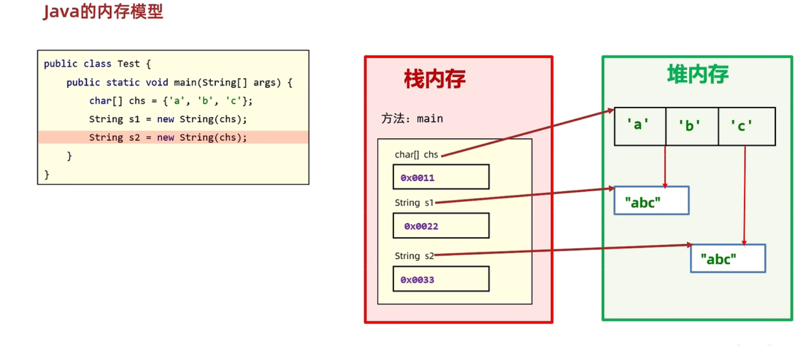
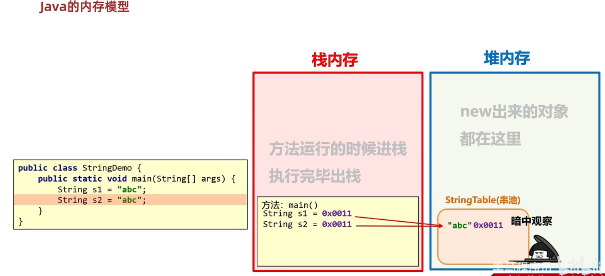

# 常用类

## String类

`String`类代表字符串，Java程序中的所有字符串文字（例如`"abc"`）都被实现为此类的实例。也就是说Java中所有被双引号引起来的字符串都是`String`的实例对象。`String`类在`java.lang`包下，所以使用的时候不需要导包！

### 特点

- **不可变性**：`String`对象一旦创建，其内容不可变。这意味着当对一个`String`对象进行修改时，实际是创建了一个新的`String`对象，并将原对象复制到新对象中，所以频繁修改字符串的操作会导致内存占用和性能问题。
- **线程安全**：由于`String`对象不可变，所有多个线程可以同时访问同一个`String`对象，而没有线程安全问题。
- **存储在常量池中**：Java中有个字符串常量池，直接使用双引号`""`字面量创建的字符串会判断是否在常量池中存在，不存在会创建加入，存在则不会重复创建。但使用`new String()`方式创建的，永远会从新开辟空间存储。
- **支持+和+=操作符**：可以使用`+`和`+=`操作符将两个字符串连接起来。需要注意的是，每次操作都会创建一个新的`String`对象
- **支持Unicode编码**：`String`类中的字符编码采用`Unicode`编码，所以可以支持多种语言和字符集
- **支持常用的字符串操作**：`String`类提供了许多常用的字符串操作，例如字符串比较、查找、替换、切割、大小写转换等。

### 构造方法

**常用的构造方法**

| 方法名                    | 说明                                      |
| ------------------------- | ----------------------------------------- |
| public String()           | 创建一个空白字符串对象，不含有任何内容    |
| public String(char[] chs) | 根据字符数组的内容，来创建字符串对象      |
| public String(byte[] bys) | 根据字节数组的内容，来创建字符串对象      |
| String s = "abc"          | 直接赋值的方式创建字符串对象，内容就是abc |

**示例代码**

```java
public class StringDemo {
    public static void main(String[] args) {
        // 使用String创建
        String s1 = new String("abc");
        sout(s1); // "abc"
            
        // 使用字符数组
        char[] c = {'a', 'b', 'c'};
        String s2 = new String(c);
        sout(s2); // "abc"
        
        // 使用字节数组创建
        byte[] bs = {97, 98, 99};
        String s3 = new String(bs);
        sout(s3); // "abc"
        
        //使用字面量直接创建
        String s4 = new String("abc");
        sout(s4); // "abc"
    }
}
```

::: tip

- 字符数组常用在更换某个字符，此时需要构造方法
- 字节数组常用在把字节信息进行转换，此时需要构造方法

:::

#### 构造和直接赋值方式创建对象区别

- 通过构造方法创建

通过`new`创建的字符串对象，每一次`new`都会申请一个内存空间，虽然内容相同，但是地址值不同



> 不存在复用，因为每次`new`出来的对象会在内存中开辟一个新的空间

- 直接赋值方式创建

以`""`方式创建的字符串，只要字符序列相同（顺序和大小写），无论在程序代码中出现几次，JVM都只会创建一个`String`对象，并在字符串池中维护



> 当使用双引号直接赋值时，系统会检查该字符串在串池中是否存在。若不存在，则创建新的、存在则复用。

### 	字符串的比较

#### ==号的作用

- 比较基本数据类型：比较的是具体的值
- 比较引用数据类型：比较的是对象地址值

#### equals方法的作用

- 方法介绍

  ```java
  public boolean equals(String s);	// 比较两个字符串内容是否相同、区分大小写
  ```

- 基本用例

  ```java
  public class StringDemo02 {
      public static void main(String[] args) {
          //构造方法的方式得到对象
          char[] chs = {'a', 'b', 'c'};
          String s1 = new String(chs);
          String s2 = new String(chs);
  
          //直接赋值的方式得到对象
          String s3 = "abc";
          String s4 = "abc";
  
          //比较字符串对象地址是否相同
          System.out.println(s1 == s2); // false
          System.out.println(s1 == s3); // false
          System.out.println(s3 == s4); // true
          System.out.println("--------");
  
          //比较字符串内容是否相同
          System.out.println(s1.equals(s2)); // true
          System.out.println(s1.equals(s3)); // true
          System.out.println(s3.equals(s4)); // true
      }
  }
  ```

  #### equalsIgnoreCase是Java中的一个字符串方法，用于比较两个字符串是否相等，但忽略他们的大小写。它与`equals`方法相似，但不考虑大小写的区别

  ```java
  public boolean equalsIgnoreCase(String anoterString);
  ```

  ### 案例--手机号屏蔽

  需求：以字符串的形式从键盘接收一个手机号，将中间四位用*代替

  ```java
  public class Test8手机号屏蔽 {
      public static void main(String[] args) {
          /*以字符串的形式从键盘接受一个手机号，将中间四位号码屏蔽
          最终效果为：131****9468*/
  
          //1.键盘录入一个手机号码
          Scanner sc = new Scanner(System.in);
          System.out.println("请输入手机号码");
          String phoneNumber = sc.next();//13112349408
  
          //2.截取手机号码中的前三位
          String star = phoneNumber.substring(0, 3);
  
          //3.截取手机号码中的最后四位
          //此时我用substring方法，是用1个参数的，还是两个参数的？1个参数的会更好
          //因为现在我要截取到最后，所以建议使用1个参数的。
          String end = phoneNumber.substring(7);
  
          //4.拼接
          String result = star + "****" + end;
  
          System.out.println(result);
      }
  }
  ```

> 补充：在Java中，`substring`是字符串类中的一个方法，用于截取一个字符串的子串
>
> 这个方法有两个不同的用法：
>
> 1. 截取从指定位置开始到字符串末尾的子串：
>
>    ```java
>    public String substring(int beginIndex);
>    ```
>
>    其中`beginIndex`表示截取子串的起始位置。返回从`beginIndex`开始到字符串末尾的子串。
>
>    ```java
>    String str = "Heelo,world!";
>    String substr = str.substring(7);
>    System.out.println(substr); // "world!"
>    ```
>
> 2. 截取从指定位置开始到指定位置结束的子串：
>
>    ```java
>    public String substring(int beginIndex, int endIndex);
>    ```
>
>    其中`beginIndex`和`endIndex`分别表示截取子串的起始位置和结束位置。返回从`beginIndex`开始到`endIndex - 1`结束的子串。
>
>    ```java
>    String str = "Hello, world!";
>    String substr = str.substring(7, 12);  
>    System.out.println(substr);// "world"
>    ```
>
>    需要注意的是，`substring`方法返回的是一个新的字符串，而不是在原字符串上进行修改。如果`beginIndex`或`endIndex`超出了字符串的范围，会抛出`IndexOutOfBoundsExxception`异常

### 案例--敏感词替换

需求1：键盘录入一个字符串，如果字符串中包含（TMD），则使用***替代

```java
public class Test9敏感词替换 {
    public static void main(String[] args) {
        //1.定义一个变量表示骂人的话
        String talk = "后裔你玩什么啊，TMD";


        //2.把这句话中的敏感词进行替换
        String result = talk.replaceAll("TMD", "***");

        //3.打印
        System.out.println(talk);
        System.out.println(result);
    }
}
```

需求2：如果要替换的敏感词比较多怎么办？

```java
public class Test10多个敏感词替换 {
    public static void main(String[] args) {
        //实际开发中，敏感词会有很多很多

        //1.先键盘录入要说的话
        Scanner sc = new Scanner(System.in);
        System.out.println("请输入要说的话");
        String talk = sc.next();//后裔你玩什么啊，TMD,GDX,ctmd,ZZ

        //2.定义一个数组用来存多个敏感词
        String[] arr = {"TMD","GDX","ctmd","ZZ","lj","FW","nt"};

        //3.把说的话中所有的敏感词都替换为***

        for (int i = 0; i < arr.length; i++) {
            //i 索引
            //arr[i] 元素 --- 敏感词
            talk = talk.replaceAll(arr[i],"***");
        }

        //4.打印结果
        System.out.println(talk);//后裔你玩什么啊，***,***,***,***
    }
}
```

> 补充：在 Java 中，`replace` 是字符串类中的一个方法，用于替换一个字符串中的某些字符或子串。****
>
> 这个方法有两种不同的用法：
>
> 1. 用新的字符串替换掉所有的旧字符串：
>
>    ```java
>    public String replace(CharSequence target, CharSequence replacement)
>    ```
>
>    其中，`target` 表示要被替换的旧字符串，`replacement` 表示用于替换的新字符串。返回一个新的字符串，其中所有的 `target` 都被替换成了 `replacement`。
>
>    例如：
>
>    ```java
>    String str = "Hello, world!";
>    String newStr = str.replace("o", "0");  // 替换所有的 "o" 为 "0"
>    System.out.println(newStr);
>    ```
>
> 2. 用新的字符串替换掉某个位置开始的一段子串：
>
>    ```java
>     public String replace(int startIndex, int endIndex, String newStr)
>    ```
>
>    其中，startIndex 和 endIndex 分别表示要被替换的子串的起始位置和结束位置（不包括 endIndex 所在的字符），newStr 表示用于替换的新字符串。返回一个新的字符串，其中从 startIndex 开始到 endIndex - 1 结束的子串都被替换成了 newStr。
>    ```java
>    String str = "Hello, world!";
>    String newStr = str.replace(7, 12, "JAVA");  // 替换 "world" 为 "JAVA"
>    System.out.println(newStr);
>    ```
>
> 需要注意的是，`replace` 方法返回的是一个新的字符串，而不是在原字符串上进行修改。如果 `startIndex` 或 `endIndex` 超出了字符串的范围，会抛出 `IndexOutOfBoundsException` 异常。

## StringBuilder类

`StringBuilder`可以看成一个容器，创建之后里面的内容是可以变的。当我们在拼接字符串和反转字符串的时候会使用到

### 常用方法

| 方法名                           | 说明                                                |
| -------------------------------- | --------------------------------------------------- |
| public StringBuilder append(E e) | 添加数据，并返回对象本身                            |
| public StringBuilder reverse()   | 反转容器中的内容                                    |
| public int length()              | 返回长度(字符出现的个数)                            |
| public String toString()         | 通过toString()就可以实现把StringBuilder转换为String |

### 基本用例-基本使用

```java
public class StringBuilderDemo {
     public static void main(String[] args) {
        //1.创建对象
        StringBuilder sb = new StringBuilder("abc");

        //2.添加元素
        /*sb.append(1);
        sb.append(2.3);
        sb.append(true);*/

        //反转
        sb.reverse();

        //获取长度
        int len = sb.length();
        System.out.println(len);

        //打印
        //普及：
        //因为StringBuilder是Java已经写好的类
        //java在底层对他做了一些特殊处理。
        //打印对象不是地址值而是属性值。
        System.out.println(sb);
    }
}
```

#### 链式编程

```java
public class StringBuilderDemo4 {
    public static void main(String[] args) {
        //1.创建对象
        StringBuilder sb = new StringBuilder();

        //2.添加字符串
        sb.append("aaa").append("bbb").append("ccc").append("ddd");

        System.out.println(sb);// aaabbbcccddd

        //3.再把StringBuilder变回字符串
        String str = sb.toString();
        System.out.println(str);// aaabbbcccddd
    }
}
```

::: warning 

需要用`toString()`将他变成字符串，因为此时为`StringBuilder`容器而不是字符串

:::

## StringJoiner类

主要是用作连接字符串

### 构造方法

| 方法名称                                                     | 说明                                       |
| ------------------------------------------------------------ | ------------------------------------------ |
| `public StringJoiner(String delimiter)`                      | 传递一个连接符，不包含开头结尾             |
| `public StringJoiner(String delimiter, String prefix, String suffix)` | 三个参数分别为：连接符，开头符号，结尾符号 |

```java
public class Test1 {
    static void main(String[] args) {
        // 主要是字符串连接 三个参数分别为：
        // 连接符 开头符号 结尾符号
        StringJoiner sj = new StringJoiner(", ", "[", "]");
        sj.add("aaa").add("bbb").add("ccc");
        System.out.println(sj); // [aaa, bbb, ccc]
    }
}
```

## 字符串原理

### 字符串存储的内存原理

- 直接赋值会复用字符串池中的
- new出来的不会复用，而是开辟一个新的空间

### ==号比较的到底是什么？

- 基本数据类型比较的是数据值
- 引用数据类型比较的是地址值
  - 直接赋值的字符串其实也是比较地址，不过是字符串池中复用的地址值
  - 使用`equals`可以比较字符串的数据值

### 字符串拼接的底层原理

- 如果没有变量参与，都是字符串直接相加，编译之后就是拼接之后的结果，会复用串池中的字符串

  ```java
  int a = "a" + "b" + "c";
  // 编译成class文件时会变成
  int a = "abc"; // 且在真正执行的时候就是执行这个
  ```

- 如果有变量参与，会创建新的字符串，浪费内存

### StringBuilder提高效率原理图

- 所有要拼接的内容都会往StringBuilder中放，不会创建很多无用的空间，节约内存

### StringBuilder源码分析

- 默认创建一个长度为16的字节数组

- 添加的内容长度小于16，直接存
- 添加的内容大于16会扩容（原来的容量*2 + 2）
- 如果扩容之后还不够，以实际长度为准