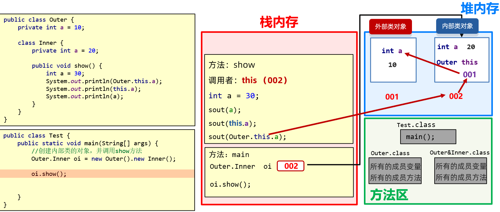

# 内部类

将一个类A定义在另一个类B里面，里面的那个类A就称为**内部类**，B则称为**外部类**，可以把内部类理解成寄生，外部类理解成宿主。

Java内部类时定义在另一个类中的类，他可以访问包含他的外部类的所有成员和方法，包括私有成员和方法。

### 作用

一个事物内部还有一个独立的事物，内部的事物脱离外部的事物无法独立使用

1. 人里面有一颗心脏
2. 汽车内部有一个发动机
3. 为了实现更好的封装性

## 分类

1. **成员内部类**，类定义**在了成员位置** (类中方法外称为成员位置，**无s**tatic修饰的内部类)
2. **静态内部类**，类定义**在了成员位置** (类中方法外称为成员位置，**有**static修饰的内部类)
3. **局部内部类**，类定义在方法内
4. **匿名内部类**，没有名字的内部类，可以在方法中，也可以在类中方法外。

## 成员内部类

### 特点

- 无`static`修饰的内部类，属于外部类对象的。
- 宿主：外部类对象。

### 使用格式

```java
 // 前提是new对象
外部类.内部类。 // 访问内部类的类型都是用 外部类.内部类
```

### 获取成员内部类对象

方式一：外部直接创建成员内部类的对象

```java
/* 格式：
	外部类.内部类 变量 = new 外部类（）.new 内部类（）;*/
public class Test {
    public static void main(String[] args) {
        //  宿主：外部类对象。
       // Outer out = new Outer();
        // 创建内部类对象。
        Outer.Inner oi = new Outer().new Inner();
        oi.method();
    }
}

class Outer {
    // 成员内部类，属于外部类对象的。
    // 拓展：成员内部类不能定义静态成员。
    public class Inner{
        // 这里面的东西与类是完全一样的。
        public void method(){
            System.out.println("内部类中的方法被调用了");
        }
    }
}
```

方式二：在外部类中定义一个方法提供内部类的对象

```java
public class Outer {
    String name;
    private class Inner{
        static int a = 10;
    }
    public Inner getInstance(){
        return new Inner();
    }
}

public class Test {
    public static void main(String[] args) {
        Outer o = new Outer();
        System.out.println(o.getInstance());
    }
}
```

> - 当成员内部类被private修饰时。在外部类编写方法，对外提供内部类对象
> - 当成员内部类被非私有修饰时，直接创建对象。Outer.Inner oi = new Outer().new Inner();

### 细节

编写成员内部类的注意点：

1. 成员内部类可以被一些修饰符所修饰，比如：private，默认，protected，public，static等
2. 在成员内部类里面，JDK16之前不能定义静态变量，JDK16开始才可以定义静态变量。
3. 创建内部类对象时，对象中有一个隐含的Outer.this记录外部类对象的地址值。（请参见”成员内部类“的内存图）



::: tip 

- 方法区中的字节码文件，会加载外部内字节码文件和内部类的字节码文件，它是两个独立的字节码文件

  

- 当new Inner（）时会在堆内存中记录隐藏的this，而这个this是外部类的地址

- 补充：a，就近原则、this.a，是内部类中的a、Outer.this.a，是外部类中的a

:::

### 案例-面试题

> 内部类访问外部类对象的格式是：外部类名.this

```java
public class Test {
    public static void main(String[] args) {
        Outer.inner oi = new Outer().new inner();
        oi.method();
    }
}

class Outer {	// 外部类
    private int a = 30;

    // 在成员位置定义一个类
    class inner {
        private int a = 20;

        public void method() {
            int a = 10;
            System.out.println(???);	// 10   答案：a
            System.out.println(???);	// 20	答案：this.a
            System.out.println(???);	// 30	答案：Outer.this.a
        }
    }
}
```

> 外部类成员变量和内部类成员变量重名时，在内部类如何访问？使`System.out.println(outer.this.变量名);`

## 静态内部类

### 特点

- 静态内部类是一种特殊的成员内部类
- 有`static`修饰，属于外部类本身的。

总结：

> 静态内部类与其他类的用法完全一样。只是访问的时候需要加上`外部类.内部类`

::: tip

- 静态内部类可以直接访问外部类的静态成员。
- 静态内部类不可以直接访问外部类的非静态成员，如果要访问需要创建外部类的对象。
- 静态内部类中没有隐含的Outer.this。

:::

### 使用格式

```java
外部类名.内部类名.方法名();
```

### 获取成员内部类对象

```java
/* 格式：
	外部类.内部类  变量 = new  外部类.内部类构造器;	*/
// 外部类：Outer01
class Outer01{
    private static  String sc_name = "黑马程序";
    // 内部类: Inner01
    public static class Inner01{
        // 这里面的东西与类是完全一样的。
        private String name;
        public Inner01(String name) {
            this.name = name;
        }
        public void showName(){
            System.out.println(this.name);
            // 拓展:静态内部类可以直接访问外部类的静态成员。
            System.out.println(sc_name);
        }
    }
}

public class InnerClassDemo01 {
    public static void main(String[] args) {
        // 创建静态内部类对象。
        // 外部类.内部类  变量 = new  外部类.内部类构造器;
        Outer01.Inner01 in  = new Outer01.Inner01("张三");
        in.showName();
    }
}
```


小结

> 1. 概述
>    - 定义：定义在另一个类中的类
>    - 作用：实现更好的封装性，内部的事物脱离外部的事物无法使用
> 2. 分类：
>    1. **成员内部类**，类定义在了成员位置（类中方法外称为成员位置，无static修饰的内部类）
>    2. **静态内部类**，类定义在了成员位置（类中方法外称为成员位置，有static修饰的内部类）
>    3. **局部内部类**，类定义在方法内
>    4. **匿名内部类**，没有名字的内部类，可以在方法中，也可以在类中方法外（只使用一次类时，可以使用匿名内部类）
