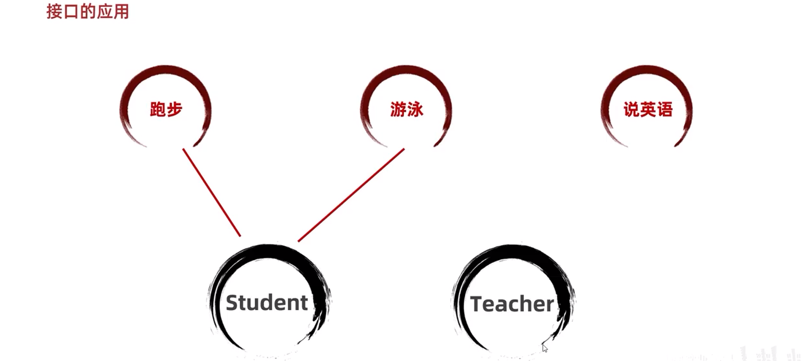
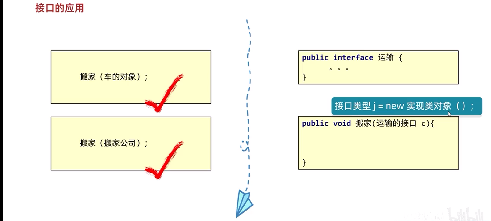

# 接口

我们已经学完了抽象类，抽象类中可以用抽象方法，也可以有普通方法，构造方法，成员变量等。那么什么是接口呢？接口是更加彻底的抽象，JDK6之前，包括JDK7，接口中全部是抽象方法。接口同样是不能创建对象的

```java
//接口的定义格式：
interface 接口名称{
    // 抽象方法
}

// 接口的声明：interface
// 接口名称：首字母大写，满足“驼峰模式”
```

> 在JDK7，包括JDK7之前，接口中的只有包含：抽象方法和常量

#### 抽象方法

::: tip

​	接口中的抽象方法默认会自动加上：`public static final`修饰。也就是说在接口中定义的成员变量实际上是一个常量。这里是使用`public static final`修饰后，变量值就不可被修改，并且是静态化的变量可以直接用接口名访问，所以也叫常量。常量必须要给初始值。常量命名规范建议字母全部大写，多个单词用下划线连接。

:::

```java
public interface InterF {
    // 抽象方法！
    //    public abstract void run();
    void run();

    //    public abstract String getName();
    String getName();

    //    public abstract int add(int a , int b);
    int add(int a , int b);


    // 它的最终写法是：
    // public static final int AGE = 12 ;
    int AGE  = 12; //常量
    String SCHOOL_NAME = "黑马程序员";
}
```

## 基本的实现

类与接口的关系为实现关系，即类实现接口，该类可以称为接口的实现类，也可以称为接口的子类。实现的动作类似继承，格式相仿，只是关键字不同，实现使用`implements`关键字

```java
/**接口的实现：
    在Java中接口是被实现的，实现接口的类称为实现类。
    实现类的格式:*/
class 类名 implements 接口1,接口2,接口3...{
    
}
```

### 要求和意义

1. 必须重写全部接口中所有的抽象方法。
2. 如果一个类实现了接口，但是没有重写全部接口的全部抽象方法，那么这个类也必须定义成抽象类。
3. 意义：接口体现的是一种规范，接口对实现类是一种强制性的约束，要么全部完成接口中的方法，要么自己也定义成抽象类。这正是一种强制性的规范。

### 案例-基本实现

假如我们定义一个运动员的**接口**（规范），代码如下：

```java
/**
   接口：接口体现的是规范。
 * */
public interface SportMan {
    void run(); // 抽象方法，跑步。
    void law(); // 抽象方法，遵守法律。
    String compittion(String project);  // 抽象方法，比赛。
}
```

接下来定义一个乒乓球运动员类，实现接口，实现接口的**实现类**代码如下：

```java
package com.itheima._03接口的实现;
/**
 * 接口的实现：
 *    在Java中接口是被实现的，实现接口的类称为实现类。
 *    实现类的格式:
 *      class 类名 implements 接口1,接口2,接口3...{
 *
 *
 *      }
 * */
public class PingPongMan implements SportMan {
    @Override
    public void run() {
        System.out.println("乒乓球运动员稍微跑一下！！");
    }

    @Override
    public void law() {
        System.out.println("乒乓球运动员守法！");
    }

    @Override
    public String compittion(String project) {
        return "参加"+project+"得金牌！";
    }
}
```

**测试代码**：

```java
public class TestMain {
    public static void main(String[] args) {
        // 创建实现类对象。
        PingPongMan zjk = new PingPongMan();
        zjk.run();
        zjk.law();
        System.out.println(zjk.compittion("全球乒乓球比赛"));
    }
}
```

### 案例-多实现

**类与接口之间的关系是多实现的，一个类可以同时实现多个接口。**

首先我们先定义两个接口，代码如下：

```java
/** 法律规范：接口*/
public interface Law {
    void rule();
}

/** 这一个运动员的规范：接口*/
public interface SportMan {
    void run();
}
```

然后定义一个实现类：

```java
/**
 * Java中接口是可以被多实现的：
 *    一个类可以实现多个接口: Law, SportMan
 *
 * */
public class JumpMan implements Law ,SportMan {
    @Override
    public void rule() {
        System.out.println("尊长守法");
    }

    @Override
    public void run() {
        System.out.println("训练跑步！");
    }
}
```

> 从上面可以看出类与接口之间是可以多实现的，我们可以理解成实现多个规范，这是合理的

## 接口与接口的多继承

Java中，接口与接口之间是可以多继承的：也就是一个接口可以同时继承多个接口

::: tip

- **类与接口是实现关系**
- **接口与接口是继承关系**

:::

接口继承接口就是把其他接口的抽象方法与本接口进行了合并。

```java
public interface Abc {
    void go();
    void test();
}

/** 法律规范：接口*/
public interface Law {
    void rule();
    void test();
}

 *
 *  总结：
 *     接口与类之间是多实现的。
 *     接口与接口之间是多继承的。
 * */
public interface SportMan extends Law , Abc {
    void run();
}
```

## JDK8以后接口中新增的方法

- 允许在接口中定义默认方法，需要使用关键字default修饰

  作用：解决接口升级的问题

- 接口中默认方法的定义格式：
  - 格式：public **default** 返回值类型方法名(){}
  - 范例：public **default** void show(){}
- 接口中默认方法的注意事项：
  - 默认方法不是抽象方法，所以不强制被重写。但是如果被重写，重写的时候去掉**default**关键字
  - public可以省略，**default不能省略**
  - 如果实现了多个接口，多个接口中存在相同名字的默认方法，子类就必须对该方法重写

```java
public interface InterA {
     /*接口中默认方法的定义格式：
            格式：public default 返回值类型 方法名(参数列表) {   }

        接口中默认方法的注意事项：
            1.默认方法不是抽象方法，所以不强制被重写。但是如果被重写，重写的时候去掉default关键字
            2.public可以省略，default不能省略
            3.如果实现了多个接口，多个接口中存在相同名字的默认方法，子类就必须对该方法进行重写*/


    public abstract void method();

    public default void show(){
        System.out.println("InterA接口中的默认方法 ---- show");
    }
}
```

- 允许在接口中定义静态方法，需要用`static`修饰
- 接口中静态方法的定义格式
  - 格式：`public static 返回值类型 方法名(参数列表){}`
  - 范例：`public static void show() {}`
- 接口中静态方法的注意事项：
  - 静态方法只能通过接口名调用，不用通过实现类名或对象名调用
  - `public`可以省略，`static`不能省略

> 在接口中，被`static`修饰的方法，不能被重写，可以直接调用
>
> 重写（子类把从父类继承下来的虚方法表里面的方法进行覆盖了，这才叫重写。）

## JDK9新增的方法

**基本用例**

```java
/*格式：
private返回值类型方法名(参数列表){} */
private void show() { }

/*格式：
 private static返回值类型方法名(参数列表){} */
private static void method(){ }
```

## 接口的应用

### 接口的灵活使用

接口代表规则，是行为的抽象。想要让那个类拥有一个行为，就让这个类实现对应的接口就可以了



> 若想让某种javaBean实现某种功能，则实现某种接口即可

### 接口的多态

当一个方法的参数是接口时，可以传递接口所有实现类的对象，这种方式称之为**接口多态**。



> 如果一个方法中，当参数为接口时，那么在调用方法时就可传递这个接口的所有实现类对象

```java
public class Main {
    public static void main(String[] args) {
        test(new IHomeServiceImpl());
    }
    private static void test(IHomeService IHomeService){
        IHomeServiceImpl home1= (IHomeServiceImpl) IHomeService;
        home1.test();
    }
}
```

> IHomeService为接口，那么当这个接口需要什么对象时，new相应对象即可拿到这个接口对应的实现类对象

## 接口的细节

关于接口的使用，以下为语法上要注意的细节，虽然条目较多，但若理解了抽象的本质，无需死记硬背。

1. 当两个接口中存在相同抽象方法的时候，该怎么办？

> 只要**重写一次**即可。此时重写的方法，既表示重写1接口的，也表示重写2接口的。

2. 实现类能不能继承A类的时候，同时实现其他接口呢？

> - 继承的父类，就好比是亲爸爸一样
> - 实现的接口，就好比是干爹一样
> - 可以继承一个类的同时，再实现多个接口，只不过，要把接口里面所有的抽象方法，全部实现。

3. 实现类能不能继承一个抽象类的时候，同时实现其他接口呢？

> 实现类可以继承一个抽象类的同时，再实现其他多个接口，只不过要把里面所有的抽象方法**全部重写**。

4. 实现类Zi，实现了一个接口，还继承了一个Fu类。假设在接口中有一个方法，父类中也有一个相同的方法。子类如何操作呢？

> - 处理办法一：如果父类中的方法体，能满足**当前业务的需求**，在子类中可以不用重写。
> - 处理办法二：如果父类中的方法体，不能满足**当前业务的需求**，需要在子类中重写。

5. 如果一个接口中，有10个抽象方法，但是我在实现类中，只需要用其中一个，该怎么办?（重点）

> 1. 可以在接口跟实现类中间，新建一个中间类（适配器类）
> 2. 让这个适配器类去实现接口，对接口里面的**所有的方法做空重写**。
> 3. 让子类**继承**这个适配器类，想要用到哪个方法，就重写哪个方法。
> 4. 因为中间类没有什么实际的意义，所以一般会把中间类**定义为抽象**的，不让外界创建对象


小结

> 1. 概述
>
>    - 接口是一种规范或契约，它只定义了方法签名、常量以及嵌套类型的生命，没有方法实现或属性
>
>      ```java
>      //接口的定义格式：
>      interface 接口名称{
>          // 抽象方法
>      }
>      // 接口的声明：interface
>      // 接口名称：首字母大写，满足“驼峰模式”
>      ```
>
>    - 特点
>      - 抽象方法：会自动加上public abstract修饰
>      - 常量：会自动加上public static final修饰
>
> 2. 基本实现
>
>    - 实现方式：使用`implements`关键字
>
>      ```java
>      /**接口的实现：
>          在Java中接口是被实现的，实现接口的类称为实现类。
>          实现类的格式:*/
>      class 类名 implements 接口1,接口2,接口3...{
>      }
>      ```
>
>    - 要求：接口体现的是一种规范，接口对实现类是一种强制性的约束。需要强制重写或定义抽象类
>
> 3. 接口与接口的多继承
>
>    - 含义：一个接口可以继承另一个或多个接口，这被称为接口的多继承
>
>      ```java
>      public interface SportMan extends Law , Abc {
>          void run();
>      }
>      ```
>
>    - 补充：接口和类之间的关系
>
>      - 类和类是继承关系，只能单继承，不能多继承
>      - 类与接口是实现关系，可以但实现，还可以多实现
>      - 接口与接口是继承关系，可以单继承，还可以多继承
>
> 4. JDK中接口新增
>
>    - JDK7以前：接口中只能定义抽象方法
>
>    - JDK8以后：新增默认方法(**default method**)
>
>      ```java
>      格式：public default 返回值类型 方法名(参数列表) {   }
>      // 例如
>      public default void show(){
>          System.out.println("InterA接口中的默认方法 ---- show");
>      }
>      ```
>
>    - 特点：
>
>      - 默认方法不是抽象方法，所以不强制被重写
>      - 解决接口升级的问题
>
>      ::: warning
>
>      - 静态方法只能通过接口名调用，不能通过实现类名或对象名调用
>      - public可以省略，staticc不能省略
>
>      :::
>
>    - JDK9以后：新增private修饰符
>
>      ```java
>      - 格式 : private返回值类型方法名(参数列表){}
>      - 范例: private void show() { }
>          
>      - 格式: private static返回值类型方法名(参数列表){}
>      - 范例: private static void method(){ }
>      ```
>
> 5. 接口的多态
>    - 当一个方法的参数是接口时，可以传递接口实现所有实现类的对象，这种方式称之为接口多态
> 6. 接口的细节
>    - 实现类可以同时继承A类也可以实现接口，不过需要实现所有方法
>    - 实现类可以同时继承抽象类也可以实现接口，不过需要重写所有方法
>    - 实现类实现了两个接口，且两个接口存在相同抽象方法，此时只需重写一次
>    - 当实现了接口，子类实现类中的方法跟父类方法同名时，必须重写