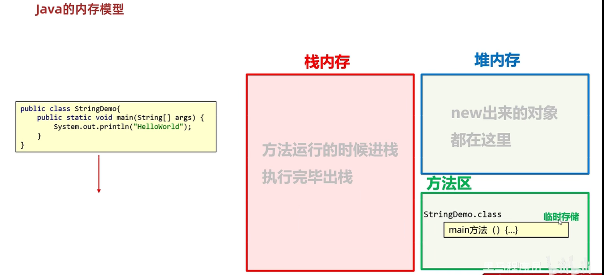
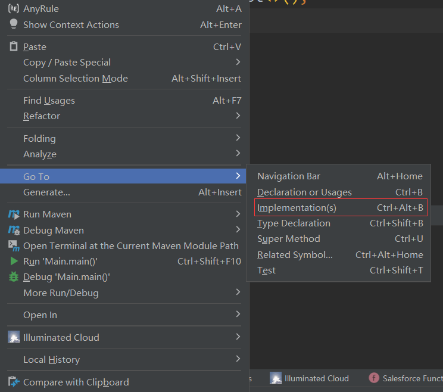
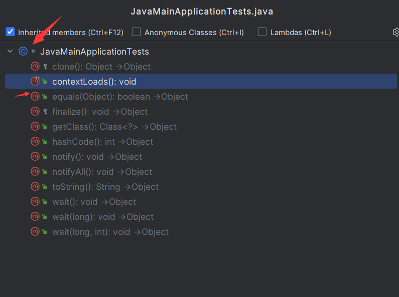

# 知识加油站

## Java内存模型

在Java中，执行一个`helloWorld`方法的内存图

> **栈内存**为方法提供使用、**堆内存**为对象提供使用、方法区为执行的class文件临时存储

::: tip

- 参考资料：https://www.bilibili.com/video/BV17F411T7Ao/?p=107
- 当执行main方法时，会生成StringDemo这个class文件

:::

## Idea快捷键

### 查看接口实现类

> Ctrl+Alt+B

选中一个方法，按键Ctrl+Alt+B即可查看实现此接口的实现类

### 图标小细节

Ctrl+F12可以查看当前类中的状态，例如成员方法，成员属性等等

::: tip 

C表示类，M表示方法，F表示常量或，静态成员变量，->表示继承，T表示重写

:::

## int和Integer的区别

在Java中，`int`是一种原始数据类型，用于表示整数值。它是Java中最常用的数据类型之一，他的大小为4个字节（32位），可以表示介于-2,147,483,648和2,147,483,647之间的整数。

而`Integer`是Java中的一个类，他封装了一个基本类型的int值。他允许将int值作为参数传递给需要一个对象的方法，也可以将int值转换为其他类型的值，例如字符串。

因此，`int`和`Integer`的主要区别在于`int`是个原始数据类型，`Integer`是个类，用于封装`int`值以便进行更多操作。此外，`int`在Java中是基本数据类型，而`Integer`是引用数据类型，也就是说其实`Integer`其实是个引用的指针，不是个简单的数据值。

## String和Character区别

`String`是一种对象，用于表示一组字符序列(就是字符串)，它是Java中的一个类，具有很多使用方法来处理字符串，例如连接、替换、分割和查找，字符串常量一般用双引号引起来，如：`"你好啊，李银河"`

`Character`是Java中char类型的包装类，他用于表示单个字符每个`Character`对象都包含一个`char`类型的值。他也具有一些实用的方法来操作和处理字符。如字符的大小写转换等。字符常来通常可以用单引号引起来，如：`'A'`。

因此，`String`和`Character`的主要区别在于他们表示的数据类型不一样。`String`表示一组字符，而`Character`表示单个字符。此外`String`是个类，而`Character`是个简单的数据类型。在Java中，字符串是不可变的，因此不能再原始字符串上更改，而`Character`是可以变的，因为他只表示一个字符。
